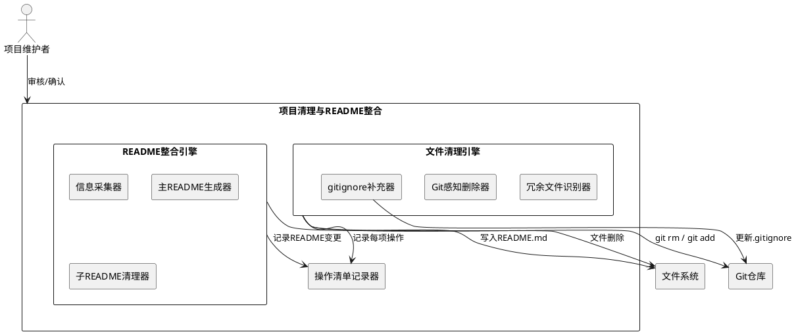
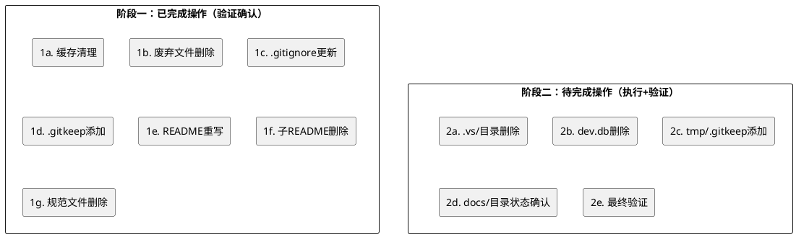
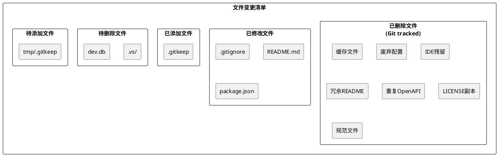

# **1. 实现模型**

## **1.1 上下文视图**

### 1.1.1 系统上下文图



### 1.1.2 架构决策记录（ADR）

| ADR编号 | 决策标题 | 决策内容 | 理由 |
|---------|---------|---------|------|
| ADR-C01 | 已完成项通过Git暂存区变更确认 | 缓存清理、废弃文件删除、.gitignore更新、.gitkeep添加、README重写等已完成操作，通过`git status`和`git diff`验证变更内容，纳入操作清单记录 | 部分清理操作已在之前执行阶段完成，无需重复执行，但需记录和验证 |
| ADR-C02 | .vs/目录整目录删除 | 将整个`.vs/`目录（Visual Studio残留）从版本控制中移除 | .vs/属于IDE私有配置，已包含在.gitignore规则中，且不属于项目构建依赖 |
| ADR-C03 | dev.db保留删除决策 | `apps/api-server/dev.db`执行删除，因.gitignore已包含`*.db`模式 | 开发环境SQLite数据库不应纳入版本控制，删除后可由应用自动重建 |
| ADR-C04 | openapi.json保留后端源 | 仅保留`apps/api-server/openapi.json`作为API规范单一权威来源 | openapi.json由FastAPI自动生成，前端目录下已删除的快照不再需要 |
| ADR-C05 | tmp/目录添加.gitkeep | 对空的`tmp/`目录添加`.gitkeep`文件以保持目录结构 | tmp/为运行时临时目录，需在版本控制中保留目录占位，与data/、logs/处理方式一致 |
| ADR-C06 | main.py保留为快捷入口 | 根目录`main.py`作为`scripts/start.py`的快捷入口保留，不纳入删除 | main.py仅3行代码，提供`python main.py`快捷启动方式，有实际使用价值 |
| ADR-C07 | docs/目录暂不迁移整合 | `apps/web-client/docs/`下的历史开发文档保留原位置，不迁移至根目录`docs/` | 这些文档为前端开发过程记录，与前端代码紧密关联，迁移会破坏相对引用关系；根目录docs/为架构级文档预留 |
| ADR-C08 | 规范/目录文件已删除确认 | `规范/`目录下的4个规范文档已被删除（Git暂存区显示deleted），不再恢复 | 规范内容已整合到主README的"项目规范"章节和.codeartsdoer规格文档中 |

## **1.2 服务/组件总体架构**

### 1.2.1 清理执行两阶段架构



### 1.2.2 文件变更分类模型



## **1.3 实现设计文档**

### 1.3.1 阶段一：已完成操作（验证确认）

#### 1.3.1.1 缓存文件清理

**执行状态**：✅ 已完成

| 文件/目录 | 类别 | 删除理由 | 验证方式 |
|-----------|------|---------|---------|
| `__pycache__/`（各处） | 缓存文件 | Python编译缓存，可由解释器自动重建 | `find . -name "__pycache__" -not -path "*/node_modules/*"` 返回空 |
| `*.pyc`（各处） | 缓存文件 | Python字节码缓存，可由解释器自动重建 | `find . -name "*.pyc" -not -path "*/node_modules/*"` 返回空 |

**.gitignore覆盖确认**：已包含`__pycache__/`、`**/__pycache__/`、`*.pyc`、`*.pyo`、`*.pyd`模式

#### 1.3.1.2 废弃配置文件删除

**执行状态**：✅ 已完成

| 文件路径 | 类别 | 删除理由 | Git状态 |
|----------|------|---------|---------|
| `package-lock.json`（根目录） | 废弃配置 | 项目已迁移至pnpm，使用pnpm-lock.yaml管理锁文件 | deleted（暂存区） |
| `requirements.txt`（根目录） | 废弃配置 | 项目已迁移至uv workspace，依赖由uv.lock管理 | deleted（暂存区） |
| `apps/web-client/package-lock.json` | 废弃配置 | 前端子项目使用pnpm，不需要npm锁文件 | deleted（暂存区） |
| `apps/web-client/openapi.json` | 重复文件 | 前端目录下的openapi.json为后端API规范快照，不应在前端仓库中保留 | deleted（暂存区） |

**.gitignore覆盖确认**：已包含`package-lock.json`模式

#### 1.3.1.3 .gitignore更新

**执行状态**：✅ 已完成

新增/确认的忽略模式（与spec.md 5.2.1规则3对齐）：

```
# 已覆盖的模式（确认存在）
__pycache__/
**/__pycache__/
*.pyc / *.pyo / *.pyd
*.db / *.sqlite / *.sqlite3
*.tmp / *.temp / *.pid / *.seed / *.pid.lock
tmp/
apps/web-client/dist/
dist/ / build/
package-lock.json
.vs/
logs/ / *.log
data/
```

#### 1.3.1.4 .gitkeep添加

**执行状态**：✅ 已完成

| 文件路径 | 目的 | 验证 |
|----------|------|------|
| `data/.gitkeep` | 保持data/目录在版本控制中的占位 | ✅ 文件存在 |
| `logs/.gitkeep` | 保持logs/目录在版本控制中的占位 | ✅ 文件存在 |
| `infrastructure/nginx/.gitkeep` | 保持nginx配置目录占位 | ✅ 文件存在 |
| `infrastructure/observability/.gitkeep` | 保持可观测性配置目录占位 | ✅ 文件存在 |
| `packages/ts-config/.gitkeep` | 保持TS配置包占位 | ✅ 文件存在 |
| `packages/py-messaging/tests/.gitkeep` | 保持测试目录占位 | ✅ 文件存在 |
| `apps/ai-worker/tests/.gitkeep` | 保持测试目录占位 | ✅ 文件存在 |
| `apps/ai-worker/src/ai_worker/tasks/.gitkeep` | 保持任务目录占位 | ✅ 文件存在 |
| `apps/ai-worker/src/ai_worker/clients/.gitkeep` | 保持客户端目录占位 | ✅ 文件存在 |

#### 1.3.1.5 主README重写

**执行状态**：✅ 已完成

当前根目录`README.md`已包含以下完整章节（符合spec.md 5.4.1规则1的7章节结构要求）：

1. **项目概述**：包含项目名称"心青年智能体平台"和Monorepo全栈定位
2. **技术栈**：包含前端、后端、异步任务、AI集成、数据库、部署、工作区7个层级
3. **目录结构**：完整的Monorepo目录树，包含apps/、packages/、infrastructure/、scripts/、tests/、docs/、data/、logs/、规范/
4. **快速开始**（安装+使用）：安装步骤、环境变量配置、基础设施启动、开发模式、构建与测试、代码检查
5. **开发指南**：前端开发、后端开发、共享包开发、提交规范
6. **部署说明**：Docker部署、生产构建
7. **项目规范**：通过提交规范（Conventional Commits）体现

**语言规则验证**：所有描述性文字使用简体中文 ✅

#### 1.3.1.6 子目录README删除

**执行状态**：✅ 已完成

Git提交`05c4812`已删除以下冗余README文件：

| 文件路径 | 类别 | 删除理由 |
|----------|------|---------|
| `apps/api-server/README.md` | 冗余README | 内容与主README重复，信息已整合 |
| `apps/web-client/README.md` | 冗余README | 内容与主README重复，信息已整合 |
| `apps/web-client/src/components/BottomNav/README.md` | 冗余README | 组件级README，信息可从源码推断 |
| `apps/web-client/src/components/Card/README.md` | 冗余README | 组件级README，信息可从源码推断 |
| `apps/web-client/src/components/FieldEditor/README.md` | 冗余README | 组件级README，信息可从源码推断 |
| `apps/web-client/src/components/Header/README.md` | 冗余README | 组件级README，信息可从源码推断 |
| `apps/web-client/src/components/ListMenu/README.md` | 冗余README | 组件级README，信息可从源码推断 |
| `apps/web-client/src/components/SectionContainer/README.md` | 冗余README | 组件级README，信息可从源码推断 |
| `apps/web-client/src/layouts/README.md` | 冗余README | 布局级README，信息可从源码推断 |

**当前状态确认**：`apps/`和`packages/`下不再存在项目自身的README文件 ✅

#### 1.3.1.7 废弃文件删除（LICENSE副本、规范文件）

**执行状态**：✅ 已完成

| 文件路径 | 类别 | 删除理由 | Git状态 |
|----------|------|---------|---------|
| `apps/api-server/LICENSE` | 冗余LICENSE | Monorepo仅需根目录LICENSE | deleted（暂存区） |
| `apps/web-client/LICENSE` | 冗余LICENSE | Monorepo仅需根目录LICENSE | deleted（暂存区） |
| `规范/单体仓库全栈项目启动脚本规范 (Monorepo Fullsta.md` | 规范文件 | 内容已整合到主README和.codeartsdoer | deleted（暂存区） |
| `规范/智院灵枢(SAP)-日志规范.md` | 规范文件 | 内容已整合到py-logger包 | deleted（暂存区） |
| `规范/智院灵枢(SAP)-项目结构.md` | 规范文件 | 内容已整合到主README目录结构章节 | deleted（暂存区） |
| `规范/注释规范.md` | 规范文件 | 内容已整合到开发指南 | deleted（暂存区） |

### 1.3.2 阶段二：待完成操作（执行+验证）

#### 1.3.2.1 .vs/目录删除

**执行状态**：⏳ 待执行

**目标**：删除根目录下`.vs/`整个目录（Visual Studio IDE残留）

**当前状态**：目录存在，包含以下内容：
- `.vs/CopilotSnapshots/` — Copilot索引快照
- `.vs/ProjectSettings.json` — 项目设置
- `.vs/slnx.sqlite` — 解决方案数据库（163KB）
- `.vs/VSWorkspaceState.json` — 工作区状态
- `.vs/Young-Hearts-Agent-Platform/` — 子项目配置
- `.vs/Young-Hearts-Agent-Platform.slnx/` — 解决方案配置

**执行方案**：

```
步骤1: rm -rf .vs/
步骤2: 确认.gitignore已包含 .vs/ 模式（已确认 ✅）
步骤3: 记录到操作清单
```

**安全验证**：
- `.vs/`不包含项目源码或构建依赖 ✅
- `.gitignore`已有`.vs/`模式，删除后不会被重新提交 ✅
- 删除不影响pnpm/uv/Docker任何工具链 ✅

#### 1.3.2.2 dev.db删除

**执行状态**：⏳ 待执行

**目标**：删除`apps/api-server/dev.db`

**当前状态**：文件存在于`apps/api-server/`目录下

**执行方案**：

```
步骤1: 确认dev.db未被SQLite进程占用
        - 检查方式：lsof apps/api-server/dev.db 或 fuser apps/api-server/dev.db
        - 若被占用：停止占用进程后重试
步骤2: rm apps/api-server/dev.db
步骤3: 确认.gitignore已包含 *.db 模式（已确认 ✅）
步骤4: 记录到操作清单
```

**安全验证**：
- dev.db为开发环境SQLite数据库，可由应用启动时自动重建 ✅
- `.gitignore`已有`*.db`模式，删除后不会被重新提交 ✅
- 不影响生产数据库（生产使用PostgreSQL，通过docker-compose.yml配置） ✅

#### 1.3.2.3 tmp/目录添加.gitkeep

**执行状态**：⏳ 待执行

**目标**：为空的`tmp/`目录添加`.gitkeep`文件

**当前状态**：`tmp/`目录存在但为空（无.gitkeep），`.gitignore`已包含`tmp/`模式

**设计决策**：根据ADR-C05，对tmp/目录添加`.gitkeep`以保持目录结构在版本控制中的占位。

**执行方案**：

```
步骤1: touch tmp/.gitkeep
步骤2: 记录到操作清单
```

**注意事项**：
- `.gitignore`中有`tmp/`模式，但`.gitkeep`是空文件（无扩展名），不会被`tmp/`模式忽略
- 如果`tmp/`模式导致`.gitkeep`也被忽略，需在.gitignore中添加例外：`!tmp/.gitkeep`

#### 1.3.2.4 docs/目录状态确认

**执行状态**：⏳ 待确认

**当前状态**：
- 根目录`docs/`目录不存在（未创建）
- `apps/web-client/docs/`目录存在，包含大量前端开发过程文档（页面设计、任务记录、归档文档等）

**设计决策**：根据ADR-C07，`apps/web-client/docs/`保留原位置，不迁移至根目录`docs/`。理由：
1. 这些文档为前端开发过程记录，与前端代码紧密关联
2. 迁移会破坏文档内部相对引用关系
3. 根目录`docs/`为架构级文档预留位置（如API设计文档、部署架构文档等），与开发过程文档定位不同

**执行方案**：

```
步骤1: 确认apps/web-client/docs/目录内容完整性
步骤2: 确认主README中未引用apps/web-client/docs/下的具体文件路径
步骤3: 记录决策到操作清单（保留原位置，不迁移）
```

#### 1.3.2.5 main.py处置决策

**执行状态**：✅ 确认保留

**当前状态**：根目录存在`main.py`，内容为3行代码的快捷启动入口

**设计决策**：根据ADR-C06，保留main.py。理由：
1. 提供`python main.py`快捷启动方式，与`python scripts/start.py`等效
2. 代码仅3行，无维护负担
3. 符合Python项目常见惯例（根级入口点）

#### 1.3.2.6 openapi.json保留确认

**执行状态**：✅ 确认保留

**当前状态**：仅`apps/api-server/openapi.json`存在

**设计决策**：保留`apps/api-server/openapi.json`作为API规范单一权威来源（ADR-C04）。前端目录下的`apps/web-client/openapi.json`已被删除（Git暂存区confirmed）。

#### 1.3.2.7 最终验证

**执行状态**：⏳ 待执行

验证清单见第3节"验证方案"。

# **2. 接口设计**

## **2.1 总体设计**

本组件为纯文件系统操作任务，不涉及运行时接口（API/RPC/Event）。所有"接口"表现为文件系统操作序列和操作清单输出格式。

## **2.2 接口清单**

### 2.2.1 操作清单输出格式

操作清单以Markdown表格形式记录，每行包含以下字段：

| 字段 | 类型 | 说明 | 示例 |
|------|------|------|------|
| 文件路径 | string | 相对于项目根目录的路径 | `apps/api-server/dev.db` |
| 操作类型 | enum | `DELETE` / `ADD` / `MODIFY` / `KEEP` | `DELETE` |
| 文件类别 | enum | 临时文件/缓存文件/构建产物/废弃配置/开发环境数据库/重复文件/IDE残留/冗余README/规范文件/占位文件 | `开发环境数据库` |
| 执行状态 | enum | `已完成`/`待执行`/`跳过-受保护`/`跳过-待确认`/`失败` | `待执行` |
| 理由 | string | 完整陈述句 | `开发环境SQLite数据库，不应纳入版本控制` |

### 2.2.2 .gitignore补充建议输出格式

| 字段 | 类型 | 说明 | 示例 |
|------|------|------|------|
| 忽略模式 | string | .gitignore模式语法 | `*.db` |
| 关联删除类别 | string | 关联的删除文件类别 | `开发环境数据库` |
| 当前状态 | boolean | 是否已存在于.gitignore | `true` |

# **3. 验证方案**

## **3.1 阶段一已完成项验证**

### 3.1.1 缓存文件验证

```bash
# 验证：项目源码目录中不再存在__pycache__和*.pyc
find . -name "__pycache__" -not -path "*/node_modules/*" -not -path "./.git/*" -not -path "./.codeartsdoer/*"
# 预期输出：空

find . -name "*.pyc" -o -name "*.pyo" -o -name "*.pyd" | grep -v node_modules | grep -v .git | grep -v .codeartsdoer
# 预期输出：空
```

### 3.1.2 废弃配置验证

```bash
# 验证：根目录和子目录中不存在package-lock.json（npm锁文件）
find . -name "package-lock.json" -not -path "*/node_modules/*" -not -path "./.git/*"
# 预期输出：空

# 验证：根目录不存在requirements.txt
ls requirements.txt 2>/dev/null
# 预期输出：文件不存在

# 验证：前端目录不存在openapi.json
ls apps/web-client/openapi.json 2>/dev/null
# 预期输出：文件不存在
```

### 3.1.3 .gitignore完整性验证

```bash
# 验证：.gitignore包含所有必需模式
grep -c "__pycache__" .gitignore  # 预期 ≥ 1
grep -c "*.pyc" .gitignore        # 预期 ≥ 1
grep -c "*.db" .gitignore         # 预期 ≥ 1
grep -c "*.tmp" .gitignore        # 预期 ≥ 1
grep -c ".vs/" .gitignore         # 预期 ≥ 1
grep -c "package-lock.json" .gitignore  # 预期 ≥ 1
```

### 3.1.4 .gitkeep存在性验证

```bash
# 验证：关键空目录有.gitkeep
ls data/.gitkeep logs/.gitkeep infrastructure/nginx/.gitkeep infrastructure/observability/.gitkeep
# 预期：全部存在
```

### 3.1.5 主README完整性验证

```bash
# 验证：README.md包含7个必需章节
grep -c "技术栈" README.md            # 预期 ≥ 1
grep -c "目录结构" README.md           # 预期 ≥ 1
grep -c "安装" README.md              # 预期 ≥ 1
grep -c "使用方法\|开发模式" README.md  # 预期 ≥ 1
grep -c "开发指南" README.md           # 预期 ≥ 1
grep -c "部署" README.md              # 预期 ≥ 1
```

### 3.1.6 子README清除验证

```bash
# 验证：apps/和packages/下不存在项目自身的README.md
find apps -maxdepth 3 -name "README.md" -not -path "*/node_modules/*"
find packages -maxdepth 3 -name "README.md" -not -path "*/node_modules/*"
# 预期输出：空
```

## **3.2 阶段二待完成项验证**

### 3.2.1 .vs/删除验证

```bash
# 执行前确认
ls -la .vs/  # 预期：目录存在

# 执行后验证
ls .vs/ 2>/dev/null
# 预期输出：目录不存在
```

### 3.2.2 dev.db删除验证

```bash
# 执行前确认
ls -la apps/api-server/dev.db  # 预期：文件存在

# 执行后验证
ls apps/api-server/dev.db 2>/dev/null
# 预期输出：文件不存在
```

### 3.2.3 tmp/.gitkeep添加验证

```bash
# 执行前确认
ls tmp/.gitkeep 2>/dev/null  # 预期：文件不存在

# 执行后验证
ls tmp/.gitkeep
# 预期输出：文件存在
```

## **3.3 全局集成验证**

### 3.3.1 构建完整性验证

```bash
# 验证：前端仍可正常安装依赖
cd apps/web-client && pnpm install
# 预期：安装成功

# 验证：Python依赖仍可正常安装
uv sync --all-packages
# 预期：安装成功

# 验证：前端可正常启动开发服务器
cd apps/web-client && pnpm dev
# 预期：Vite开发服务器在port 5173启动成功
```

### 3.3.2 README信息一致性验证

```bash
# 验证：README中目录结构与实际一致
# 检查README中提到的每个目录是否实际存在
for dir in apps packages infrastructure scripts tests docs data logs; do
    [ -d "$dir" ] && echo "$dir: 存在" || echo "$dir: 缺失"
done
# 预期：全部输出"存在"（docs/可能不存在，需确认README中是否引用）
```

### 3.3.3 Git可回溯性验证

```bash
# 验证：所有已删除文件可通过Git恢复
git log --oneline -5
# 预期：能看到删除操作之前的提交

# 对关键文件的恢复测试（仅验证，不实际恢复）
git show HEAD:package-lock.json > /dev/null 2>&1 && echo "package-lock.json可恢复" || echo "不可恢复"
git show HEAD:requirements.txt > /dev/null 2>&1 && echo "requirements.txt可恢复" || echo "不可恢复"
```

# **4. 数据模型**

## **4.1 设计目标**

定义操作清单和验证结果的数据结构，确保清理操作的完整记录和可审计性。

## **4.2 模型实现**

### 4.2.1 操作清单项（CleanupOperation）

```typescript
interface CleanupOperation {
  /** 文件路径（相对于项目根目录） */
  filePath: string;
  /** 操作类型 */
  operationType: "DELETE" | "ADD" | "MODIFY" | "KEEP";
  /** 文件类别 */
  category:
    | "临时文件"
    | "缓存文件"
    | "构建产物"
    | "废弃配置"
    | "开发环境数据库"
    | "重复文件"
    | "IDE残留"
    | "冗余README"
    | "规范文件"
    | "占位文件";
  /** 执行状态 */
  status: "已完成" | "待执行" | "跳过-受保护" | "跳过-待确认" | "失败";
  /** 操作理由（完整陈述句） */
  reason: string;
  /** 执行阶段 */
  phase: 1 | 2;
}
```

### 4.2.2 完整操作清单（按阶段和类别分组）

#### 阶段一已完成的操作

| filePath | operationType | category | status | reason | phase |
|----------|--------------|----------|--------|--------|-------|
| `__pycache__/`（各处） | DELETE | 缓存文件 | 已完成 | Python编译缓存，可由解释器自动重建，不应纳入版本控制 | 1 |
| `*.pyc`（各处） | DELETE | 缓存文件 | 已完成 | Python字节码缓存，可由解释器自动重建 | 1 |
| `package-lock.json` | DELETE | 废弃配置 | 已完成 | 项目已迁移至pnpm，使用pnpm-lock.yaml管理锁文件 | 1 |
| `requirements.txt` | DELETE | 废弃配置 | 已完成 | 项目已迁移至uv workspace，依赖由uv.lock管理 | 1 |
| `apps/web-client/package-lock.json` | DELETE | 废弃配置 | 已完成 | 前端子项目使用pnpm，不需要npm锁文件 | 1 |
| `apps/web-client/openapi.json` | DELETE | 重复文件 | 已完成 | 前端目录下的openapi.json为后端API规范快照，仅保留后端源 | 1 |
| `apps/api-server/LICENSE` | DELETE | 废弃配置 | 已完成 | Monorepo仅需根目录LICENSE | 1 |
| `apps/web-client/LICENSE` | DELETE | 废弃配置 | 已完成 | Monorepo仅需根目录LICENSE | 1 |
| `规范/单体仓库全栈项目启动脚本规范 (Monorepo Fullsta.md` | DELETE | 规范文件 | 已完成 | 内容已整合到主README和.codeartsdoer规格文档 | 1 |
| `规范/智院灵枢(SAP)-日志规范.md` | DELETE | 规范文件 | 已完成 | 内容已整合到py-logger包 | 1 |
| `规范/智院灵枢(SAP)-项目结构.md` | DELETE | 规范文件 | 已完成 | 内容已整合到主README目录结构章节 | 1 |
| `规范/注释规范.md` | DELETE | 规范文件 | 已完成 | 内容已整合到开发指南 | 1 |
| `apps/api-server/README.md` | DELETE | 冗余README | 已完成 | 内容与主README重复，信息已整合 | 1 |
| `apps/web-client/README.md` | DELETE | 冗余README | 已完成 | 内容与主README重复，信息已整合 | 1 |
| `apps/web-client/src/components/*/README.md`（6个） | DELETE | 冗余README | 已完成 | 组件级README，信息可从源码推断 | 1 |
| `apps/web-client/src/layouts/README.md` | DELETE | 冗余README | 已完成 | 布局级README，信息可从源码推断 | 1 |
| `.gitignore` | MODIFY | — | 已完成 | 补充遗漏的忽略模式，防止同类文件再次被提交 | 1 |
| `README.md` | MODIFY | — | 已完成 | 重写为包含7章节结构的完整主README | 1 |
| `data/.gitkeep` | ADD | 占位文件 | 已完成 | 保持data/目录在版本控制中的占位 | 1 |
| `logs/.gitkeep` | ADD | 占位文件 | 已完成 | 保持logs/目录在版本控制中的占位 | 1 |
| `infrastructure/nginx/.gitkeep` | ADD | 占位文件 | 已完成 | 保持nginx配置目录占位 | 1 |
| `infrastructure/observability/.gitkeep` | ADD | 占位文件 | 已完成 | 保持可观测性配置目录占位 | 1 |
| `packages/ts-config/.gitkeep` | ADD | 占位文件 | 已完成 | 保持TS配置包占位 | 1 |
| `packages/py-messaging/tests/.gitkeep` | ADD | 占位文件 | 已完成 | 保持测试目录占位 | 1 |
| `apps/ai-worker/tests/.gitkeep` | ADD | 占位文件 | 已完成 | 保持测试目录占位 | 1 |
| `apps/ai-worker/src/ai_worker/tasks/.gitkeep` | ADD | 占位文件 | 已完成 | 保持任务目录占位 | 1 |
| `apps/ai-worker/src/ai_worker/clients/.gitkeep` | ADD | 占位文件 | 已完成 | 保持客户端目录占位 | 1 |

#### 阶段二待执行的操作

| filePath | operationType | category | status | reason | phase |
|----------|--------------|----------|--------|--------|-------|
| `.vs/` | DELETE | IDE残留 | 待执行 | Visual Studio IDE配置残留，不应纳入版本控制 | 2 |
| `apps/api-server/dev.db` | DELETE | 开发环境数据库 | 待执行 | 开发环境SQLite数据库，不应纳入版本控制 | 2 |
| `tmp/.gitkeep` | ADD | 占位文件 | 待执行 | 保持tmp/目录在版本控制中的占位 | 2 |

#### 保留项（不纳入删除清单）

| filePath | reason |
|----------|--------|
| `main.py` | 根目录快捷启动入口（ADR-C06），仅3行代码，有实际使用价值 |
| `apps/api-server/openapi.json` | API规范单一权威来源（ADR-C04），由FastAPI自动生成 |
| `apps/web-client/docs/` | 前端开发过程文档（ADR-C07），与前端代码紧密关联，保留原位置 |
| `.env.example` | 环境变量模板，必须保留 |
| `docker-compose.yml` | Docker部署配置，必须保留 |
| `pnpm-lock.yaml` | pnpm锁文件，必须保留 |
| `uv.lock` | uv锁文件，必须保留 |

### 4.2.3 .gitignore覆盖验证结果

| 忽略模式 | 关联删除类别 | 当前状态 |
|----------|------------|---------|
| `__pycache__/` | 缓存文件 | ✅ 已存在 |
| `*.pyc` | 缓存文件 | ✅ 已存在 |
| `*.db` | 开发环境数据库 | ✅ 已存在 |
| `*.tmp` / `*.temp` / `*.pid` / `*.seed` | 临时文件 | ✅ 已存在 |
| `.vs/` | IDE残留 | ✅ 已存在 |
| `apps/web-client/dist/` | 构建产物 | ✅ 已存在 |
| `package-lock.json` | 废弃配置 | ✅ 已存在 |
| `tmp/` | 临时目录 | ✅ 已存在 |
| `logs/` | 日志目录 | ✅ 已存在 |
| `data/` | 数据目录 | ✅ 已存在 |

**结论**：所有删除文件类别均已被.gitignore覆盖，无需补充新模式。

### 4.2.4 风险识别与缓解措施

| 风险编号 | 风险描述 | 影响级别 | 触发条件 | 缓解措施 |
|---------|---------|---------|---------|---------|
| R01 | dev.db被SQLite进程占用导致删除失败 | 低 | 删除时API Server正在运行 | 先停止API Server进程，再执行删除；失败时在操作清单标记"失败-文件占用" |
| R02 | tmp/.gitkeep被.gitignore的tmp/模式忽略 | 低 | git add tmp/.gitkeep时文件被忽略 | 在.gitignore中添加例外规则`!tmp/.gitkeep`，或验证git add -f强制添加 |
| R03 | 删除操作不可回溯（非Git仓库状态） | 极低 | 当前Git仓库正常初始化 | 所有删除文件均已被Git跟踪或已在暂存区记录，可通过`git checkout`恢复 |
| R04 | README中引用了已删除文件的路径 | 低 | README目录结构章节引用了规范/等已删除目录 | 验证README内容与实际目录结构一致，移除对已删除目录的引用 |
| R05 | apps/web-client/docs/文档引用路径断裂 | 极低 | 文档内部使用相对路径引用其他文件 | docs/保留原位置（ADR-C07），不涉及路径迁移，无断裂风险 |
