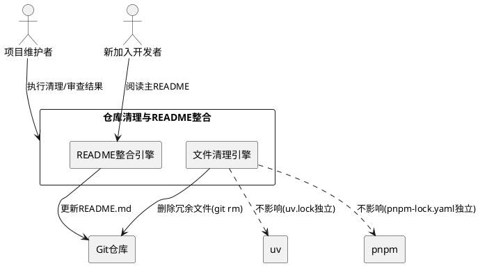
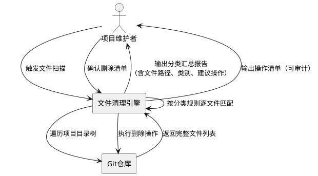
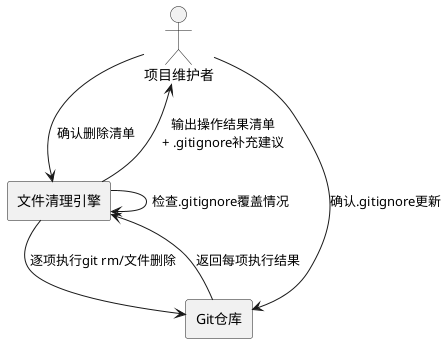
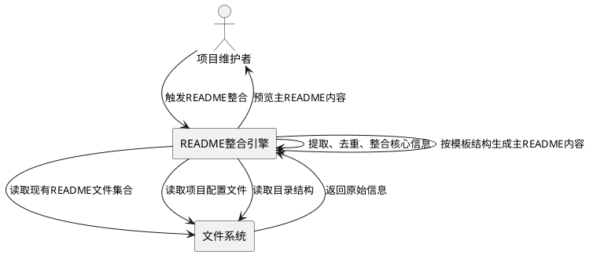
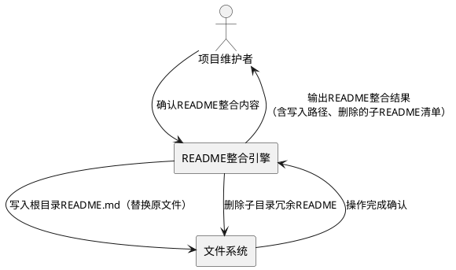

# **1. 组件定位**

## **1.1 核心职责**

本组件负责清理青年之心智能体平台仓库中的冗余文件并整合重构项目README文档，实现仓库整洁度和文档信息集中化的工程治理目标。

## **1.2 核心输入**

1. **项目完整目录树**：包含apps/（web-client、api-server、ai-worker）、packages/（9个共享包）、infrastructure/、scripts/、tests/、docs/、规范/等全部目录和文件
2. **现有README文件集合**：根目录README.md及apps/web-client/docs/下的旧版项目文档（项目结构、技术栈、数据模型与API设计、功能文档、界面设计方案等）
3. **.gitignore规则文件**：已定义的忽略模式（__pycache__/、*.pyc、*.db、dist/、*.tmp等），用于对比识别已被跟踪但应被忽略的文件
4. **项目配置文件**：pyproject.toml、package.json、pnpm-workspace.yaml、docker-compose.yml等，用于提取技术栈和项目结构信息
5. **开发者操作指令**：明确哪些文件属于必要保留、哪些属于可安全删除的判断依据

## **1.3 核心输出**

1. **清理后的仓库目录树**：移除所有临时文件、缓存文件、重复文件、无用构建产物、废弃配置、开发环境数据库文件后，仓库仅保留必要源码和配置
2. **统一的主README.md**：位于项目根目录的完整README文件，涵盖项目概述、技术栈、目录结构、安装步骤、使用方法、开发指南、部署说明等关键内容
3. **已删除的子目录README文件**：apps/和packages/下的冗余README文件被移除（如有）
4. **更新后的.gitignore**：补充遗漏的忽略模式，确保清理后的文件类型不会被重新提交
5. **清理操作清单**：记录每个被删除文件的路径、类型、删除理由，便于审计和回溯

## **1.4 职责边界**

1. **不负责**源代码逻辑的修改或重构（仅删除文件和重写文档）
2. **不负责**业务功能的新增或变更
3. **不负责**生产环境数据库的迁移或清洗（仅删除开发环境遗留的dev.db文件）
4. **不负责**node_modules/目录的清理（该目录由包管理器管理，应通过.gitignore和.git维护）
5. **不负责**.codeartsdoer/、.git/、.arts/等工具链元数据目录的修改
6. **不负责**apps/web-client/docs/下开发过程文档的重写（仅读取其中核心信息用于整合到主README）

# **2. 领域术语**

**冗余文件**
: 在版本控制仓库中被跟踪但无实际业务价值的文件，包括临时文件、缓存产物、重复文件、废弃配置等，删除后不影响项目正常构建和运行。

**临时文件**
: 开发过程中产生的中间产物，如*.tmp、*.temp、*.pid、*.seed等，通常由进程运行时自动生成，不应纳入版本控制。

**缓存文件**
: Python运行时产生的编译缓存，如__pycache__/目录和*.pyc字节码文件，可由解释器自动重建，不应纳入版本控制。

**构建产物**
: 前端构建工具（如Vite）生成的输出目录（如dist/），可通过构建命令重新生成，不应纳入版本控制。

**废弃配置文件**
: 因项目结构演进或工具链迁移而不再生效的配置文件，如根目录旧的package-lock.json（项目已迁移至pnpm）、旧的requirements.txt（项目已迁移至uv workspace）等。

**开发环境数据库文件**
: 开发调试时本地生成的SQLite数据库文件（如dev.db），包含测试数据和环境特定内容，不应纳入版本控制。

**重复OpenAPI规范文件**
: 多个位置存在相同或不同版本的openapi.json文件（如apps/web-client/openapi.json和apps/api-server/openapi.json），属于构建时产物或手动导出快照，应保留单一权威来源。

**主README（Master README）**
: 位于项目根目录的唯一综合性README.md文件，作为项目入口文档，涵盖项目全貌信息，替代散落在各子目录中的局部README文件。

**工程治理（Repository Hygiene）**
: 对代码仓库进行结构优化、冗余清理、文档整合等维护活动，目标是提升仓库的可读性、可维护性和新成员上手效率。

**EARS格式**
: Easy Approach to Requirements Syntax，一种简洁的需求语法模式，通过条件-主体-响应结构描述可验证的系统行为。

# **3. 角色与边界**

## **3.1 核心角色**

- **项目维护者**：负责执行仓库清理操作和README重写，需要了解项目完整结构和各文件用途
- **新加入开发者**：作为重写后README的主要受众，需要通过主README快速了解项目全貌和开发流程

## **3.2 外部系统**

- **Git版本控制系统**：上游依赖，清理操作需通过git rm或文件删除+git add完成，需确保删除操作可追溯
- **pnpm包管理器**：依赖方，根目录package-lock.json删除后pnpm不受影响（pnpm使用pnpm-lock.yaml）
- **uv包管理器**：依赖方，requirements.txt删除后uv不受影响（uv使用uv.lock）

## **3.3 交互上下文**

# **4. DFX约束**

## **4.1 性能**

1. 文件扫描和识别操作应当在30秒内完成（项目文件规模在万级以内）
2. README重写为纯文本操作，无性能约束

## **4.2 可靠性**

1. 删除操作必须生成完整的操作清单，支持一键回滚（通过git checkout恢复）
2. 删除操作不得破坏项目的构建和运行能力
3. 每个被删除文件必须在操作清单中有明确的分类标签和删除理由

## **4.3 安全性**

1. 禁止删除.git/目录下的任何内容
2. 禁止删除.codeartsdoer/目录下的任何内容（规格文档）
3. 禁止删除包含敏感信息的配置文件（.env、.env.example）——这些文件应保留
4. 禁止删除源代码文件（*.py、*.ts、*.tsx、*.js、*.jsx、*.vue等）
5. 所有删除操作前必须进行白名单校验，仅允许删除预定义类别的文件

## **4.4 可维护性**

1. 清理后需更新.gitignore，补充遗漏的忽略模式，防止同类文件再次被提交
2. README内容需与实际项目结构保持同步，变更目录结构时需同步更新README

## **4.5 兼容性**

1. 清理操作不得影响pnpm workspace的依赖解析（pnpm-lock.yaml须保留）
2. 清理操作不得影响uv workspace的依赖解析（uv.lock须保留）
3. 清理操作不得影响Docker构建流程（docker-compose.yml及相关配置须保留）

# **5. 核心能力**

## **5.1 冗余文件识别与分类**

### **5.1.1 业务规则**

1. **临时文件识别规则**：系统必须识别以下扩展名的文件为临时文件——*.tmp、*.temp、*.pid、*.seed、*.pid.lock

   a. 验收条件：[扫描到匹配*.tmp、*.temp、*.pid、*.seed、*.pid.lock扩展名的文件] → [将其分类为"临时文件"类别并纳入删除候选清单]

2. **缓存文件识别规则**：系统必须识别__pycache__/目录及其下所有*.pyc文件、以及独立的*.pyc、*.pyo、*.pyd文件为缓存文件

   a. 验收条件：[扫描到__pycache__/目录或*.pyc文件] → [将其分类为"缓存文件"类别并纳入删除候选清单]

3. **构建产物识别规则**：系统必须识别apps/web-client/dist/目录为前端构建产物；不得将node_modules/下的dist/或build/识别为项目构建产物

   a. 验收条件：[扫描到apps/web-client/dist/目录] → [将其分类为"构建产物"类别并纳入删除候选清单]

   b. 验收条件：[扫描到node_modules/下的dist/或build/目录] → [忽略，不纳入删除候选清单]

4. **废弃配置识别规则**：系统必须识别以下文件为废弃配置——根目录package-lock.json（项目已使用pnpm，应使用pnpm-lock.yaml）、根目录requirements.txt（项目已使用uv workspace，依赖由uv.lock管理）

   a. 验收条件：[扫描到根目录package-lock.json] → [将其分类为"废弃配置"类别并纳入删除候选清单，标注理由"项目已迁移至pnpm，使用pnpm-lock.yaml管理锁文件"]

   b. 验收条件：[扫描到根目录requirements.txt] → [将其分类为"废弃配置"类别并纳入删除候选清单，标注理由"项目已迁移至uv workspace，依赖由uv.lock管理"]

5. **开发数据库识别规则**：系统必须识别dev.db文件（根目录和apps/api-server/下）为开发环境数据库遗留

   a. 验收条件：[扫描到dev.db文件] → [将其分类为"开发环境数据库"类别并纳入删除候选清单，标注理由"开发环境SQLite数据库，不应纳入版本控制"]

6. **重复OpenAPI文件识别规则**：系统必须识别散落在多个位置的openapi.json为重复文件，仅保留后端源apps/api-server/openapi.json（如为动态生成则全删），删除apps/web-client/openapi.json

   a. 验收条件：[扫描到apps/web-client/openapi.json] → [将其分类为"重复文件"类别并纳入删除候选清单，标注理由"前端目录下的openapi.json为后端API规范快照，不应在前端仓库中保留"]

7. **IDE残留识别规则**：系统必须识别.vs/目录（Visual Studio残留）为IDE配置遗留

   a. 验收条件：[扫描到.vs/目录] → [将其分类为"IDE残留"类别并纳入删除候选清单，标注理由"Visual Studio配置残留，不应纳入版本控制"]

8. **空目录识别规则**：系统必须识别tmp/、data/、logs/等空目录为运行时占位目录

   a. 验收条件：[扫描到tmp/、data/、logs/等空目录] → [不纳入删除候选清单，但建议在.gitkeep中保留或通过.gitignore管理]

9. **禁止项**：禁止将以下文件/目录纳入删除候选清单

   a. 验收条件：[遇到.git/、.codeartsdoer/、.arts/、.gitignore、.env、.env.example、pyproject.toml、package.json、pnpm-workspace.yaml、pnpm-lock.yaml、uv.lock、docker-compose.yml、源代码文件] → [跳过，不纳入删除候选清单]

### **5.1.2 交互流程**

### **5.1.3 异常场景**

1. **文件正在被占用**

   a. 触发条件：被删除文件正被运行中的进程占用（如dev.db被SQLite连接占用）
   b. 系统行为：跳过该文件，在操作清单中标记为"删除失败-文件占用"
   c. 用户感知：操作清单中该文件条目状态为"失败"，提示需先停止占用进程

2. **文件分类不确定**

   a. 触发条件：某文件不匹配任何预定义的分类规则，但疑似冗余
   b. 系统行为：将该文件归入"待确认"类别，不自动删除
   c. 用户感知：分类汇总报告中该文件标记为"待确认"，需人工判断

3. **误删保护触发**

   a. 触发条件：某文件虽匹配分类规则，但被白名单排除（如.gitignore本身虽是配置文件但不应删除）
   b. 系统行为：跳过该文件，不纳入删除候选清单
   c. 用户感知：分类汇总报告中该文件标记为"受保护-跳过"

## **5.2 冗余文件删除**

### **5.2.1 业务规则**

1. **删除执行规则**：系统必须按照确认后的删除清单逐项执行删除，每项删除操作必须记录到操作清单

   a. 验收条件：[项目维护者确认删除清单] → [系统按清单逐项删除文件，并在操作清单中记录每项的执行结果（成功/失败/跳过）]

2. **Git感知删除规则**：对于已被Git跟踪的文件，系统必须使用`git rm`而非普通文件删除，确保删除操作被Git记录

   a. 验收条件：[被删除文件已被Git跟踪] → [使用`git rm`执行删除，使删除出现在Git暂存区]

   b. 验收条件：[被删除文件未被Git跟踪（如已被.gitignore排除但残留）] → [使用普通文件删除，无需`git rm`]

3. **.gitignore补充规则**：删除完成后，系统必须检查.gitignore是否已覆盖所有被删除文件的类型模式，对遗漏的模式提出补充建议

   a. 验收条件：[删除清单中包含__pycache__/类型文件但.gitignore中缺少该模式] → [提示补充`__pycache__/`到.gitignore]

   b. 验收条件：[删除清单中包含dev.db类型文件但.gitignore中缺少`*.db`模式] → [提示补充`*.db`到.gitignore]

4. **回滚保障规则**：系统必须确保所有删除操作可通过Git回溯恢复

   a. 验收条件：[删除操作完成前项目已提交至Git] → [可通过`git checkout HEAD -- <file>`恢复任何被删除的已跟踪文件]

5. **禁止项**：禁止批量删除时不生成操作清单；禁止在未确认的情况下自动删除"待确认"类别的文件

   a. 验收条件：[执行批量删除] → [必须先生成操作清单并获得确认后方可执行]

### **5.2.2 交互流程**

### **5.2.3 异常场景**

1. **Git仓库未初始化**

   a. 触发条件：项目目录未被Git初始化
   b. 系统行为：使用普通文件删除替代`git rm`，在操作清单中标注"非Git删除-无法通过Git回溯"
   c. 用户感知：操作清单警告"无法通过Git回滚，建议先初始化Git仓库"

2. **部分删除失败**

   a. 触发条件：删除清单中部分文件删除失败（权限不足等）
   b. 系统行为：继续执行剩余删除操作，在操作清单中标记失败项
   c. 用户感知：操作清单汇总"成功N项，失败M项"，失败项需人工处理

## **5.3 README信息采集与整合**

### **5.3.1 业务规则**

1. **信息源采集规则**：系统必须从以下来源采集README所需的核心信息

   a. 验收条件：[开始README整合] → [采集根目录现有README.md、apps/web-client/docs/下的项目结构文档和技术栈文档、pyproject.toml中的项目元数据、package.json中的脚本定义、pnpm-workspace.yaml中的工作区配置]

2. **项目概述信息提取规则**：系统必须从现有文档和配置中提取项目名称、项目定位、核心业务能力描述

   a. 验收条件：[采集到pyproject.toml中name="young-hearts-agent-platform"和description] → [在主README项目概述章节中包含"青年之心智能体平台"名称和Monorepo全栈项目定位]

3. **技术栈信息提取规则**：系统必须汇总项目使用的全部技术栈

   a. 验收条件：[采集到项目源码和配置] → [主README技术栈章节必须包含：前端（React 18+Vite+TypeScript+antd-mobile）、后端（FastAPI+SQLAlchemy+Pydantic+uv）、异步任务（Celery+Redis）、AI集成（豆包AI+RAG+ChromaDB/Milvus）、部署（Docker+Nginx）、工作区管理（pnpm-workspace+uv workspace）]

4. **目录结构信息提取规则**：系统必须根据实际目录树生成准确的目录结构说明

   a. 验收条件：[项目目录树包含apps/、packages/、infrastructure/、scripts/等目录] → [主README目录结构章节必须包含每个顶层目录及其子目录的说明，且说明与实际结构一致]

5. **安装步骤信息提取规则**：系统必须从package.json的scripts和pyproject.toml中提取依赖安装命令

   a. 验收条件：[package.json中定义了install:all脚本] → [主README安装步骤章节必须包含`pnpm run install:all`（或等效的pnpm install + uv sync命令）]

6. **使用方法信息提取规则**：系统必须从package.json的scripts中提取开发和构建命令

   a. 验收条件：[package.json中定义了dev、dev:api、dev:web、dev:worker、dev:all、build等脚本] → [主README使用方法章节必须包含这些命令及其说明]

7. **开发指南信息提取规则**：系统必须包含代码规范、工作流、测试等开发指导信息

   a. 验收条件：[pyproject.toml中配置了ruff和pytest] → [主README开发指南章节必须包含代码检查（ruff）和测试（pytest）命令]

8. **部署说明信息提取规则**：系统必须从docker-compose.yml和infrastructure/目录提取部署相关信息

   a. 验收条件：[项目包含docker-compose.yml和infrastructure/目录] → [主README部署说明章节必须包含Docker部署方式和相关配置说明]

9. **信息去重规则**：当多个信息源存在重复或冲突内容时，系统必须以当前实际状态为准，忽略旧文档中的过时描述

   a. 验收条件：[根目录现有README.md描述目录结构为/frontend和/backend（旧版单体结构）] → [忽略此过时描述，以当前apps/和packages/的Monorepo结构为准]

### **5.3.2 交互流程**

### **5.3.3 异常场景**

1. **信息源文件缺失**

   a. 触发条件：某个预期的信息源文件不存在（如apps/web-client/docs/下的技术栈文档缺失）
   b. 系统行为：从项目配置和源码中推断替代信息，标注该章节为"基于推断生成"
   c. 用户感知：主README预览中该章节有"推断标注"，建议人工核实

2. **信息源内容过时**

   a. 触发条件：旧文档描述的技术栈或目录结构与当前项目不符
   b. 系统行为：以当前pyproject.toml/package.json/目录树为准，忽略旧文档的过时内容
   c. 用户感知：主README内容与当前项目一致，旧文档的过时部分未被采纳

## **5.4 主README生成与子README清理**

### **5.4.1 业务规则**

1. **主README结构规则**：系统必须按照以下固定章节结构生成主README.md

   a. 验收条件：[生成主README.md] → [文件必须包含以下章节（按顺序）：项目概述、技术栈、目录结构、快速开始（安装+使用）、开发指南、部署说明、项目规范]

2. **主README语言规则**：系统必须使用简体中文撰写主README内容（代码块和命令除外）

   a. 验收条件：[生成主README.md] → [所有描述性文字使用简体中文，代码示例、命令、文件路径保持原文]

3. **主README完整性规则**：系统必须确保每个章节包含实质内容，不允许出现空章节或仅含占位符的章节

   a. 验收条件：[主README某章节仅有"TODO"占位符] → [该章节不合格，需补充实质内容或移除该章节]

4. **子README清理规则**：系统必须删除apps/和packages/子目录下的冗余README文件（如有），仅保留根目录主README.md

   a. 验收条件：[扫描到apps/或packages/下存在README文件且内容与主README信息重复] → [删除该子目录README文件，在操作清单中记录]

   b. 验收条件：[扫描到apps/或packages/下存在README文件且包含子项目特有信息] → [将该特有信息整合到主README对应章节后，再删除子目录README]

5. **旧版项目文档处理规则**：apps/web-client/docs/下的旧版项目文档（项目结构、技术栈、数据模型与API设计、功能文档等）为历史开发记录，系统不得删除这些文档，但可从中提取核心信息用于主README

   a. 验收条件：[扫描到apps/web-client/docs/下的项目文档] → [不纳入删除清单，但可读取提取核心信息]

6. **主README替换规则**：系统必须用新生成的主README替换根目录现有的README.md

   a. 验收条件：[根目录已存在README.md] → [用新生成的完整README内容替换原文件，原文件内容通过Git可追溯]

7. **禁止项**：禁止在主README中包含已删除文件的引用；禁止主README章节结构缺失

   a. 验收条件：[主README目录结构章节引用了被删除的文件或目录] → [必须移除该引用或更新为实际存在的路径]

### **5.4.2 交互流程**

### **5.4.3 异常场景**

1. **根目录README.md写入失败**

   a. 触发条件：文件系统权限不足或磁盘空间不够
   b. 系统行为：中止写入，保留原README.md不变
   c. 用户感知：错误提示"README.md写入失败，请检查文件权限或磁盘空间"

2. **子目录README包含独有信息**

   a. 触发条件：子目录README包含主README中未涵盖的子项目特有信息
   b. 系统行为：先将特有信息整合到主README，再删除子目录README
   c. 用户感知：主README中新增了子项目特有信息章节，子目录README随后被删除

# **6. 数据约束**

## **6.1 删除候选文件**

1. **文件路径**：必须为项目根目录下的相对路径，格式如`apps/api-server/dev.db`
2. **文件类别**：必须为以下枚举值之一——临时文件、缓存文件、构建产物、废弃配置、开发环境数据库、重复文件、IDE残留、待确认
3. **删除理由**：必须为完整陈述句，说明为何该文件可安全删除
4. **执行状态**：必须为以下枚举值之一——待执行、成功、失败-文件占用、失败-权限不足、跳过-受保护、跳过-待确认

## **6.2 .gitignore补充建议**

1. **忽略模式**：必须为合法的.gitignore模式语法（如`*.db`、`__pycache__/`）
2. **关联删除类别**：必须关联到某个删除文件类别，说明为何需要补充此模式
3. **当前状态**：必须标识该模式当前是否已存在于.gitignore中（true/false）

## **6.3 主README章节**

1. **章节名称**：必须为以下固定值之一——项目概述、技术栈、目录结构、快速开始、开发指南、部署说明、项目规范
2. **章节内容**：必须为非空Markdown文本，不允许仅有占位符
3. **章节顺序**：必须按照6.3中章节名称的列举顺序排列
