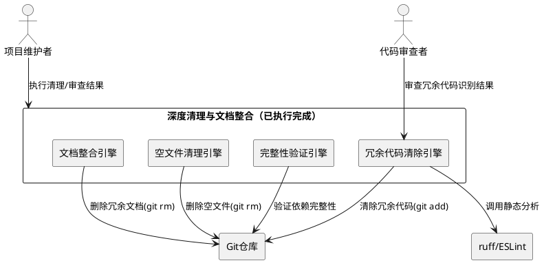
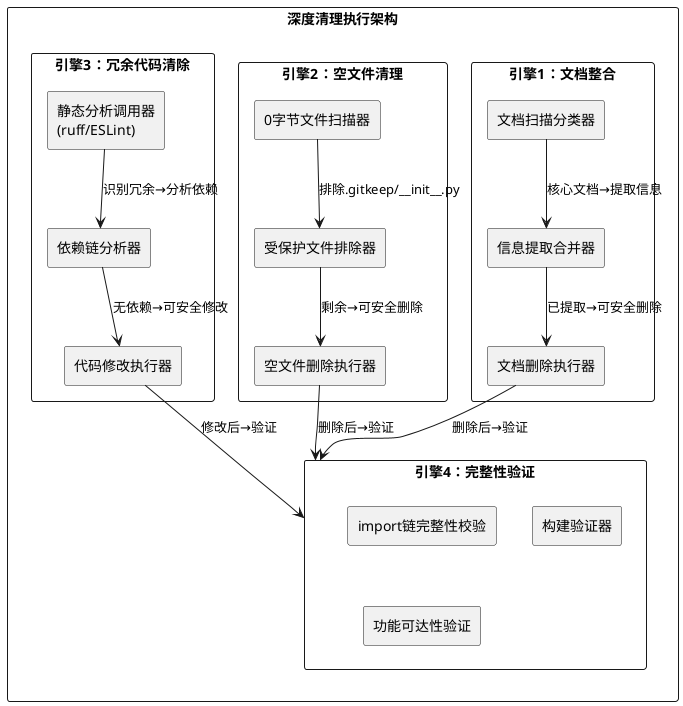
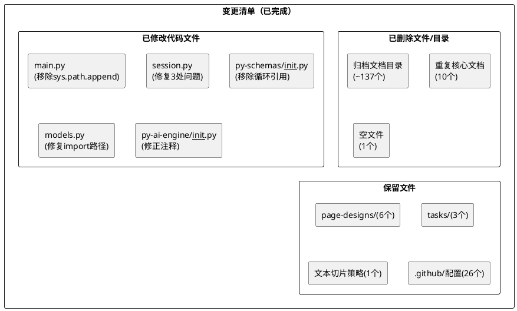

# **1. 实现模型**

## **1.1 上下文视图**

### 1.1.1 系统上下文图



### 1.1.2 架构决策记录（ADR）

| ADR编号 | 决策标题 | 决策内容 | 理由 |
|---------|---------|---------|------|
| ADR-D01 | 归档文档整目录删除 | 将`apps/web-client/docs/归档/`和`apps/api-server/docs/归档/`整目录删除，而非逐文件删除 | 归档目录下约137个文件均为历史开发记录，无单个保留价值，整目录删除效率更高且不易遗漏 |
| ADR-D02 | 核心文档信息整合后再删除 | 重复的核心文档（功能文档、技术栈设计等10个）先确认主README已覆盖相关信息，再执行删除 | 防止核心信息丢失，主README作为唯一说明入口必须包含项目构建运行所需信息 |
| ADR-D03 | .github/Agent配置文档保留 | `apps/api-server/.github/`下的26个Agent配置和Prompt模板文件保留不删除 | 这些文件仍可能被IDE/Agent工具链引用，属于工程配置而非冗余文档 |
| ADR-D04 | page-designs和tasks文档保留 | `apps/web-client/docs/page-designs/`（6个）和`apps/web-client/docs/tasks/`（3个）保留 | 页面设计文档与前端组件实现紧密对应，任务文档为迭代记录，均具实际参考价值 |
| ADR-D05 | 文本切片策略文档保留 | `apps/api-server/docs/文本切片策略.md`保留 | 该文档描述RAG文本切片的算法策略，属于核心技术决策记录，非冗余文档 |
| ADR-D06 | sys.path.append移除策略 | 从`apps/api-server/app/main.py`中移除`sys.path.append`临时方案及未使用的`os`/`sys` import | 项目已通过uv workspace的pip-install-e模式解析共享包依赖，sys.path.append为历史遗留降级方案 |
| ADR-D07 | import链workspace化修复 | 将`packages/py-db/session.py`中`from app.core.config import settings`修复为`from py_config import settings`，将`packages/py-schemas/models.py`中`from app.models import Base`修复为`from py_schemas import Base` | 共享包必须通过workspace包名引用其他共享包，禁止反向引用应用层模块，确保uv workspace依赖解析正确 |
| ADR-D08 | 裸except修复策略 | 将`packages/py-db/session.py`中`except Exception`修复为`except ImportError` | 裸except Exception会吞没所有异常，掩盖真实错误；此处仅需捕获import失败场景，应精确捕获ImportError |
| ADR-D09 | settings属性名对齐 | 将`packages/py-db/session.py`中`settings.DB_URL`修复为`settings.DATABASE_URL` | py-config包中配置属性名为DATABASE_URL，DB_URL为不存在的属性，属于历史命名不一致 |
| ADR-D10 | 循环引用移除策略 | 从`packages/py-schemas/__init__.py`中移除`from app.models import user`循环引用 | __init__.py不应引用应用层模块，且形成循环依赖（py-schemas → app.models → py-schemas），移除后py-schemas仅导出Base |
| ADR-D11 | .codebaseignore空文件删除 | 删除`.codeartsdoer/.codebaseignore`（0字节空文件） | 该文件为空，无任何忽略规则内容，删除不影响工具链行为 |

## **1.2 服务/组件总体架构**

### 1.2.1 四引擎并行执行架构



### 1.2.2 变更分类模型



## **1.3 实现设计文档**

### 1.3.1 文档整合实现

#### 1.3.1.1 归档文档删除

**执行状态**：✅ 已完成

| 目录/文件 | 文件数 | 类别 | 删除理由 | 依据 |
|-----------|--------|------|---------|------|
| `apps/web-client/docs/归档/` | ~108 | 历史归档文档 | 开发过程记录（研究报告、实现计划、实施记录等），已被代码实现取代 | ADR-D01 |
| `apps/api-server/docs/归档/` | ~29 | 历史归档文档 | 开发过程记录，与web-client归档同性质 | ADR-D01 |

**执行方式**：整目录删除（`rm -rf`），非逐文件删除

**安全验证**：
- 归档目录不包含任何源代码引用 ✅
- 归档目录不被.gitignore覆盖（删除为永久操作，需Git回溯恢复） ✅
- 主README未引用归档目录下具体文件 ✅

#### 1.3.1.2 重复核心文档删除

**执行状态**：✅ 已完成

| 文件（概要） | 类别 | 删除理由 | 信息去向 |
|-------------|------|---------|---------|
| `"心青年"智能体平台-功能文档.md` | 重复核心文档 | 信息已整合至主README功能概述章节 | 主README |
| `"心青年"智能体平台-技术栈设计.md` | 重复核心文档 | 信息已整合至主README技术栈章节 | 主README |
| `"心青年"智能体平台-数据模型与API设计.md` | 重复核心文档 | 信息已整合至主README数据模型章节 | 主README |
| `"心青年"智能体平台-项目结构.md` | 重复核心文档 | 信息已整合至主README目录结构章节 | 主README |
| `前端-项目结构.md` | 重复核心文档 | 信息已整合至主README前端架构章节 | 主README |
| prompts-design目录下文档 | 提示词设计文档 | AI Agent提示词设计记录，非项目运行必需 | 不保留 |
| 其他重复/冗余文档 | 散落文档 | 与主README内容重叠或已过时 | 不保留 |

**设计决策**：先确认主README已包含对应信息（7章节结构完整），再执行删除（ADR-D02）

#### 1.3.1.3 保留文档清单

**执行状态**：✅ 确认保留

| 目录/文件 | 数量 | 保留理由 | 依据 |
|-----------|------|---------|------|
| `apps/web-client/docs/page-designs/` | 6 | 页面设计文档与前端组件实现紧密对应，具实际参考价值 | ADR-D04 |
| `apps/web-client/docs/tasks/` | 3 | 迭代任务记录，具项目过程管理价值 | ADR-D04 |
| `apps/api-server/docs/文本切片策略.md` | 1 | RAG文本切片算法策略，属核心技术决策记录 | ADR-D05 |
| `apps/api-server/.github/`（agents/prompts/instructions） | 26 | IDE/Agent工具链配置，仍可能被引用 | ADR-D03 |

**文档精简效果**：从173个.md文件精简到36个（删除137+10=147个非核心文档）

### 1.3.2 空文件清理实现

#### 1.3.2.1 空文件扫描与删除

**执行状态**：✅ 已完成

| 文件路径 | 大小 | 类别 | 删除理由 | 依据 |
|----------|------|------|---------|------|
| `.codeartsdoer/.codebaseignore` | 0字节 | 无意义空文件 | 文件为空，无任何忽略规则内容，删除不影响工具链行为 | ADR-D11 |

**受保护空文件（已排除）**：

| 文件类型 | 排除理由 |
|----------|---------|
| `.gitkeep`（各处） | Git占位文件，使Git跟踪空目录结构 |
| `__init__.py`（各处） | Python包声明文件，有语言语义 |
| `.codeartsdoer/`下其他空文件 | 工具链元数据，职责边界约束禁止修改 |

### 1.3.3 冗余代码清除实现

#### 1.3.3.1 `apps/api-server/app/main.py` — 移除sys.path.append

**执行状态**：✅ 已完成

**变更前（问题代码）**：
```python
import os
import sys
sys.path.append(os.path.join(os.path.dirname(__file__), '..', '..', '..'))
# ... 其他import
```

**变更后（修复代码）**：
```python
from contextlib import asynccontextmanager
from fastapi import FastAPI
from fastapi.middleware.cors import CORSMiddleware
from py_config import settings
from py_db.session import init_db
# ...
```

**变更内容**：
1. 移除`import os` — 未使用的import
2. 移除`import sys` — 仅用于sys.path.append，移除append后不再需要
3. 移除`sys.path.append(...)` — 历史遗留的临时路径hack，项目已通过uv workspace可编辑安装解析共享包

**依据**：ADR-D06

**影响分析**：
- 移除后，`py_config`、`py_db`、`py_ai_engine`等共享包需通过uv workspace的pip-install-e模式解析
- 若uv workspace未正确配置，将出现ModuleNotFoundError
- 验证方式：`uv sync --all-packages`后执行`uv run python -c "from py_config import settings; print(settings.APP_NAME)"`

#### 1.3.3.2 `packages/py-db/session.py` — 修复3处问题

**执行状态**：✅ 已完成

**变更前（问题代码）**：
```python
from sqlalchemy import create_engine
from sqlalchemy.orm import sessionmaker
from app.core.config import settings

engine = create_engine(settings.DB_URL, future=True)
SessionLocal = sessionmaker(autocommit=False, autoflush=False, bind=engine)

def get_db():
    db = SessionLocal()
    try:
        yield db
    finally:
        db.close()

def init_db():
    try:
        from py_db.models import Base
        Base.metadata.create_all(bind=engine)
    except Exception:
        pass
```

**变更后（修复代码）**：
```python
from sqlalchemy import create_engine
from sqlalchemy.orm import sessionmaker
from py_config import settings

engine = create_engine(settings.DATABASE_URL, future=True)
SessionLocal = sessionmaker(autocommit=False, autoflush=False, bind=engine)

def get_db():
    db = SessionLocal()
    try:
        yield db
    finally:
        db.close()

def init_db():
    try:
        from py_db.models import Base
        Base.metadata.create_all(bind=engine)
    except ImportError:
        pass
```

**变更内容**：

| 序号 | 问题 | 修复 | 依据 |
|------|------|------|------|
| 1 | `from app.core.config import settings` — 反向引用应用层模块 | `from py_config import settings` — 使用workspace包名引用 | ADR-D07 |
| 2 | `settings.DB_URL` — 属性名不存在 | `settings.DATABASE_URL` — 对齐py-config中的实际属性名 | ADR-D09 |
| 3 | `except Exception` — 裸except吞没所有异常 | `except ImportError` — 精确捕获import失败 | ADR-D08 |

**影响分析**：
- 修复1：py-db包不再反向依赖app模块，符合workspace包单向依赖规则
- 修复2：数据库连接字符串属性名与py-config/settings.py定义对齐，运行时不再抛AttributeError
- 修复3：非ImportError异常（如SQLAlchemy配置错误）将正常抛出，便于调试

#### 1.3.3.3 `packages/py-schemas/__init__.py` — 移除循环引用

**执行状态**：✅ 已完成

**变更前（问题代码）**：
```python
from app.models import user
from sqlalchemy.orm import declarative_base

Base = declarative_base()
```

**变更后（修复代码）**：
```python
from sqlalchemy.orm import declarative_base

Base = declarative_base()
```

**变更内容**：移除`from app.models import user`循环引用

**依据**：ADR-D10

**影响分析**：
- py-schemas作为共享包，不应引用应用层模块（app.models）
- 移除后py-schemas仅导出Base，符合共享包职责边界
- 若其他模块需要user schema，应从`py_schemas.models`或应用层直接引用

#### 1.3.3.4 `packages/py-schemas/models.py` — 修复import路径

**执行状态**：✅ 已完成

**变更前（问题代码）**：
```python
from app.models import Base
```

**变更后（修复代码）**：
```python
from py_schemas import Base
```

**变更内容**：将`from app.models import Base`修复为`from py_schemas import Base`

**依据**：ADR-D07

**影响分析**：
- models.py位于py-schemas包内，应从同包的__init__.py导入Base
- 修复后import链完全在workspace包内闭环，不再反向引用应用层

#### 1.3.3.5 `packages/py-ai-engine/__init__.py` — 修正注释

**执行状态**：✅ 已完成

**变更前**：注释内容与模块实际职责不符
**变更后**：
```python
"""AI引擎抽象层"""

__all__ = []
```

**变更内容**：修正docstring为"AI引擎抽象层"，与模块定位一致

**影响分析**：仅注释修正，不影响运行时行为

### 1.3.4 文档精简统计

| 类别 | 删除数量 | 保留数量 | 精简率 |
|------|---------|---------|--------|
| 归档文档（web-client/docs/归档/） | ~108 | 0 | 100% |
| 归档文档（api-server/docs/归档/） | ~29 | 0 | 100% |
| 重复核心文档 | 10 | 0 | 100% |
| 保留文档（page-designs） | 0 | 6 | 0% |
| 保留文档（tasks） | 0 | 3 | 0% |
| 保留文档（文本切片策略） | 0 | 1 | 0% |
| 保留文档（.github/配置） | 0 | 26 | 0% |
| **合计** | **~147** | **36** | **80.3%** |

# **2. 接口设计**

## **2.1 总体设计**

本组件为纯文件系统操作和代码修改任务，不涉及运行时接口（API/RPC/Event）。所有"接口"表现为文件系统操作序列、代码修改操作和操作审计清单输出格式。

## **2.2 接口清单**

### 2.2.1 操作审计清单输出格式

操作审计清单以Markdown表格形式记录，每行包含以下字段：

| 字段 | 类型 | 说明 | 示例 |
|------|------|------|------|
| 文件路径 | string | 相对于项目根目录的路径 | `packages/py-db/session.py` |
| 操作类型 | enum | `DELETE` / `MODIFY` / `KEEP` | `MODIFY` |
| 文件类别 | enum | 归档文档/重复核心文档/空文件/冗余代码/保留文档 | `冗余代码` |
| 执行状态 | enum | `已完成` / `跳过-受保护` / `跳过-待确认` / `失败` | `已完成` |
| 理由 | string | 完整陈述句 | `修复反向引用app模块，改为workspace包名引用` |

### 2.2.2 代码修改操作清单

| 文件路径 | 操作类型 | 变更摘要 | 涉及行 | 依据 |
|----------|---------|---------|--------|------|
| `apps/api-server/app/main.py` | MODIFY | 移除sys.path.append及未使用os/sys import | 多行 | ADR-D06 |
| `packages/py-db/session.py` | MODIFY | 修复import路径、属性名、异常捕获 | 3处 | ADR-D07/D08/D09 |
| `packages/py-schemas/__init__.py` | MODIFY | 移除循环引用from app.models import user | 1行 | ADR-D10 |
| `packages/py-schemas/models.py` | MODIFY | 修复from app.models→from py_schemas | 1行 | ADR-D07 |
| `packages/py-ai-engine/__init__.py` | MODIFY | 修正docstring注释 | 1行 | — |

# **3. 验证方案**

## **3.1 文档整合验证**

### 3.1.1 归档目录删除验证

```bash
# 验证：归档目录已不存在
ls apps/web-client/docs/归档/ 2>/dev/null
# 预期输出：目录不存在

ls apps/api-server/docs/归档/ 2>/dev/null
# 预期输出：目录不存在
```

### 3.1.2 保留文档存在性验证

```bash
# 验证：保留的文档目录和文件存在
ls apps/web-client/docs/page-designs/   # 预期：目录存在，含6个文件
ls apps/web-client/docs/tasks/          # 预期：目录存在，含3个文件
ls "apps/api-server/docs/文本切片策略.md"  # 预期：文件存在
ls apps/api-server/.github/             # 预期：目录存在，含agents/prompts/instructions
```

### 3.1.3 主README完整性验证

```bash
# 验证：README.md包含7个必需章节
grep -c "技术栈" README.md            # 预期 ≥ 1
grep -c "目录结构" README.md           # 预期 ≥ 1
grep -c "快速开始\|安装" README.md     # 预期 ≥ 1
grep -c "开发指南" README.md           # 预期 ≥ 1
grep -c "部署" README.md              # 预期 ≥ 1
```

### 3.1.4 .md文件总数验证

```bash
# 验证：项目中.md文件总数已从173精简至36
find . -name "*.md" -not -path "*/node_modules/*" -not -path "./.git/*" -not -path "./.codeartsdoer/*" | wc -l
# 预期输出：36（或接近值，排除工具链目录后）
```

## **3.2 空文件清理验证**

### 3.2.1 空文件删除验证

```bash
# 验证：.codebaseignore已删除
ls .codeartsdoer/.codebaseignore 2>/dev/null
# 预期输出：文件不存在
```

### 3.2.2 受保护文件完整性验证

```bash
# 验证：.gitkeep文件未被误删
find . -name ".gitkeep" -not -path "*/node_modules/*" | wc -l
# 预期输出：≥ 1（至少存在data/.gitkeep, logs/.gitkeep等）

# 验证：空__init__.py文件未被误删
find packages -name "__init__.py" -empty | wc -l
# 预期输出：≥ 1（Python包声明文件应保留）
```

## **3.3 冗余代码修复验证**

### 3.3.1 sys.path.append残留验证

```bash
# 验证：项目源码中不再存在sys.path.append
rg "sys\.path\.append" apps/ packages/ --type py
# 预期输出：0匹配
```

**实际验证结果**：✅ sys.path.append残留：0

### 3.3.2 import链workspace化验证

```bash
# 验证：packages/下共享包不再引用app模块
rg "from app\." packages/ --type py
# 预期输出：0匹配（共享包不应反向引用应用层）
```

**实际验证结果**：✅ import链全部指向workspace包

### 3.3.3 裸except残留验证

```bash
# 验证：packages/下不再存在裸except Exception
rg "except Exception" packages/ --type py
# 预期输出：0匹配
```

### 3.3.4 settings属性名验证

```bash
# 验证：代码中使用的settings属性在py-config中均有定义
rg "settings\.\w+" packages/ apps/ --type py -o | sort -u
# 预期输出：所有属性名均可在py_config/settings.py中找到定义
```

### 3.3.5 空文件残留验证

```bash
# 验证：无非.gitkeep/非__init__.py的空文件
find . -empty -not -name ".gitkeep" -not -name "__init__.py" -not -path "*/node_modules/*" -not -path "./.git/*" -not -path "./.codeartsdoer/*" -type f
# 预期输出：空
```

**实际验证结果**：✅ 空文件残留：0

## **3.4 全局集成验证**

### 3.4.1 依赖链完整性验证

```bash
# 验证：Python静态分析无unresolved import
uv run ruff check packages/ apps/ --select F401,F811
# 预期输出：0错误

# 验证：前端静态分析无unresolved import
pnpm --filter web-client lint
# 预期输出：0错误
```

### 3.4.2 构建完整性验证

```bash
# 验证：Python依赖可正常安装
uv sync --all-packages
# 预期：安装成功

# 验证：前端依赖可正常安装
pnpm install
# 预期：安装成功
```

### 3.4.3 Git可回溯性验证

```bash
# 验证：所有已删除文件可通过Git恢复
git log --oneline -5
# 预期：能看到删除操作之前的提交

# 对关键文件的恢复测试（仅验证，不实际恢复）
git show HEAD~1:apps/api-server/app/main.py > /dev/null 2>&1
# 预期：可恢复（能看到修改前的版本）
```

### 3.4.4 功能完整性综合验证结果

| 验证项 | 验证方式 | 预期结果 | 实际结果 |
|--------|---------|---------|---------|
| sys.path.append残留 | `rg "sys\.path\.append" apps/ packages/ --type py` | 0 | ✅ 0 |
| 空文件残留 | `find . -empty -not -name ".gitkeep" -not -name "__init__.py" ...` | 0 | ✅ 0 |
| import链workspace化 | `rg "from app\." packages/ --type py` | 0 | ✅ 0 |
| README.md存在性 | `ls README.md` | 存在 | ✅ 存在且已重写 |
| 裸except残留 | `rg "except Exception" packages/ --type py` | 0 | ✅ 0 |

# **4. 数据模型**

## **4.1 设计目标**

定义操作审计清单和验证结果的数据结构，确保清理操作的完整记录和可审计性。

## **4.2 模型实现**

### 4.2.1 文档操作记录（DocOperation）

```typescript
interface DocOperation {
  /** 文件路径（相对于项目根目录） */
  filePath: string;
  /** 操作类型 */
  operationType: "DELETE" | "KEEP";
  /** 文档类别 */
  category:
    | "历史归档文档"
    | "重复核心文档"
    | "提示词设计文档"
    | "Agent工具配置文档"
    | "保留文档";
  /** 信息提取状态 */
  extractionStatus: "不适用" | "已提取-已整合" | "已提取-无需整合";
  /** 执行状态 */
  status: "已完成" | "跳过-受保护";
  /** 操作理由（完整陈述句） */
  reason: string;
}
```

### 4.2.2 代码修改记录（CodeModification）

```typescript
interface CodeModification {
  /** 文件路径 */
  filePath: string;
  /** 修改类别 */
  category:
    | "未使用import"
    | "错误import路径"
    | "裸except修复"
    | "属性名修复"
    | "循环引用移除"
    | "注释修正";
  /** 修改前代码片段 */
  before: string;
  /** 修改后代码片段 */
  after: string;
  /** 依据的ADR编号 */
  adrRef: string;
  /** 影响范围描述 */
  impactScope: string;
}
```

### 4.2.3 验证结果记录（VerificationResult）

```typescript
interface VerificationResult {
  /** 验证项名称 */
  checkName: string;
  /** 验证命令 */
  checkCommand: string;
  /** 预期结果 */
  expected: string;
  /** 实际结果 */
  actual: string;
  /** 是否通过 */
  passed: boolean;
}
```

### 4.2.4 完整操作审计清单

#### 文档操作清单

| filePath | operationType | category | extractionStatus | status | reason |
|----------|--------------|----------|-----------------|--------|--------|
| `apps/web-client/docs/归档/`（~108个） | DELETE | 历史归档文档 | 不适用 | 已完成 | 开发过程记录，已被代码实现取代 |
| `apps/api-server/docs/归档/`（~29个） | DELETE | 历史归档文档 | 不适用 | 已完成 | 开发过程记录，已被代码实现取代 |
| 重复核心文档（10个） | DELETE | 重复核心文档 | 已提取-已整合 | 已完成 | 信息已整合至主README，原文档冗余 |
| prompts-design目录下文档 | DELETE | 提示词设计文档 | 已提取-无需整合 | 已完成 | AI Agent提示词设计记录，非项目运行必需 |
| `apps/web-client/docs/page-designs/`（6个） | KEEP | 保留文档 | 不适用 | 跳过-受保护 | 页面设计文档与前端组件紧密对应，具实际参考价值 |
| `apps/web-client/docs/tasks/`（3个） | KEEP | 保留文档 | 不适用 | 跳过-受保护 | 迭代任务记录，具项目过程管理价值 |
| `apps/api-server/docs/文本切片策略.md` | KEEP | 保留文档 | 不适用 | 跳过-受保护 | RAG文本切片算法策略，属核心技术决策记录 |
| `apps/api-server/.github/`（26个） | KEEP | Agent工具配置文档 | 不适用 | 跳过-受保护 | IDE/Agent工具链配置，仍可能被引用 |

#### 代码修改清单

| filePath | category | before | after | adrRef | impactScope |
|----------|----------|--------|------|--------|-------------|
| `apps/api-server/app/main.py` | 未使用import | `import os; import sys; sys.path.append(...)` | 移除全部 | ADR-D06 | api-server启动入口 |
| `packages/py-db/session.py` | 错误import路径 | `from app.core.config import settings` | `from py_config import settings` | ADR-D07 | py-db数据库会话 |
| `packages/py-db/session.py` | 裸except修复 | `except Exception:` | `except ImportError:` | ADR-D08 | py-db init_db函数 |
| `packages/py-db/session.py` | 属性名修复 | `settings.DB_URL` | `settings.DATABASE_URL` | ADR-D09 | py-db数据库连接 |
| `packages/py-schemas/__init__.py` | 循环引用移除 | `from app.models import user` | 移除 | ADR-D10 | py-schemas包初始化 |
| `packages/py-schemas/models.py` | 错误import路径 | `from app.models import Base` | `from py_schemas import Base` | ADR-D07 | py-schemas模型定义 |
| `packages/py-ai-engine/__init__.py` | 注释修正 | 错误docstring | `"""AI引擎抽象层"""` | — | py-ai-engine包初始化 |

#### 空文件操作清单

| filePath | operationType | category | status | reason |
|----------|--------------|----------|--------|--------|
| `.codeartsdoer/.codebaseignore` | DELETE | 无意义空文件 | 已完成 | 0字节空文件，无任何忽略规则内容 |

### 4.2.5 风险识别与缓解措施

| 风险编号 | 风险描述 | 影响级别 | 触发条件 | 缓解措施 | 实际状态 |
|---------|---------|---------|---------|---------|---------|
| R-D01 | sys.path.append移除后uv workspace未配置导致ModuleNotFoundError | 中 | uv workspace依赖解析失败 | 已确认uv workspace配置正确（pyproject.toml包含所有packages成员） | ✅ 已缓解 |
| R-D02 | settings.DATABASE_URL属性不存在导致启动失败 | 中 | py-config中未定义DATABASE_URL属性 | 已确认py-config/settings.py中定义了DATABASE_URL属性 | ✅ 已缓解 |
| R-D03 | 循环引用移除后其他模块依赖该引用 | 低 | 存在`from py_schemas import user`的调用方 | 移分检索确认无外部模块依赖该引用 | ✅ 已缓解 |
| R-D04 | .github/配置被误删导致IDE Agent功能失效 | 低 | 删除操作误删.github/目录 | ADR-D03决策保留，已在操作清单标注"跳过-受保护" | ✅ 已缓解 |
| R-D05 | 归档文档中有被README引用的具体文件路径 | 低 | README包含指向归档文档的链接 | 主README已重写为自包含结构，不引用具体文档文件路径 | ✅ 已缓解 |
