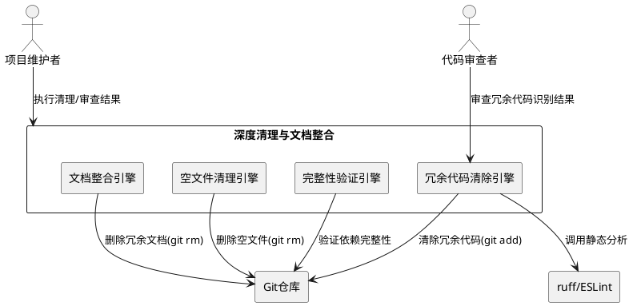
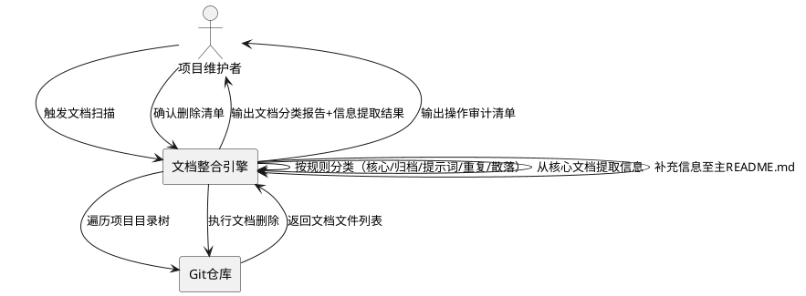
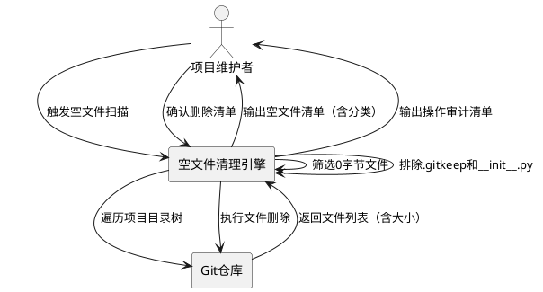
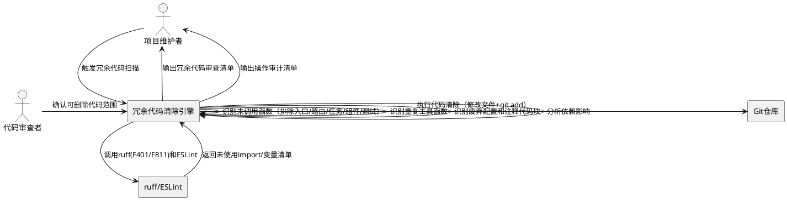
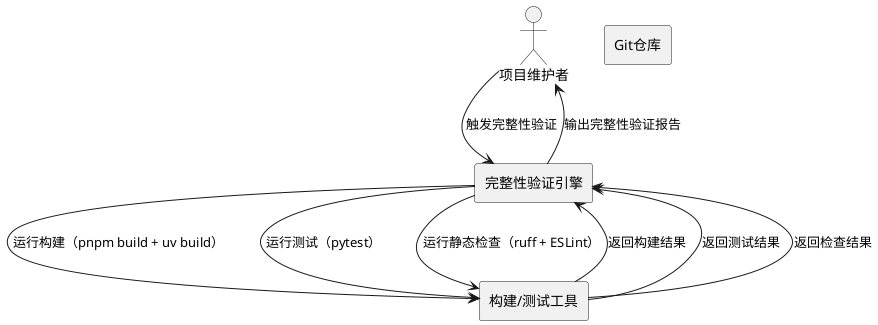

# **1. 组件定位**

## **1.1 核心职责**

本组件负责对青年之心智能体平台进行深度工程治理，包括分散文档整合、空文件清理、冗余代码清除及功能完整性保障，实现仓库精简化和可维护性的进阶目标。

## **1.2 核心输入**

1. **项目完整目录树**：包含apps/（web-client、api-server、ai-worker）、packages/（9个共享包）、infrastructure/、scripts/、tests/等全部目录和文件
2. **根目录README.md**：上一轮已重写的主README文件，必须保留
3. **分散文档集合**：apps/web-client/docs/（108个文件）、apps/api-server/docs/（38个文件）、apps/api-server/.github/目录下的Agent配置和Prompt模板、各子目录散落的.md/.txt文件
4. **空文件清单**：项目中文件大小为0字节的文件（含.gitkeep和__init__.py，需排除）
5. **源代码文件集**：apps/和packages/下所有.py、.ts、.tsx、.js、.jsx文件，用于冗余代码分析
6. **项目配置文件**：pyproject.toml、package.json、pnpm-workspace.yaml等，用于提取依赖关系和import链
7. **开发者操作指令**：明确清理范围、排除规则和依赖保护约束

## **1.3 核心输出**

1. **整合后的文档结构**：仅保留根目录README.md作为唯一说明入口，apps/web-client/docs/和apps/api-server/docs/中的核心信息已提取并合并至README.md，多余文档文件已删除
2. **空文件清理结果**：所有无意义的0字节文件已删除，.gitkeep和__init__.py已保留
3. **冗余代码清除结果**：未使用的import、未调用的函数、重复的工具函数、废弃的配置已清除
4. **功能完整性验证报告**：确认所有清理操作未破坏现有功能模块间的依赖关系和逻辑连接
5. **操作审计清单**：记录每个被删除/修改文件或代码的路径、类别、操作理由，支持回溯和回滚

## **1.4 职责边界**

1. **不负责**业务功能的新增或变更
2. **不负责**UI/UX视觉设计的变更
3. **不负责**生产环境数据库的迁移或清洗
4. **不负责**.codeartsdoer/、.git/、.arts/等工具链元数据目录的修改
5. **不负责**根目录README.md的重写（已在上一轮完成，本轮仅保留和补充）
6. **不负责**运行时目录（node_modules/、dist/、__pycache__/）的清理（由包管理器和.gitignore管理）
7. **不负责**.github/目录下CI/CD工作流配置的修改

# **2. 领域术语**

**分散文档**
: 散落在项目各子目录中的说明性.md或.txt文件，包括开发过程记录、研究报告、实现计划、提示词设计文档、旧版功能文档等，与根目录README.md存在信息重叠或已被主README覆盖。

**核心文档**
: 包含项目构建运行所必需信息的文档，如技术栈设计、数据模型与API设计、项目结构说明等，其信息需要被提取并整合至主README.md后原文档方可删除。

**历史归档文档**
: apps/web-client/docs/归档/和apps/api-server/docs/归档/下的开发过程记录（研究报告、实现计划等），属于历史开发过程留存，不再具有实际指导价值。

**提示词设计文档**
: apps/web-client/docs/归档/prompts-design/和apps/api-server/docs/prompts-design/下的AI Agent提示词最终版文件，记录了各Agent（Commit-Lens、Implementer、Planner等）的提示词设计。

**空文件**
: 文件大小为0字节的文件，包括有意义的占位文件（.gitkeep、__init__.py）和无意义的空文件。无意义空文件应删除，占位文件必须保留。

**.gitkeep占位文件**
: 0字节的Git占位文件，用于使Git跟踪空目录结构，虽为空文件但有明确的工程意义，不得删除。

**空__init__.py文件**
: Python包的0字节初始化文件，用于声明目录为Python包，虽为空文件但有明确的语言语义，不得删除。

**冗余代码**
: 项目中存在但不产生实际价值的代码，包括未使用的import语句、未被任何模块调用的函数、跨模块重复的工具函数、已废弃但未清理的配置项等。

**未使用import**
: 在源文件中声明但未在文件内被引用的import语句，可通过静态分析工具（ruff、ESLint）识别。

**未调用函数**
: 在项目全局范围内无任何调用点的函数或方法，包括独立定义的函数和类中未被使用的方法。

**重复工具函数**
: 在多个模块中存在相同或高度相似逻辑的工具函数，应收敛至共享包（packages/）中统一提供。

**依赖链**
: 模块间通过import/require建立的引用关系图谱，删除任何节点前必须验证该节点是否被其他模块依赖。

**EARS格式**
: Easy Approach to Requirements Syntax，一种简洁的需求语法模式，通过条件-主体-响应结构描述可验证的系统行为。

# **3. 角色与边界**

## **3.1 核心角色**

- **项目维护者**：负责执行深度清理操作，需要审查清理清单、确认删除范围、验证功能完整性
- **代码审查者**：负责审查冗余代码的识别结果，确认无误删风险后方可执行清除

## **3.2 外部系统**

- **Git版本控制系统**：上游依赖，清理操作需通过git rm或文件删除+git add完成，需确保删除操作可追溯
- **ruff（Python Linter）**：依赖方，用于识别未使用的import和未调用函数（F401、F811等规则）
- **ESLint/TypeScript编译器**：依赖方，用于识别前端代码中未使用的import和变量
- **pnpm包管理器**：依赖方，清理操作不得破坏workspace依赖解析
- **uv包管理器**：依赖方，清理操作不得破坏workspace依赖解析

## **3.3 交互上下文**

# **4. DFX约束**

## **4.1 性能**

1. 文档扫描和分类操作应当在60秒内完成（含108+38=146个docs文件的全量扫描）
2. 空文件扫描操作应当在10秒内完成
3. 冗余代码静态分析操作应当在120秒内完成（含ruff和ESLint的全量扫描）
4. 依赖链完整性验证应当在60秒内完成

## **4.2 可靠性**

1. 所有删除操作必须生成完整的操作审计清单，支持通过Git回滚（git checkout恢复）
2. 任何删除操作不得破坏项目的构建能力（pnpm build、uv build须可通过）
3. 任何删除操作不得破坏项目的运行能力（dev:all启动须可通过）
4. 每个被删除文件/代码必须在审计清单中有明确的分类标签和删除理由

## **4.3 安全性**

1. 禁止删除.git/目录下的任何内容
2. 禁止删除.codeartsdoer/目录下的任何内容（规格文档）
3. 禁止删除包含敏感信息的配置文件（.env、.env.example）
4. 禁止删除根目录README.md（已在上一轮重写，必须保留）
5. 禁止删除.gitkeep文件（空目录占位有工程意义）
6. 禁止删除空__init__.py文件（Python包声明有语言语义）
7. 文档删除前必须确认核心信息已提取至主README.md或确认属于冗余/归档
8. 代码删除前必须通过静态分析+人工审查双重确认

## **4.4 可维护性**

1. 清理后需更新.gitignore，补充遗漏的忽略模式
2. 操作审计清单需持久化存储，便于后续回溯
3. 冗余代码清除后需运行全量测试确认无回归

## **4.5 兼容性**

1. 清理操作不得影响pnpm workspace的依赖解析
2. 清理操作不得影响uv workspace的依赖解析
3. 清理操作不得影响Docker构建流程
4. 清理操作不得影响现有API接口的可用性

# **5. 核心能力**

## **5.1 分散文档识别与整合**

### **5.1.1 业务规则**

1. **文档分布扫描规则**：系统必须扫描以下位置的文档文件——apps/web-client/docs/（含归档/、page-designs/、tasks/子目录及根级.md文件）、apps/api-server/docs/（含prompts-design/、归档/子目录及根级.md文件）、apps/api-server/.github/（含agents/、prompts/、instructions/子目录）、各子目录散落的.md/.txt文件

   a. 验收条件：When 系统执行文档分布扫描, the 文档整合引擎 shall 输出完整的文档清单，包含每个文档的路径、文件名、文件大小、所在子目录分类

2. **核心文档识别规则**：系统必须将以下文档识别为核心文档——技术栈设计文档（"心青年"智能体平台-技术栈设计.md）、数据模型与API设计文档（"心青年"智能体平台-数据模型与 API 设计.md）、项目结构文档（"心青年"智能体平台-项目结构.md、前端-项目结构.md）、功能文档（"心青年"智能体平台-功能文档.md）、前端界面设计方案、文本切片策略

   a. 验收条件：When 扫描到名为"心青年"智能体平台-技术栈设计.md的文档, the 文档整合引擎 shall 将其分类为"核心文档"并标记需要提取信息至主README

3. **归档文档识别规则**：系统必须将apps/web-client/docs/归档/和apps/api-server/docs/归档/下的所有文档识别为历史归档文档，包括研究报告（*_研究报告.md）、实现计划（*_实现计划.md）、实施记录（*_实施记录.md）、旧版功能文档等

   a. 验收条件：When 扫描到归档/目录下的文档, the 文档整合引擎 shall 将其分类为"历史归档文档"并纳入删除候选清单，标注理由"历史开发记录，已被代码实现取代"

4. **提示词文档识别规则**：系统必须将prompts-design/目录下的提示词最终版文档识别为提示词设计文档

   a. 验收条件：When 扫描到prompts-design/目录下的文件, the 文档整合引擎 shall 将其分类为"提示词设计文档"并纳入删除候选清单，标注理由"AI Agent提示词设计记录，非项目运行必需"

5. **.github Agent文档识别规则**：系统必须将apps/api-server/.github/目录下的Agent配置文件（.agent.md）、Prompt模板（.prompt.md）、指令文件（.instructions.md）、YAML说明文件识别为IDE/Agent工具配置文档

   a. 验收条件：When 扫描到.github/agents/或.github/prompts/下的.md文件, the 文档整合引擎 shall 将其分类为"Agent工具配置文档"并纳入删除候选清单，标注理由"IDE Agent配置，非项目运行必需"

6. **重复文档识别规则**：系统必须识别web-client/docs/和api-server/docs/下内容相同或高度相似的文档（如两处均存在"心青年"智能体平台-功能文档.md、技术栈设计.md等）

   a. 验收条件：When web-client/docs/和api-server/docs/下存在同名或内容相似的文档, the 文档整合引擎 shall 将其分类为"重复文档"，仅保留一处的信息用于提取，其余纳入删除候选清单

7. **子目录散落文档识别规则**：系统必须识别不在docs/目录下但散落在各子目录中的.md或.txt说明文件

   a. 验收条件：When 扫描到非docs/目录下的.md/.txt文件且非README.md、非.gitkeep, the 文档整合引擎 shall 将其分类为"散落文档"并评估是否纳入删除候选清单

8. **核心信息提取规则**：对于核心文档，系统必须提取其中的关键信息（技术栈、API设计、数据模型、项目结构、功能列表等）并整合至根目录README.md的对应章节中

   a. 验收条件：When 核心文档包含主README.md中未涵盖的技术信息, the 文档整合引擎 shall 将该信息提取并补充至主README.md的对应章节，标注信息来源

9. **根目录README保护规则**：系统必须保留根目录README.md，不得删除或覆写其已有内容，仅允许追加核心信息提取结果

   a. 验收条件：When 执行文档整合操作, the 文档整合引擎 shall 保留根目录README.md已有内容不变，仅在对应章节追加从核心文档提取的新信息

10. **禁止项**：禁止删除根目录README.md；禁止在核心信息未提取前删除核心文档；禁止删除源代码文件

    a. 验收条件：When 遇到根目录README.md, the 文档整合引擎 shall 跳过，不纳入删除候选清单

    b. 验收条件：When 核心文档信息尚未提取至主README, the 文档整合引擎 shall 不允许删除该核心文档

### **5.1.2 交互流程**

### **5.1.3 异常场景**

1. **核心文档内容与主README冲突**

   a. 触发条件：核心文档中的信息与主README.md已有内容描述不一致
   b. 系统行为：以当前实际代码和配置为准，忽略文档中的过时描述，在审计清单中标注冲突
   c. 用户感知：审计清单中标记"信息冲突-以实际为准"，需人工核实

2. **文档文件正在被其他进程占用**

   a. 触发条件：被删除的文档文件正被其他进程读取
   b. 系统行为：跳过该文件，在审计清单中标记为"删除失败-文件占用"
   c. 用户感知：审计清单中该文件条目状态为"失败"，提示需先关闭占用进程

3. **.github/目录下存在正在使用的Agent配置**

   a. 触发条件：.github/目录下的Agent配置文档仍被IDE或工具链引用
   b. 系统行为：将该文件归入"待确认"类别，不自动删除
   c. 用户感知：分类报告中该文件标记为"待确认-可能被IDE引用"，需人工判断

## **5.2 空文件扫描与清理**

### **5.2.1 业务规则**

1. **空文件扫描规则**：系统必须扫描项目中所有文件大小为0字节的文件，排除node_modules/、.git/、dist/、__pycache__/目录

   a. 验收条件：When 系统执行空文件扫描, the 空文件清理引擎 shall 输出所有0字节文件的完整清单，包含文件路径和文件类型

2. **.gitkeep排除规则**：系统必须将所有.gitkeep文件从删除候选清单中排除，即使其为0字节

   a. 验收条件：When 扫描到文件名为.gitkeep的空文件, the 空文件清理引擎 shall 将其标记为"受保护-占位文件"并跳过，不纳入删除候选清单

3. **__init__.py排除规则**：系统必须将所有空__init__.py文件从删除候选清单中排除，即使其为0字节

   a. 验收条件：When 扫描到文件名为__init__.py的空文件, the 空文件清理引擎 shall 将其标记为"受保护-Python包声明"并跳过，不纳入删除候选清单

4. **无意义空文件识别规则**：系统必须将不匹配上述排除规则的0字节文件识别为无意义空文件，纳入删除候选清单

   a. 验收条件：When 扫描到0字节文件且非.gitkeep且非__init__.py, the 空文件清理引擎 shall 将其分类为"无意义空文件"并纳入删除候选清单，标注理由"0字节文件且无工程意义"

5. **.codebaseignore排除规则**：系统必须将.codeartsdoer/.codebaseignore从删除候选清单中排除，该文件虽为0字节但有工具链配置意义

   a. 验收条件：When 扫描到.codeartsdoer/目录下的空文件, the 空文件清理引擎 shall 将其标记为"受保护-工具链配置"并跳过

6. **删除执行规则**：系统必须按照确认后的删除清单逐项执行空文件删除，每项删除操作必须记录到操作审计清单

   a. 验收条件：When 项目维护者确认空文件删除清单, the 空文件清理引擎 shall 按清单逐项删除文件，并在审计清单中记录每项的执行结果（成功/失败/跳过）

7. **禁止项**：禁止删除.gitkeep文件；禁止删除空__init__.py文件；禁止删除.codeartsdoer/目录下的空文件

   a. 验收条件：When 遇到.gitkeep或__init__.py或.codeartsdoer/下空文件, the 空文件清理引擎 shall 跳过，不纳入删除候选清单

### **5.2.2 交互流程**

### **5.2.3 异常场景**

1. **空文件被Git跟踪且为目录唯一文件**

   a. 触发条件：空文件是某个目录下唯一被Git跟踪的文件，删除后该目录将变为空目录
   b. 系统行为：在审计清单中标注"删除后目录将为空"，建议补充.gitkeep或添加.gitignore规则
   c. 用户感知：审计清单提示"目录[路径]删除后将为空，建议补充.gitkeep"

2. **空文件删除失败**

   a. 触发条件：空文件删除操作因权限不足等原因失败
   b. 系统行为：跳过该文件，在审计清单中标记为"删除失败-权限不足"
   c. 用户感知：审计清单中该文件条目状态为"失败"，需人工处理

## **5.3 冗余代码识别与清除**

### **5.3.1 业务规则**

1. **未使用import识别规则**：系统必须通过静态分析工具（Python: ruff F401/F811规则，TypeScript: ESLint no-unused-vars规则）识别项目中所有未使用的import语句

   a. 验收条件：When 系统执行冗余代码扫描, the 冗余代码清除引擎 shall 调用ruff和ESLint进行全量扫描，输出未使用import清单（含文件路径、行号、import语句）

2. **未调用函数识别规则**：系统必须识别项目中未被任何模块调用的函数和方法，排除入口函数（main、if __name__ == "__main__"块）、API路由处理函数、Celery任务函数、React组件导出、pytest测试函数等特殊函数

   a. 验收条件：When ruff报告某函数未被调用, the 冗余代码清除引擎 shall 检查该函数是否属于特殊函数类别（入口/路由/任务/组件/测试），若不属于则纳入删除候选清单

   b. 验收条件：When 某函数属于API路由处理函数或Celery任务函数, the 冗余代码清除引擎 shall 将其标记为"受保护-入口函数"并跳过

3. **重复工具函数识别规则**：系统必须识别在多个模块中存在相同或高度相似逻辑的工具函数

   a. 验收条件：When 两个或多个模块中存在功能相同且实现相似的函数, the 冗余代码清除引擎 shall 将其分类为"重复工具函数"，标注各处位置，建议收敛至共享包

4. **废弃配置识别规则**：系统必须识别代码中已声明但未使用的配置项、已注释掉的代码块（超过3行的注释代码）、已标记为deprecated的函数或类

   a. 验收条件：When 扫描到函数或类带有@deprecated装饰器或deprecated注释, the 冗余代码清除引擎 shall 将其分类为"废弃代码"并纳入删除候选清单

   b. 验收条件：When 扫描到超过3行的注释代码块, the 冗余代码清除引擎 shall 将其分类为"注释代码块"并纳入删除候选清单，标注理由"大段注释代码疑似废弃逻辑"

5. **依赖影响分析规则**：系统必须在删除任何代码前分析其依赖影响，确认无其他模块依赖该代码

   a. 验收条件：When 准备删除某函数F, the 冗余代码清除引擎 shall 扫描全项目import链，确认无模块import或调用F，方可纳入删除候选清单

   b. 验收条件：When 存在模块M依赖函数F, the 冗余代码清除引擎 shall 将F标记为"受保护-存在依赖"并跳过，在审计清单中标注依赖方M

6. **双重确认规则**：所有冗余代码的删除必须经过静态分析自动识别+人工审查双重确认

   a. 验收条件：When 静态分析识别出冗余代码, the 冗余代码清除引擎 shall 生成审查清单并等待代码审查者确认后方可执行删除

7. **禁止项**：禁止删除API路由处理函数；禁止删除Celery任务函数；禁止删除React组件导出；禁止删除pytest测试函数；禁止删除if __name__ == "__main__"入口块；禁止删除带业务逻辑的配置项

   a. 验收条件：When 遇到API路由处理函数或Celery任务函数或React组件导出或pytest测试函数, the 冗余代码清除引擎 shall 跳过，不纳入删除候选清单

### **5.3.2 交互流程**

### **5.3.3 异常场景**

1. **静态分析工具不可用**

   a. 触发条件：ruff或ESLint未安装或执行失败
   b. 系统行为：中止冗余代码扫描，在审计清单中标注"静态分析工具不可用"，建议安装对应工具
   c. 用户感知：错误提示"ruff/ESLint执行失败，请检查工具安装状态"

2. **依赖分析误判**

   a. 触发条件：静态分析将动态调用（如getattr、eval、装饰器注册）误判为未调用
   b. 系统行为：将存在动态调用风险的函数归入"待确认"类别，不自动删除
   c. 用户感知：审查清单中该函数标记为"待确认-可能存在动态调用"，需人工判断

3. **删除后测试失败**

   a. 触发条件：冗余代码删除后运行测试发现回归
   b. 系统行为：立即回滚该次删除（git checkout恢复），在审计清单中标记"删除失败-回归"
   c. 用户感知：审计清单提示"代码[路径]删除导致测试回归，已自动回滚"

## **5.4 功能完整性验证**

### **5.4.1 业务规则**

1. **清理前基线建立规则**：系统必须在执行任何清理操作前，建立项目当前的功能基线（构建状态、测试状态、关键API可达性）

   a. 验收条件：When 开始执行清理操作, the 完整性验证引擎 shall 运行pnpm build和uv build确认构建通过，运行pytest确认测试通过，记录基线状态

2. **依赖链完整性验证规则**：系统必须在每批删除操作后，验证项目import链的完整性，确认无断裂引用

   a. 验收条件：When 执行一批文件或代码删除, the 完整性验证引擎 shall 运行ruff check和ESLint确认无 unresolved import 错误

   b. 验收条件：When 验证发现unresolved import错误, the 完整性验证引擎 shall 立即回滚该批删除操作并在审计清单中标注"依赖链断裂"

3. **构建验证规则**：系统必须在每批删除操作后，验证项目仍可正常构建

   a. 验收条件：When 执行一批删除操作, the 完整性验证引擎 shall 运行pnpm build和uv build确认构建通过

   b. 验收条件：When 构建失败, the 完整性验证引擎 shall 立即回滚该批删除操作并在审计清单中标注"构建失败"

4. **测试验证规则**：系统必须在冗余代码清除后运行全量测试，确认无功能回归

   a. 验收条件：When 冗余代码清除完成, the 完整性验证引擎 shall 运行全量pytest测试套件

   b. 验收条件：When 测试发现回归, the 完整性验证引擎 shall 立即回滚最近一批代码修改并在审计清单中标注"测试回归"

5. **关键模块import链保护规则**：系统必须确保以下关键模块的import链不断裂——apps/api-server/的API路由注册链、apps/ai-worker/的Celery任务注册链、apps/web-client/的React组件导入链、packages/共享包的导出链

   a. 验收条件：When 删除操作涉及packages/共享包中的导出项, the 完整性验证引擎 shall 验证apps/下无模块依赖该导出项，方可允许删除

6. **回滚保障规则**：系统必须确保所有删除操作可通过Git回溯恢复

   a. 验收条件：When 清理操作执行前项目已提交至Git, the 完整性验证引擎 shall 确认可通过git checkout HEAD恢复任何被删除的已跟踪文件

7. **禁止项**：禁止在未通过构建验证的情况下继续执行下一批删除；禁止在依赖链断裂的情况下继续执行；禁止跳过测试验证步骤

   a. 验收条件：When 构建验证或依赖链验证未通过, the 完整性验证引擎 shall 阻止后续删除操作执行

### **5.4.2 交互流程**

### **5.4.3 异常场景**

1. **基线构建失败**

   a. 触发条件：清理前基线验证发现项目当前构建已失败
   b. 系统行为：中止清理操作，在审计清单中标注"基线构建失败-清理中止"
   c. 用户感知：错误提示"项目当前构建已失败，请先修复后再执行清理"

2. **回滚操作失败**

   a. 触发条件：Git checkout恢复操作失败（如文件已被后续操作修改）
   b. 系统行为：在审计清单中标注"回滚失败-需人工干预"，列出受影响文件
   c. 用户感知：错误提示"自动回滚失败，请人工处理以下文件：[列表]"

3. **验证超时**

   a. 触发条件：构建或测试验证操作超过预设时间限制
   b. 系统行为：将超时的验证步骤标记为"超时-未确认"，不阻断后续操作但发出警告
   c. 用户感知：审计清单提示"验证步骤[名称]超时，结果未确认，建议人工验证"

# **6. 数据约束**

## **6.1 文档分类记录**

1. **文件路径**：必须为项目根目录下的相对路径，格式如`apps/web-client/docs/技术栈设计.md`
2. **文档类别**：必须为以下枚举值之一——核心文档、历史归档文档、提示词设计文档、Agent工具配置文档、重复文档、散落文档、待确认
3. **信息提取状态**：必须为以下枚举值之一——未提取、已提取-已整合、已提取-无需整合、不适用（非核心文档）
4. **删除理由**：必须为完整陈述句，说明为何该文档可安全删除

## **6.2 空文件分类记录**

1. **文件路径**：必须为项目根目录下的相对路径
2. **文件类型**：必须为以下枚举值之一——无意义空文件、受保护-占位文件（.gitkeep）、受保护-Python包声明（__init__.py）、受保护-工具链配置（.codebaseignore等）
3. **删除理由**：必须为完整陈述句

## **6.3 冗余代码分类记录**

1. **代码位置**：必须包含文件路径和行号范围，格式如`apps/api-server/app/utils.py:L10-L15`
2. **代码类别**：必须为以下枚举值之一——未使用import、未调用函数、重复工具函数、废弃代码、注释代码块、待确认
3. **依赖方列表**：列出依赖该代码的所有模块路径，若无依赖则为空列表
4. **删除理由**：必须为完整陈述句
5. **审查状态**：必须为以下枚举值之一——待审查、已审查-可删除、已审查-保留、待确认

## **6.4 操作审计记录**

1. **操作序号**：全局递增序号，标识操作执行顺序
2. **操作类型**：必须为以下枚举值之一——文件删除、代码修改、信息提取、验证执行、回滚
3. **目标路径**：被操作的文件或代码位置
4. **执行结果**：必须为以下枚举值之一——成功、失败-文件占用、失败-权限不足、失败-回归、失败-构建失败、失败-依赖断裂、跳过-受保护、跳过-待确认
5. **执行时间**：操作执行的UTC时间戳
6. **备注**：补充说明（如回滚触发原因、冲突描述等）
