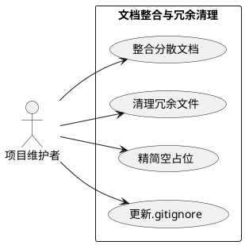
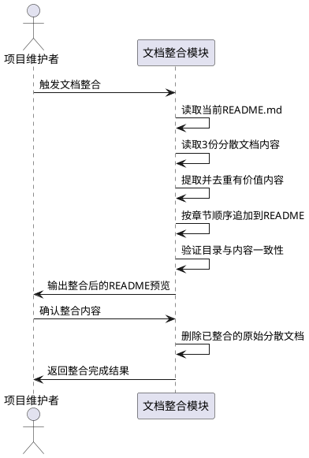
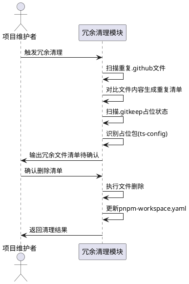
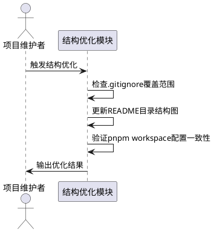

# **1. 组件定位**

## **1.1 核心职责**

本组件负责整合项目分散文档至统一 README.md、清理冗余文件与空占位目录、精简无用代码与废弃依赖，实现项目文档连贯可读、结构紧凑可维护。

## **1.2 核心输入**

1. **当前 README.md**：根目录已有基本内容（徽章、架构概览、快速启动、项目结构、API端点、环境变量、开发指南、贡献指南）
2. **分散的解释/说明文档**：
   - `apps/web-client/.github/copilot-instructions.md`（模块化设计思想3条原则）
   - `apps/web-client/.github/instructions/.instructions.md`（项目基本信息、开发目的、期望效果、人员信息、前端框架选择、模块化设计思想4条）
   - `apps/api-server/.github/instructions/.instructions.md`（项目基本信息、开发目的、期望效果、人员信息、版本控制、后端框架选择，内容与web-client版部分重叠）
3. **规范文档**（保留独立，不合并到README）：
   - `规范/智院灵枢(SAP)-项目结构.md`
   - `规范/单体仓库全栈项目启动脚本规范 (Monorepo Fullsta.md`
   - `规范/智院灵枢(SAP)-日志规范.md`
   - `规范/注释规范.md`
4. **页面设计文档**（保留独立，业务设计资产）：
   - `apps/web-client/docs/page-designs/` 下6个页面设计MD
5. **任务研究报告**（保留独立，过程文档）：
   - `apps/web-client/docs/tasks/` 下3个报告/计划MD
6. **项目文件扫描结果**：冗余文件清单、空__init__.py清单、.gitkeep占位目录清单、重复.github配置清单

## **1.3 核心输出**

1. **增强后的 README.md**：整合分散文档中有价值的内容，补充项目愿景/背景、团队信息、模块化设计原则章节
2. **已删除的冗余文件**：重复的.github配置文件、空占位.gitkeep文件、空__init__.py、占位ts-config包
3. **精简后的项目结构**：删除冗余后目录结构更紧凑，无孤立空目录
4. **更新的 .gitignore**：补充应忽略的文件模式

## **1.4 职责边界**

1. **不负责**业务功能代码的新增或修改
2. **不负责**规范文档（规范/目录）的内容改写或删除
3. **不负责**页面设计文档和任务研究报告的合并或删除
4. **不负责**.codeartsdoer/目录下已有spec/design/tasks文档的处理
5. **不负责**代码逻辑重构或性能优化

---

# **2. 领域术语**

**文档整合**
: 将多个分散的Markdown文档中的有价值内容提取、归纳、重写到统一README.md的过程，同时删除原分散文件。

**冗余文件**
: 在项目中存在但无实际作用的文件，包括：内容完全相同的重复文件、仅含空行的空文件、.gitkeep占位但对应目录下已有其他内容的文件、版本为0.0.0且导出空对象的占位包。

**空__init__.py**
: 文件大小为0字节或仅含空行的Python包初始化文件，无任何import或__all__声明，仅用于目录标记。

**占位包**
: 在packages/中声明但未提供实际功能的包，如ts-config（version 0.0.0，index.js导出空对象{}）。

**重复.github配置**
: 在apps/web-client/.github/和apps/api-server/.github/下内容完全相同的agent定义文件和prompt模板文件。

---

# **3. 角色与边界**

## **3.1 核心角色**

- **项目维护者**：执行文档整合与冗余清理操作的开发者，需要确认删除清单和整合内容

## **3.2 外部系统**

- **Git 版本控制**：所有文件变更需通过git跟踪，变更前需确保工作区干净
- **pnpm 工作区**：ts-config包删除后需同步更新pnpm-workspace.yaml
- **IDE/编辑器**：.github/下的agent和prompt文件变更会影响Copilot功能

## **3.3 交互上下文**

---

# **4. DFX约束**

## **4.1 性能**

- 文档整合操作须在单次git commit中完成，避免中间状态影响其他开发者
- 冗余文件删除须确保删除后项目仍可通过 `npm run install:all` 和 `uv sync --all-packages` 正常安装

## **4.2 可靠性**

- 删除文件前须验证项目核心功能不受影响：API Server可启动、Web Client可构建、Python共享包可导入
- 文档整合须保留原文档的语义完整性，不得丢失关键信息

## **4.3 安全性**

- 禁止删除规范/目录下的任何文件（项目合规基线）
- 禁止删除apps/web-client/docs/下的页面设计文档和任务研究报告（业务资产）
- 禁止删除.codeartsdoer/目录下的任何文件

## **4.4 可维护性**

- 整合后的README.md结构须与目录（Table of Contents）保持同步
- 删除占位目录后，若对应功能将来需恢复，须在README中记录预留说明

## **4.5 兼容性**

- 删除ts-config包后，pnpm-workspace.yaml须同步移除该包声明
- 删除.github/重复文件后，两个子项目各自保留的独立配置须能正常工作

---

# **5. 核心能力**

## **5.1 文档整合**

### **5.1.1 业务规则**

1. **README内容增强规则**：从分散文档中提取有价值且在当前README中缺失的内容，按以下顺序追加到README对应章节：
   a. 验收条件：[从.instructions.md提取项目愿景和开发目的] → [在README"架构概览"章节前新增"项目愿景"章节]

2. **模块化设计原则整合规则**：从copilot-instructions.md和.instructions.md中提取的模块化设计原则（单一职责、低耦合、高内聚、可复用/可扩展），须合并去重后写入README"开发指南"章节下新增的"设计原则"子章节：
   a. 验收条件：[copilot-instructions.md含3条原则 + .instructions.md含4条原则] → [README中"设计原则"章节包含去重后的4条原则]

3. **团队信息整合规则**：从.instructions.md提取的开发人员信息（组长技能、组员背景），须写入README"贡献指南"章节下新增的"团队构成"子章节：
   a. 验收条件：[两个.instructions.md均含团队信息] → [README"团队构成"章节包含去重后的团队信息，仅保留一份]

4. **规范文档引用规则**：规范/目录下的4份规范文档不在README中内联，而是在README中新增"项目规范"章节，以链接列表方式引用：
   a. 验收条件：[README"项目规范"章节包含4条链接] → [每条链接指向规范/目录下对应文件]

5. **分散文档删除规则**：已整合内容的原始分散文档须删除：
   a. 验收条件：[README整合完成并验证] → [删除 apps/web-client/.github/copilot-instructions.md、apps/web-client/.github/instructions/.instructions.md、apps/api-server/.github/instructions/.instructions.md]

6. **禁止项**：禁止将页面设计文档（docs/page-designs/）和任务研究报告（docs/tasks/）合并到README
   a. 验收条件：[执行文档整合] → [上述文档保持原位置不变]

### **5.1.2 交互流程**

### **5.1.3 异常场景**

1. **分散文档内容冲突**
   a. 触发条件：两个.instructions.md中同一段落描述不一致
   b. 系统行为：保留api-server版本（更精简、更新），丢弃web-client版本中的冗余描述
   c. 用户感知：README中仅出现一份统一描述

2. **README目录与内容不同步**
   a. 触发条件：新增章节后目录（Table of Contents）未更新
   b. 系统行为：自动重新生成目录锚点列表
   c. 用户感知：目录链接可正确跳转到对应章节

---

## **5.2 冗余文件清理**

### **5.2.1 业务规则**

1. **重复.github配置清理规则**：跨子项目内容完全相同的文件，保留web-client版本（功能更完整），删除api-server版本：
   a. 验收条件：[检测到完全相同的文件对] → [删除api-server下对应文件，保留web-client下文件]

   **完全相同的文件清单（需删除api-server版本）**：
   - `apps/api-server/.github/agents/Commit-Lens.agent.md`（与web-client版完全相同）
   - `apps/api-server/.github/agents/Readme-Manager.agent.md`（与web-client版完全相同）
   - `apps/api-server/.github/YAML_fontmatter.md`（与web-client版完全相同）
   - `apps/api-server/.github/prompts/design-functions.prompt.md`（与web-client版完全相同）
   - `apps/api-server/.github/prompts/design-program-structure.prompt.md`（与web-client版完全相同）
   - `apps/api-server/.github/prompts/design-tech-stack.prompt.md`（与web-client版完全相同）

2. **内容不同的.github配置保留规则**：跨子项目内容不同的文件，两个版本均保留（各自适配不同技术栈）：
   a. 验收条件：[检测到内容不同的文件对] → [两份均保留不动]

   **内容不同的文件（两份均保留）**：
   - `Implementer.agent.md`（web-client多web工具，api-server多audit要求）
   - `Planner.agent.md`（web-client研究模式，api-server直接设计模式）
   - `Prompt-Engineer.agent.md`（web-client多模式设计，api-server上下文适配设计）
   - `Researcher.agent.md`（web-client研究模式+路径规则，api-server简化版）

3. **web-client独有.github文件保留规则**：仅存在于web-client的文件予以保留：
   a. 验收条件：[文件仅在web-client存在] → [保留不动]

   **web-client独有文件**：
   - `apps/web-client/.github/agents/View-Forge.agent.md`
   - `apps/web-client/.github/copilot-instructions.md`（整合后删除）
   - `apps/web-client/.github/prompts/design-frontend-frame.prompt.md`
   - `apps/web-client/.github/prompts/page-design-search-context.prompt.md`

4. **空占位.gitkeep清理规则**：当.gitkeep所在目录下已有其他实质性文件时，删除该.gitkeep（目录已非空，不再需要占位）：
   a. 验收条件：[.gitkeep所在目录存在其他非.gitkeep文件] → [删除该.gitkeep文件]

   **需删除的.gitkeep（目录已有内容）**：
   - `apps/web-client/src/features/auth/.gitkeep`（同目录下无其他文件，但auth feature已有独立实现，需确认）
   - `packages/py-db/py_db/migrations/versions/.gitkeep`（migrations目录下可能有迁移文件，需确认）

   **需保留的.gitkeep（目录仅含.gitkeep，删除后目录为空会被git忽略）**：
   - `data/.gitkeep`
   - `logs/.gitkeep`
   - `tmp/.gitkeep`
   - `apps/ai-worker/tests/.gitkeep`
   - `apps/web-client/src/features/notice/.gitkeep`
   - `apps/web-client/src/features/member/.gitkeep`
   - `apps/web-client/src/features/student/.gitkeep`
   - `apps/web-client/src/features/tenant/.gitkeep`
   - `apps/web-client/src/features/activity/.gitkeep`
   - `apps/web-client/src/features/agent/.gitkeep`
   - `apps/web-client/src/test/admin/.gitkeep`
   - `apps/web-client/src/test/auth/.gitkeep`
   - `apps/web-client/src/test/features/.gitkeep`
   - `apps/web-client/src/test/components/.gitkeep`
   - `apps/web-client/src/test/store/.gitkeep`
   - `apps/web-client/src/test/api/.gitkeep`

5. **空__init__.py处理规则**：文件大小为0字节的__init__.py属于合法的Python包标记，予以保留不做删除：
   a. 验收条件：[__init__.py文件大小为0字节] → [保留不动，空__init__.py是Python包的标准实践]

   **当前空__init__.py清单（均保留）**：
   - `apps/ai-worker/src/ai_worker/__init__.py`（0字节）
   - `apps/ai-worker/src/ai_worker/tasks/__init__.py`（0字节）
   - `apps/ai-worker/src/ai_worker/pipelines/__init__.py`（0字节）
   - `apps/api-server/app/repositories/__init__.py`（0字节）

6. **占位包清理规则**：ts-config包（version 0.0.0，index.js导出空对象{}）属于占位包，须整体删除：
   a. 验收条件：[包版本为0.0.0且导出空对象] → [删除packages/ts-config/目录，并从pnpm-workspace.yaml中移除该包声明]

7. **禁止项**：禁止删除任何在.codeartsdoer/、规范/、node_modules/目录下的文件
   a. 验收条件：[执行清理操作] → [上述目录内文件不受影响]

### **5.2.2 交互流程**

### **5.2.3 异常场景**

1. **重复文件误删**
   a. 触发条件：删除api-server下重复文件后，api-server的Copilot功能依赖该文件路径
   b. 系统行为：仅删除内容完全相同的文件，内容不同的文件均保留，避免功能损失
   c. 用户感知：api-server仍可通过自身保留的独立配置文件正常工作

2. **占位包被其他包引用**
   a. 触发条件：删除ts-config后，web-client的package.json引用了@young-hearts/ts-config
   b. 系统行为：先检查引用关系，若有引用则先移除引用再删除包
   c. 用户感知：项目安装不报错

---

## **5.3 项目结构优化**

### **5.3.1 业务规则**

1. **.gitignore增强规则**：补充当前.gitignore中缺失但应忽略的文件模式：
   a. 验收条件：[扫描项目发现不应纳入版本控制的文件] → [.gitignore中补充对应模式]

   **建议补充的.gitignore规则**：
   - `__pycache__/`（Python字节码缓存，已有但需确认）
   - `*.pyc`（编译缓存）
   - `.venv/`（Python虚拟环境）
   - `dist/`（构建产物）
   - `.env`（环境变量含密钥，已有但需确认）
   - `*.db`（SQLite数据库文件）
   - `uv.lock`（uv锁文件，视团队策略决定）

2. **README目录结构更新规则**：清理完成后，README中的项目结构树形图须与实际目录结构保持一致：
   a. 验收条件：[执行冗余清理] → [README项目结构章节中移除ts-config，标注copilot-instructions.md和.instructions.md已删除]

3. **.instructions.md整合后标记规则**：删除分散的.instructions.md和copilot-instructions.md后，在README中明确说明开发指引已统一至README：
   a. 验收条件：[删除.instructions.md文件] → [README"开发指南"章节说明"本项目开发指引统一记录于本README，子项目不再维护独立的.instructions.md文件"]

### **5.3.2 交互流程**

### **5.3.3 异常场景**

1. **pnpm-workspace.yaml与实际目录不匹配**
   a. 触发条件：删除ts-config目录后，yaml中仍声明该包
   b. 系统行为：同步从yaml中移除 `packages/ts-config` 声明
   c. 用户感知：`pnpm install` 不报错

---

# **6. 数据约束**

## **6.1 待整合文档清单**

1. **文件路径**：`apps/web-client/.github/copilot-instructions.md`
2. **内容摘要**：模块化设计思想3条（单一职责、低耦合、可复用/可扩展）
3. **目标章节**：README"开发指南 > 设计原则"
4. **整合后处理**：删除原文件

1. **文件路径**：`apps/web-client/.github/instructions/.instructions.md`
2. **内容摘要**：项目基本信息、开发目的（攀登杯+实践团）、期望效果（短/中/长期）、开发人员信息、前端框架选择、模块化设计思想4条
3. **目标章节**：README"项目愿景"+"开发指南 > 设计原则"+"贡献指南 > 团队构成"
4. **整合后处理**：删除原文件

1. **文件路径**：`apps/api-server/.github/instructions/.instructions.md`
2. **内容摘要**：项目基本信息、开发目的（与web-client版相同）、期望效果（相同）、开发人员信息（相同）、版本控制说明、后端框架选择
3. **目标章节**：README"项目愿景"+"贡献指南 > 团队构成"（去重，仅保留api-server独有的"版本控制"和"后端框架"描述）
4. **整合后处理**：删除原文件

## **6.2 待删除冗余文件清单**

1. **文件路径**：`apps/api-server/.github/agents/Commit-Lens.agent.md`
2. **删除原因**：与web-client版内容完全相同，属于跨子项目重复
3. **影响评估**：api-server的Copilot仍可通过web-client下同名文件生效（若工作区共享），或api-server保留自身独立的agent配置（仅删除完全相同的副本）

1. **文件路径**：`apps/api-server/.github/agents/Readme-Manager.agent.md`
2. **删除原因**：与web-client版内容完全相同
3. **影响评估**：同上

1. **文件路径**：`apps/api-server/.github/YAML_fontmatter.md`
2. **删除原因**：与web-client版内容完全相同
3. **影响评估**：YAML格式说明仅保留一份即可

1. **文件路径**：`apps/api-server/.github/prompts/design-functions.prompt.md`
2. **删除原因**：与web-client版内容完全相同
3. **影响评估**：功能设计prompt仅保留一份即可

1. **文件路径**：`apps/api-server/.github/prompts/design-program-structure.prompt.md`
2. **删除原因**：与web-client版内容完全相同
3. **影响评估**：程序结构设计prompt仅保留一份即可

1. **文件路径**：`apps/api-server/.github/prompts/design-tech-stack.prompt.md`
2. **删除原因**：与web-client版内容完全相同
3. **影响评估**：技术栈设计prompt仅保留一份即可

1. **文件路径**：`packages/ts-config/`（整个目录）
2. **删除原因**：占位包，version 0.0.0，index.js导出空对象{}，无实际功能
3. **影响评估**：须先检查web-client/package.json是否引用@young-hearts/ts-config，若有则先移除引用

## **6.3 保留独立的文档清单**

1. **文件路径**：`规范/`目录下4份规范文档
2. **保留原因**：项目合规基线文档，独立维护，通过README链接引用

1. **文件路径**：`apps/web-client/docs/page-designs/`下6个页面设计MD
2. **保留原因**：前端业务设计资产，与代码实现对应，不宜合并到README

1. **文件路径**：`apps/web-client/docs/tasks/`下3个任务报告/计划MD
2. **保留原因**：开发过程文档，具有独立追溯价值

1. **文件路径**：`.codeartsdoer/specs/`下所有spec/design/tasks文档
2. **保留原因**：SDD流程资产，属于工具链管理范围
