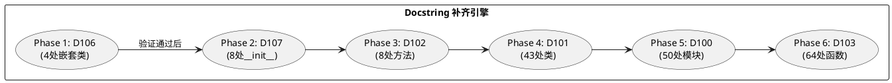

# **1. 实现模型**

## **1.1 上下文视图**

本轮渐进收敛在四轮规范驱动改造的基线上执行，聚焦两大收敛域的最终合规。上下文关系如下：

```plantuml
@startuml
skinparam componentStyle rectangle

rectangle "已完成基线（Round 1-4）" as baseline [
    Hybrid Monorepo 工作区
    三层架构目录
    py-logger 全量接入
    D104 Phase3 清零
    共享包 + 启动脚本合规
]

rectangle "本轮收敛（Round 5）" as convergence {
    rectangle "收敛域 A：Docstring" as docstring [
        D100: 50 → 0
        D101: 43 → 0
        D102: 8 → 0
        D103: 64 → 0
        D106: 4 → 0
        D107: 8 → 0
    ]
    rectangle "收敛域 B：Repository" as repository [
        auth.register: 6处 db 操作
        auth.get_current_user: 2处 db.query
    ]
    rectangle "收敛域 C：Ruff 收紧" as ruff [
        D100-D107 从 ignore 移除
    ]
}

baseline --> convergence : 基线提供
docstring --> ruff : 补齐后才能移除 ignore
repository --> docstring : 新增函数需同步补 docstring

@enduml
```

## **1.2 服务/组件总体架构**

### 1.2.1 Docstring 补齐架构

采用**分批逐规则**补齐策略，每个 D 规则独立补齐、独立验证、独立提交：



**补齐优先级设计依据**：
- 先补小范围规则（D106/D107/D102 各仅 4-8 处），可快速验证补齐模式
- 再补中范围规则（D101 类 docstring，43 处），模式稳定后批量执行
- 最后补大范围规则（D100 模块 + D103 函数，114 处），模式已验证可直接批量

### 1.2.2 Repository 重构架构

重构目标是将 `auth_service` 中所有直接 `db` 操作下沉至 `repository` 层，保持 Service 层仅包含业务逻辑编排：

```plantuml
@startuml
skinparam componentStyle rectangle

rectangle "重构前" as before {
    rectangle "auth_service.register()" as old_service [
        db.add(user)
        db.flush()
        db.add(vp/ep)
        db.commit()
        db.refresh(user)
    ]
    rectangle "user_repository" as old_repo [
        get_user_by_username()
        get_user_by_id()
        create_user()
        update_user()
        delete_user()
    ]
    old_service -[hidden]-> old_repo
}

rectangle "重构后" as after {
    rectangle "auth_service.register()" as new_service [
        组装 User/Profile 对象
        user_repo.create_user_with_profiles()
        返回 user
    ]
    rectangle "user_repository" as new_repo [
        get_user_by_username()
        get_user_by_id()
        create_user()
        create_user_with_profiles() **新增**
        update_user()
        delete_user()
    ]
    rectangle "session_repository" as new_session [
        create_session()
        delete_by_session_id()
        get_valid_session() **新增**
        get_user_by_session() **增强**
    ]
    new_service --> new_repo : 调用
    new_service --> new_session : 调用
}

before --> after : 重构

@enduml
```

### 1.2.3 Ruff Ignore 收紧架构

渐进式从 `pyproject.toml` 的 `ignore` 列表中移除 D 规则：

```text
初始状态: ignore = ["D100", "D101", "D102", "D103", "D105", "D106", "D107", "ANN101", "ANN102", "ANN401"]
Phase 1:  ignore = ["D100", "D101", "D102", "D103", "D105", "D107", "ANN101", "ANN102", "ANN401"]  ← 移除 D106
Phase 2:  ignore = ["D100", "D101", "D102", "D103", "D105", "ANN101", "ANN102", "ANN401"]          ← 移除 D107
Phase 3:  ignore = ["D100", "D101", "D103", "D105", "ANN101", "ANN102", "ANN401"]                  ← 移除 D102
Phase 4:  ignore = ["D100", "D103", "D105", "ANN101", "ANN102", "ANN401"]                          ← 移除 D101
Phase 5:  ignore = ["D103", "D105", "ANN101", "ANN102", "ANN401"]                                  ← 移除 D100
Phase 6:  ignore = ["D105", "ANN101", "ANN102", "ANN401"]                                          ← 移除 D103
Phase 7:  ignore = ["ANN101", "ANN102", "ANN401"]                                                  ← 移除 D105（0违规，直接移除）
```

## **1.3 实现设计文档**

### 1.3.1 Docstring 补齐设计

#### 模块 Docstring（D100）模板

```python
"""模块用途的中文单行描述。"""
```

- **packages/ 共享包**：描述包的核心能力和对外暴露接口
  - 例：`"""结构化日志库，提供 get_logger、events、context、middleware 能力。"""`
- **apps/ 应用**：描述应用模块在整体架构中的定位
  - 例：`"""认证服务层，处理登录、注册、会话管理等认证业务逻辑。"""`
- **scripts/ 脚本**：描述脚本的运行场景和用途
  - 例：`"""前置检查工具，验证端口、环境依赖、基础设施连通性。"""`
- **__init__.py**：描述包的导出能力
  - 空包：`"""本包初始化模块。"""`
  - 有导出：`"""本包导出核心符号：get_logger、configure_logging。"""`
- **tests/**：描述测试模块覆盖范围
  - 例：`"""用户管理接口集成测试。"""`
- **占位符**：`"""占位模块，待业务功能开发时补充实现。"""`
- **无占位符**：对于真正无逻辑的 `__init__.py`，直接写：`"""包初始化。"""`

#### 类 Docstring（D101）模板

```python
class UserCreate(BaseModel):
    """用户注册请求模型，包含基础字段和角色扩展信息。"""

class User(Base):
    """用户主表 ORM 模型，存储账户基础信息和角色标识。"""
```

- **Pydantic 模型**：说明 DTO 的用途和包含的核心字段语义
- **SQLAlchemy 模型**：说明对应的数据库表和核心业务含义
- **配置类**：说明配置来源和核心配置项

#### 方法/函数 Docstring（D102/D103）模板

```python
def verify_password(plain_password: str, hashed_password: str) -> bool:
    """校验明文密码与哈希值是否匹配。

    Args:
        plain_password: 用户输入的明文密码。
        hashed_password: 数据库存储的 argon2 哈希值。

    Returns:
        bool: 密码匹配返回 True，否则返回 False。
    """
```

- **简单函数**：单行 docstring 描述功能和返回值语义
- **带参数函数**：Google Style 完整格式（Args/Returns/Raises）
- **路由处理函数**：已在装饰器中填写 summary/description，docstring 简述执行逻辑即可

#### 嵌套类 Docstring（D106）模板

```python
class Outer:
    """外部类描述。"""

    class Inner:
        """内部嵌套类描述，说明其在外部类中的角色。"""
```

#### __init__ Docstring（D107）模板

```python
class MyClass:
    """类描述。"""

    def __init__(self, name: str):
        """初始化实例。

        Args:
            name: 实例名称。
        """
```

- 若 `__init__` 仅有简单属性赋值且语义自明，可写简化版：`"""初始化实例，设置核心属性。"""`

### 1.3.2 Repository 重构设计

#### user_repository.create_user_with_profiles()

```python
def create_user_with_profiles(
    db: Session,
    user: User,
    volunteer_profile: VolunteerProfile | None = None,
    expert_profile: ExpertProfile | None = None,
) -> User:
    """原子性创建用户及其角色扩展 Profile。

    在同一事务中写入 User 主记录和可选的 VolunteerProfile/ExpertProfile，
    任一写入失败则整体回滚。

    Args:
        db: SQLAlchemy 数据库会话。
        user: 已组装的 User ORM 对象（未持久化）。
        volunteer_profile: 志愿者扩展信息，角色含 volunteer 时传入。
        expert_profile: 专家扩展信息，角色含 expert 时传入。

    Returns:
        User: 持久化后的用户对象（含 id 和关联 profile）。

    Raises:
        IntegrityError: 用户名或邮箱重复时抛出。
    """
    db.add(user)
    db.flush()  # 获取 user.id 用于关联 profile

    if volunteer_profile is not None:
        volunteer_profile.user_id = user.id
        db.add(volunteer_profile)

    if expert_profile is not None:
        expert_profile.user_id = user.id
        db.add(expert_profile)

    db.commit()
    db.refresh(user)
    return user
```

#### session_repository.get_valid_session()

```python
def get_valid_session(db: Session, session_id: str) -> SessionModel | None:
    """按 session_id 查找会话并校验有效性（含过期判断）。

    Args:
        db: SQLAlchemy 数据库会话。
        session_id: 会话标识符。

    Returns:
        SessionModel | None: 有效且未过期的会话对象，无效或过期返回 None。
    """
    session = get_by_session_id(db, session_id)
    if not session:
        return None

    expired_at = session.expired_at
    if expired_at is not None and isinstance(expired_at, datetime):
        now = datetime.now(timezone.utc)
        if expired_at.tzinfo is None:
            expired_at = expired_at.replace(tzinfo=timezone.utc)
        if expired_at < now:
            return None

    return session
```

#### auth_service.register() 重构后

```python
async def register(db, user_in):
    """注册：组装用户对象并通过 repository 原子性持久化。"""
    from app.models.user import User, VolunteerProfile, ExpertProfile
    from app.repositories.user_repository import create_user_with_profiles
    import json as _json

    user = User(
        username=user_in.username,
        email=getattr(user_in, "email", None),
        gender=getattr(user_in, "gender", "hidden"),
        password_hash=get_password_hash(user_in.password),
        nickname=getattr(user_in, "nickname", None),
        avatar=getattr(user_in, "avatar", None),
        roles=str(user_in.roles) if user_in.roles else '[]',
        status=user_in.status or "active",
        is_active=True,
    )

    volunteer_profile = None
    if "volunteer" in user_in.roles and user_in.volunteer_info is not None:
        v = user_in.volunteer_info
        volunteer_profile = VolunteerProfile(
            full_name=getattr(v, "full_name", None),
            phone=getattr(v, "phone", None),
            public_email=getattr(v, "public_email", None),
            is_public_visible=getattr(v, "is_public_visible", False),
            skills=str(getattr(v, "skills", []) or []),
            status="pending",
            work_status="offline",
        )

    expert_profile = None
    if "expert" in user_in.roles and user_in.expert_info is not None:
        e = user_in.expert_info
        expert_profile = ExpertProfile(
            full_name=getattr(e, "full_name", None),
            phone=getattr(e, "phone", None),
            public_email=getattr(e, "public_email", None),
            title=getattr(e, "title", None),
            org=getattr(e, "org", None),
            skills=str(getattr(e, "skills", []) or []),
            status="pending",
        )

    return create_user_with_profiles(db, user, volunteer_profile, expert_profile)
```

#### auth_service.get_current_user_from_context() 重构后

```python
def get_current_user_from_context(request: Request, db: Session = Depends(get_db)):
    """从 Cookie/Header 提取 session_id，通过 repository 校验并获取当前用户。"""
    from app.repositories.session_repository import get_valid_session
    from app.repositories.user_repository import get_user_by_id

    session_id = None
    if settings.SESSION_COOKIE_NAME in request.cookies:
        session_id = request.cookies[settings.SESSION_COOKIE_NAME]
        session_id_source = "cookie"
    elif request.headers.get("X-Session-ID"):
        session_id = request.headers.get("X-Session-ID")
        session_id_source = "header"
    else:
        session_id_source = None

    if not session_id:
        raise HTTPException(status_code=401, detail="SessionID required（未在 Cookie 或 Header 中找到 session_id）")

    session = get_valid_session(db, session_id)
    if not session:
        raise HTTPException(status_code=401, detail=f"Session 失效或不存在（session_id={session_id}，来源={session_id_source}）")

    user = get_user_by_id(db, session.user_id)
    if not user:
        raise HTTPException(status_code=401, detail=f"Session 关联用户不存在（user_id={session.user_id}，session_id={session_id}）")

    if hasattr(user, "status") and getattr(user, "status", None) == "banned":
        raise HTTPException(status_code=403, detail=f"用户已被禁用（user_id={user.id}，username={user.username}）")

    return user
```

### 1.3.3 Ruff Ignore 收紧设计

**收紧策略**：每完成一个 D 规则的全量补齐后，从 ignore 列表中移除该规则，运行全量 ruff check 验证，确认 0 违规后提交。

**pyproject.toml 变更终态**：

```toml
[tool.ruff.lint]
select = ["E", "F", "W", "I", "UP", "B", "SIM", "D", "ANN"]
ignore = ["ANN101", "ANN102", "ANN401"]
```

D100-D107 全部从 ignore 中移除，仅保留 ANN 规则（类型注解为独立收敛项）。

---

# **2. 接口设计**

## **2.1 总体设计**

本轮不新增对外 API 接口，仅涉及内部函数签名的变更和新增。

## **2.2 接口清单**

### 2.2.1 新增 Repository 函数

| 函数签名 | 所在模块 | 说明 |
|----------|----------|------|
| `create_user_with_profiles(db: Session, user: User, volunteer_profile: VolunteerProfile \| None, expert_profile: ExpertProfile \| None) -> User` | `user_repository.py` | 原子性创建用户及角色 Profile |
| `get_valid_session(db: Session, session_id: str) -> SessionModel \| None` | `session_repository.py` | 查找并校验 session 有效性 |

### 2.2.2 变更函数（内部签名不变，实现变更）

| 函数签名 | 所在模块 | 变更说明 |
|----------|----------|----------|
| `register(db, user_in)` | `auth_service.py` | db 直接操作替换为 repository 调用 |
| `get_current_user_from_context(request, db)` | `auth_service.py` | db.query 替换为 repository 调用 |

### 2.2.3 Docstring 补齐接口（无函数签名变更）

所有 177 处 D 规则违规的公开符号仅补充 docstring 文本，不改变函数签名、参数或返回值。

---

# **4. 数据模型**

## **4.1 设计目标**

本轮不新增数据库表或字段，不修改 ORM 模型定义。数据模型变更仅限于：

1. Repository 函数的参数和返回值类型（Python 层面，非数据库层面）
2. Docstring 中对已有模型语义的补充说明

## **4.2 模型实现**

### 4.2.1 create_user_with_profiles 参数模型

```python
# 输入参数
@dataclass
class CreateUserWithProfilesInput:
    """创建用户及 Profile 的输入模型。"""
    user: User                          # 未持久化的 User ORM 对象
    volunteer_profile: VolunteerProfile | None  # 可选的志愿者 Profile
    expert_profile: ExpertProfile | None       # 可选的专家 Profile

# 返回值
# User: 持久化后的用户对象，含 id、关联 profile（通过 relationship 懒加载）
```

### 4.2.2 get_valid_session 返回值语义

```python
# 返回值语义
# SessionModel | None
#   - 非 None：session 存在且未过期
#   - None：session 不存在或已过期
# Service 层根据 None 统一抛出 401 HTTPException
```

### 4.2.3 D规则违规数据分布

```text
按模块分布：
  apps/api-server/         : 57 处（schemas 20 + routes 7 + services 6 + models 5 + tests 12 + 其他 7）
  packages/py-*/           : 58 处（py-auth 15 + py-messaging 12 + py-db 11 + py-logger 7 + py-schemas 7 + py-ai-engine 7 + py-config 2）
  scripts/                 : 20 处（check_utils 8 + log_utils 7 + start 4 + process_utils 5→合并计入）

按规则分布：
  D100 (模块)  : 50 处
  D101 (类)    : 43 处
  D102 (方法)  : 8 处
  D103 (函数)  : 64 处
  D106 (嵌套类): 4 处
  D107 (__init): 8 处
```
