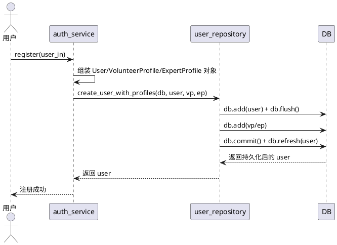
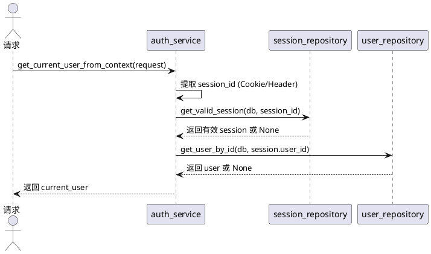

# **1. 组件定位**

## **1.1 核心职责**

本组件负责执行项目渐进收敛的下一阶段任务，聚焦两大收敛域：Ruff D100-D103/D105-D107 docstring 全量补齐（177处违规 → 0处），以及 auth_service 中残余的直接 db 操作重构为 repository 调用，实现三层架构的最终合规和代码规范工具链的全面启用。

## **1.2 核心输入**

1. **Ruff D规则违规清单**：当前 177 处 D 规则违规（D100:50, D101:43, D102:8, D103:64, D106:4, D107:8），分布在 apps/、packages/、scripts/ 下共 50 个文件
2. **Ruff 当前配置**：pyproject.toml 中 D100-D103/D105-D107 均在 ignore 列表中，需逐步移除
3. **auth_service 直接 db 操作**：`register()` 中 db.add/db.flush/db.commit/db.refresh 共 6 处，`get_current_user_from_context()` 中 db.query 共 2 处
4. **已有 repository 层**：user_repository.py、session_repository.py、notice_repository.py（空）
5. **注释规范**：Google Style Docstring（后端）、TSDoc（前端）
6. **已完成基线**：D104 Phase3 已清零，三层架构目录已到位，repository 层已创建

## **1.3 核心输出**

1. **D规则全量合规的代码**：50 个 Python 文件补齐 docstring，Ruff D 检查 0 违规
2. **D规则从 ignore 列表中移除**：pyproject.toml 中 D100-D103/D105-D107 从 ignore 中删除
3. **auth_service.register 重构**：db 直接操作迁移至 user_repository，service 层仅调用 repository
4. **auth_service.get_current_user_from_context 重构**：db.query 迁移至 session_repository + user_repository
5. **新增 repository 函数**：user_repository.create_user_with_profiles()、session_repository.get_valid_session()、session_repository.get_user_by_session()
6. **新增 py-logger 事件**：user_register_succeeded、user_register_failed 等

## **1.4 职责边界**

1. **不负责**业务功能的新增或修改（不新增 API 端点、不改变业务逻辑语义）
2. **不负责**前端 TSDoc 注释补齐（本轮聚焦后端 Python docstring）
3. **不负责**D104 相关工作（已在第四轮完成）
4. **不负责**ANN 类型注解补齐（独立收敛项，不纳入本轮）
5. **不负责**启动脚本、日志、目录结构等已在先前轮次完成的工作

---

# **2. 领域术语**

**Docstring 合规率**
: 项目 Python 代码中满足 Ruff D 规则（D100-D107）的公开模块/类/方法/函数的比例。合规率 = 1 - 违规数/公开符号总数。本轮目标：100%。

**Google Style Docstring**
: Python 函数/类的 Docstring 格式，包含摘要行、Args/Returns/Raises 等标准段落，由 `pydocstyle` 和 `ruff D` 规则强制检查。本项目在 pyproject.toml 中配置 `convention = "google"`。

**三层架构合规**
: Service 层代码中不存在 `db.add/db.commit/db.flush/db.query/db.refresh/db.delete` 等直接 SQLAlchemy Session 操作。所有数据访问必须通过 Repository 层函数调用。

**Repository 模式**
: 将数据访问逻辑（ORM 查询、增删改）封装到独立的 repository 模块中，Service 层通过调用 repository 函数间接操作数据库，实现关注点分离和可测试性。

**渐进式规则收紧**
: Ruff D 规则当前在 ignore 列表中，本轮将逐规则、逐模块补齐 docstring 后从 ignore 中移除，确保每步提交都通过 CI 检查。

---

# **3. 角色与边界**

## **3.1 核心角色**

- **平台开发者**：负责逐文件补齐 docstring、重构 auth_service 的 db 直接操作
- **代码审查者**：负责验证补齐后的 docstring 语义准确性、repository 函数的正确性

## **3.2 外部系统**

- **Ruff Linter**：D100-D107 规则检查器，补齐后需全部通过
- **py-logger**：结构化日志库，repository 重构后需补齐对应事件日志
- **SQLAlchemy Session**：数据库会话，通过 repository 层封装后 service 层不再直接操作

## **3.3 交互上下文**

```plantuml
@startuml
skinparam componentStyle rectangle

rectangle "渐进收敛" as convergence {
    [D规则 Docstring 补齐] as docstring
    [auth_service Repository 重构] as refactor
    [Ruff ignore 收紧] as ruff
}

rectangle "项目代码" as code [
    apps/api-server
    packages/py-*
    scripts/
]

rectangle "Ruff" as lint [
    D100-D107
]

docstring --> code : 补齐 docstring
refactor --> code : 重构 db 操作
ruff --> lint : 从 ignore 移除
lint --> code : 检查合规

@enduml
```

---

# **4. DFX约束**

## **4.1 性能**

1. The docstring 补齐 shall 不引入任何运行时性能变化（仅增加注释文本，不改变执行逻辑）
2. The repository 重构 shall 不改变数据库操作语义，查询计划和执行路径保持等价

## **4.2 可靠性**

1. When auth_service.register 重构为 repository 调用，the 用户注册行为 shall 与重构前完全等价（用户创建 + 角色 profile 创建 + 事务提交）
2. When auth_service.get_current_user_from_context 重构为 repository 调用，the 认证链路 shall 与重构前完全等价（session 查找 + 过期校验 + 用户查找）
3. The 重构后的代码 shall 通过现有 pytest 测试用例，不破坏任何已有测试

## **4.3 安全性**

1. The docstring 补齐 shall 不在注释中暴露 SECRET_KEY、password 原文等敏感配置值
2. The repository 重构 shall 保持 tenant_id 隔离语义，不引入跨租户数据泄露

## **4.4 可维护性**

1. The 补齐后代码 shall 通过 Ruff D100-D103/D105-D107 全量检查（0 违规）
2. The pyproject.toml 中 D100-D103/D105-D107 shall 从 ignore 列表中移除
3. The auth_service.py 中 shall 不存在 db.add/db.commit/db.flush/db.query/db.refresh/db.delete 直接调用
4. The 新增 repository 函数 shall 包含 Google Style Docstring
5. The 新增 repository 函数 shall 通过 Ruff D 规则检查

## **4.5 兼容性**

1. Where 现有 repository 函数签名存在，the 重构后 shall 保持函数签名不变
2. The auth_service 对外暴露的 login/register/logout/get_current_user_from_context 函数签名 shall 保持不变
3. The repository 新增函数 shall 不影响已有 repository 函数的行为

---

# **5. 核心能力**

## **5.1 D100 Docstring 补齐（undocumented-public-module）**

### **5.1.1 业务规则**

1. **补齐范围**：50 个 Python 模块文件需补齐模块级 docstring
2. **格式要求**：模块 docstring 为单行摘要，描述模块用途，使用中文
3. **补齐顺序**：按影响范围从大到小：packages/ 共享包 → apps/api-server → scripts/ 启动脚本
4. **验收条件**：`ruff check --select D100` 返回 0 违规

### **5.1.2 异常场景**

1. **__init__.py 模块**：空 __init__.py（仅做包标记）补齐 `"""本包初始化模块。"""` 即可
2. **含逻辑的 __init__.py**：需描述包的导出能力和用途

## **5.2 D101 Docstring 补齐（undocumented-public-class）**

### **5.2.1 业务规则**

1. **补齐范围**：43 个公开类需补齐类级 docstring
2. **格式要求**：类 docstring 描述类的职责和用途，Pydantic 模型需说明 DTO 用途
3. **验收条件**：`ruff check --select D101` 返回 0 违规

## **5.3 D102 Docstring 补齐（undocumented-public-method）**

### **5.3.1 业务规则**

1. **补齐范围**：8 个公开方法需补齐方法 docstring
2. **格式要求**：Google Style，含 Args/Returns/Raises 段落
3. **验收条件**：`ruff check --select D102` 返回 0 违规

## **5.4 D103 Docstring 补齐（undocumented-public-function）**

### **5.4.1 业务规则**

1. **补齐范围**：64 个公开函数需补齐函数 docstring
2. **格式要求**：Google Style，含 Args/Returns 段落（必要时含 Raises）
3. **重点文件**（违规数 ≥ 5）：schemas/user.py(20)、check_utils.py(8)、routes/auth.py(7)、wxpusher.py(7)、log_utils.py(7)、auth.py(6)、models/user.py(5)、jwt_handler.py(5)、middleware.py(5)、py-db/models/user.py(5)、napcat.py(5)、process_utils.py(5)
4. **验收条件**：`ruff check --select D103` 返回 0 违规

## **5.5 D106/D107 Docstring 补齐（nested-class / __init__）**

### **5.5.1 业务规则**

1. **D106 补齐范围**：4 个公开嵌套类需补齐 docstring
2. **D107 补齐范围**：8 个公开类 __init__ 需补齐 docstring
3. **验收条件**：`ruff check --select D106,D107` 返回 0 违规

## **5.6 auth_service.register Repository 重构**

### **5.6.1 业务规则**

1. **重构目标**：将 register() 中的 db.add/db.flush/db.commit/db.refresh 迁移至 user_repository
2. **新增 repository 函数**：
   - `create_user_with_profiles(db, user, volunteer_profile, expert_profile)` → 原子性创建用户及角色 profile
3. **Service 层改造**：register() 仅负责字段组装和 repository 调用，不直接操作 db
4. **事务管理**：repository 函数内部管理 db.commit()，service 层不调用 commit
5. **验收条件**：[检查 auth.py] → [register() 中无 db.add/db.commit/db.flush/db.refresh 调用]

### **5.6.2 交互流程**



### **5.6.3 异常场景**

1. **Profile 创建失败**
   a. 触发条件：VolunteerProfile 或 ExpertProfile 写入失败
   b. 系统行为：db.commit() 未执行，事务回滚，用户记录也不会持久化
   c. 用户感知：注册失败，返回 500 错误

## **5.7 auth_service.get_current_user_from_context Repository 重构**

### **5.7.1 业务规则**

1. **重构目标**：将 get_current_user_from_context() 中的 db.query 迁移至 session_repository + user_repository
2. **复用已有 repository 函数**：
   - `session_repository.get_valid_session(db, session_id)` → 查找并校验 session 有效性（含过期判断）
   - `user_repository.get_user_by_id(db, user_id)` → 按 ID 查找用户
3. **Service 层改造**：仅调用 repository 函数，不直接 db.query
4. **验收条件**：[检查 auth.py] → [get_current_user_from_context() 中无 db.query 调用]

### **5.7.2 交互流程**



### **5.7.3 异常场景**

1. **session_repository.get_valid_session 逻辑迁移**
   a. 触发条件：需将过期校验逻辑从 service 迁移至 repository
   b. 系统行为：repository 返回 None 表示 session 无效或过期，service 统一抛 401
   c. 用户感知：行为不变，错误提示不变

## **5.8 Ruff ignore 列表渐进收紧**

### **5.8.1 业务规则**

1. **收紧顺序**：按 D 规则影响面从小到大逐个移除：D106(4) → D107(8) → D102(8) → D101(43) → D100(50) → D103(64)
2. **每步验证**：移除一个 D 规则后运行 `ruff check` 确认 0 违规，再移除下一个
3. **D105 处理**：D105（undocumented-magic-method）当前 0 违规但仍在 ignore 列表中，本轮一并移除
4. **最终状态**：pyproject.toml 的 `[tool.ruff.lint].ignore` 中不再包含 D100-D107 任何规则
5. **验收条件**：[检查 pyproject.toml] → [ignore 列表中无 D100-D107]

---

# **6. 数据约束**

## **6.1 D规则违规明细（当前基线）**

| 规则 | 违规数 | 说明 |
|------|--------|------|
| D100 | 50 | undocumented-public-module |
| D101 | 43 | undocumented-public-class |
| D102 | 8  | undocumented-public-method |
| D103 | 64 | undocumented-public-function |
| D106 | 4  | undocumented-public-nested-class |
| D107 | 8  | undocumented-public-init |
| **合计** | **177** | |

## **6.2 违规集中文件（Top 12）**

| 文件 | 违规数 | 所属模块 |
|------|--------|----------|
| apps/api-server/app/schemas/user.py | 20 | api-server |
| apps/api-server/tests/test_users.py | 9 | api-server 测试 |
| scripts/utils/check_utils.py | 8 | 启动脚本 |
| apps/api-server/app/api/v1/routes/auth.py | 7 | api-server |
| packages/py-messaging/py_messaging/wxpusher.py | 7 | py-messaging |
| scripts/utils/log_utils.py | 7 | 启动脚本 |
| apps/api-server/app/services/auth.py | 6 | api-server |
| apps/api-server/app/models/user.py | 5 | api-server |
| packages/py-auth/py_auth/jwt_handler.py | 5 | py-auth |
| packages/py-auth/py_auth/middleware.py | 5 | py-auth |
| packages/py-db/py_db/models/user.py | 5 | py-db |
| packages/py-messaging/py_messaging/napcat.py | 5 | py-messaging |

## **6.3 auth_service 直接 db 操作清单**

| 位置 | 行号 | 操作 | 重构目标 |
|------|------|------|----------|
| register() | 116 | db.add(user) | user_repository.create_user_with_profiles() |
| register() | 117 | db.flush() | 同上 |
| register() | 130 | db.add(vp) | 同上 |
| register() | 143 | db.add(ep) | 同上 |
| register() | 144 | db.commit() | 同上 |
| register() | 145 | db.refresh(user) | 同上 |
| get_current_user_from_context() | 162 | db.query(SessionModel) | session_repository.get_valid_session() |
| get_current_user_from_context() | 174 | db.query(User) | user_repository.get_user_by_id() |
