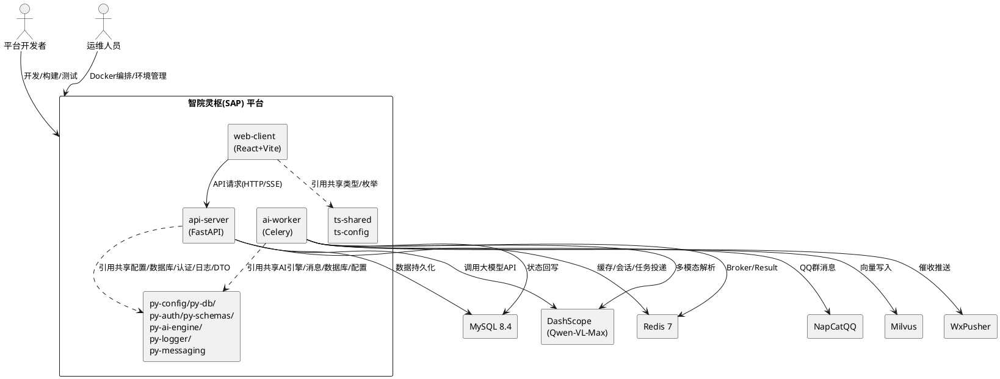
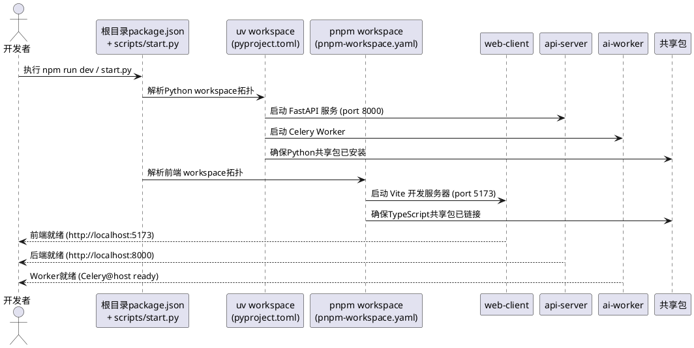
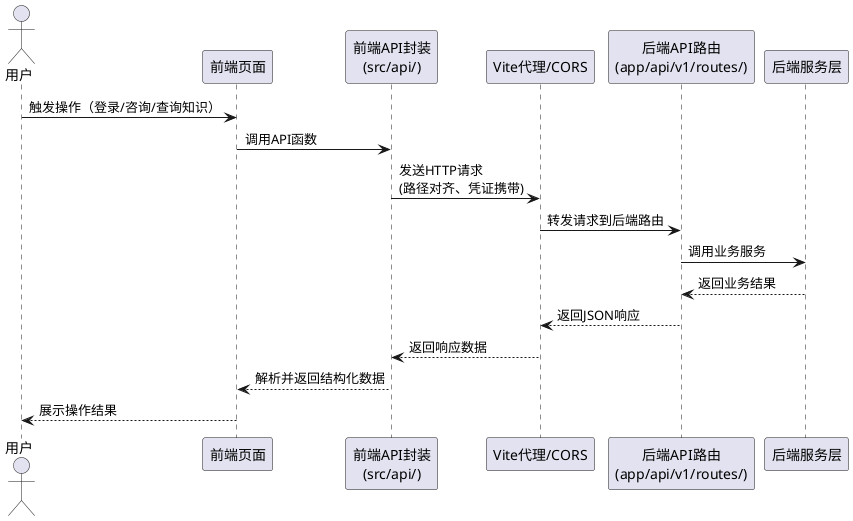
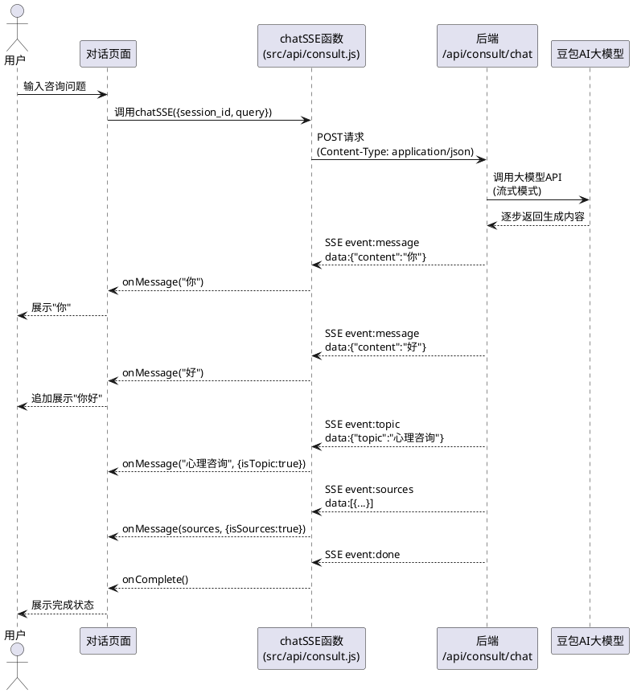
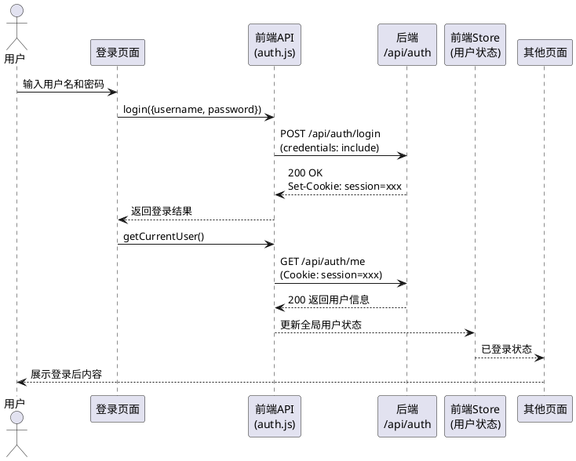
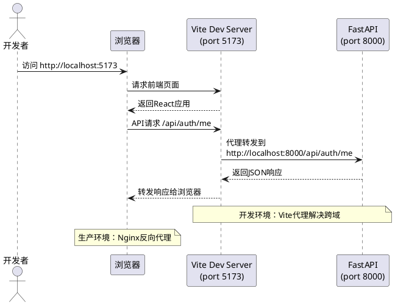
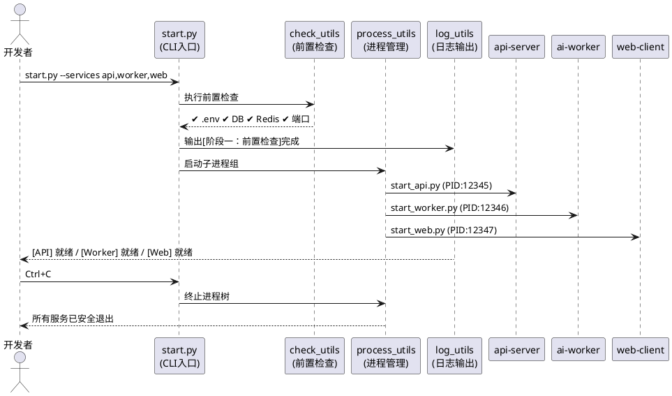
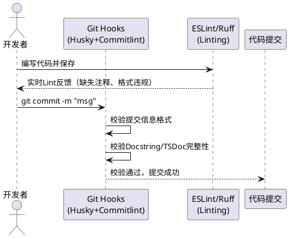
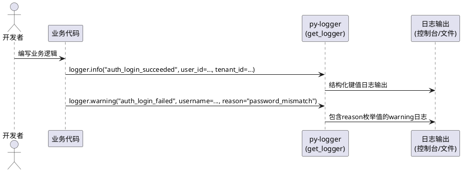

# **1. 组件定位**

## **1.1 核心职责**

本组件负责整合青年之心智能体平台的单体仓库结构并打通前后端数据流，实现规范化的Monorepo工作区管理和全链路API对接。

## **1.2 核心输入**

1. **前端应用源码**：apps/web-client/ 下的 React+Vite+TypeScript 前端工程，包含API封装层（src/shared/api/）、Feature-Based聚合（src/features/）、页面路由、状态管理等 [依据：项目结构规范-§4.1]
2. **后端应用源码**：apps/api-server/ 下的 FastAPI 后端工程，包含API路由、服务层、数据访问层（repositories/）、依赖注入层（dependencies/）、中间件（middleware/）、任务调度（tasks/）等 [依据：项目结构规范-§4.1]
3. **异步任务Worker源码**：apps/ai-worker/ 下的 Celery Worker工程，负责多模态通知解析、WxPusher催收推送、QQ群消息分发、文档切片与向量化、Excel导出等异步任务 [依据：项目结构规范-§4.1]
4. **共享包目录**：packages/ 下的7个Python共享包（py-config、py-db、py-schemas、py-ai-engine、py-logger、py-auth、py-messaging）和2个TypeScript共享包（ts-shared、ts-config占位预留） [依据：项目结构规范-§4.2]
5. **项目配置文件**：根目录 package.json、pyproject.toml（uv workspace配置）、pnpm-workspace.yaml、docker-compose.yml、.env/.env.example、main.py [依据：项目结构规范-§1,§3,§5]
6. **开发者操作指令**：工作区安装、构建、启动、测试等开发命令，含启动脚本（scripts/start.py）的前置检查、进程管理、CLI参数等 [依据：启动脚本规范-§3]
7. **前端API请求**：auth、notice、member、student、tenant等业务域的HTTP请求和SSE流式请求

## **1.3 核心输出**

1. **规范化Monorepo目录结构**：优化后的工作区目录布局，包含apps/（web-client、api-server、ai-worker）、packages/（7个Python包+2个TypeScript包）、infrastructure/、docs/、tests/、data/、logs/、tmp/、scripts/等顶层分组 [依据：项目结构规范-§3,§4]
2. **双工作空间配置文件**：pyproject.toml（Python uv workspace，定义2个apps+7个packages为workspace成员）和pnpm-workspace.yaml（Node.js pnpm workspace，包含apps/web-client与packages/ts-*） [依据：项目结构规范-§1,§5]
3. **填充内容的共享包**：包含可复用逻辑的py-config、py-db、py-schemas、py-ai-engine、py-logger、py-auth、py-messaging、ts-shared、ts-config包
4. **前后端对接验证结果**：每个API端点的对接状态、数据格式匹配情况、错误处理一致性
5. **运行中的全栈应用**：前端（web-client）、后端API（api-server）、异步任务Worker（ai-worker）可通过统一启动脚本协同运行，API请求可正确到达后端并返回预期响应 [依据：项目结构规范-§4.1]
6. **统一启动控制台**：提供前置检查、多进程管理、优雅退出、日志隔离、CLI参数支持的统一启动方案 [依据：启动脚本规范-§3]

## **1.4 职责边界**

1. **不负责**业务功能的新增开发（如新增咨询类型、新增知识分类等业务特性）
2. **不负责**UI/UX视觉设计的变更（如页面布局调整、组件样式重构）
3. **不负责**AI大模型算法的优化（如豆包模型参数调优、RAG检索策略改进）
4. **不负责**生产环境部署流程的搭建（仅确保开发环境下的Docker编排可正常运行）
5. **不负责**数据库迁移和存量数据的清洗转换

# **2. 领域术语**

**Monorepo**
: 将多个相关项目（前端应用、后端应用、共享包）存储在同一个版本控制仓库中的代码组织方式，通过工作区工具统一管理依赖和构建流程。

**工作区（Workspace）**
: Monorepo中每个可独立构建的子项目称为一个工作区，工作区工具负责解析工作区间的依赖拓扑并执行统一操作。

**共享包（Shared Package）**
: 位于 packages/ 目录下的可复用软件包，被 apps/ 下的应用通过包名引用，避免代码重复和不一致。

**API对接（API Alignment）**
: 前端API封装层（src/api/）的请求路径、请求参数、响应结构与后端API路由（app/api/v1/routes/）的端点定义保持一一对应和数据格式匹配。

**SSE流式响应（Server-Sent Events）**
: 服务器向客户端单向推送数据的HTTP长连接机制，在AI对话场景中用于逐段推送模型生成内容。

**CORS（Cross-Origin Resource Sharing）**
: 跨域资源共享机制，允许浏览器向不同源（协议+域名+端口）的服务器发送请求并获得响应。

**路由代理（Proxy）**
: 开发服务器将前端发出的API请求转发到后端服务器的机制，避免开发环境下的跨域问题。

**Cookie凭证传递**
: 使用HTTP Cookie（credentials: 'include'）在前后端之间传递认证会话标识的方式。

**pnpm-workspace**
: pnpm包管理器提供的Monorepo工作区配置机制，通过 pnpm-workspace.yaml 声明工作区路径，支持依赖提升和包间引用。

**uv workspace** [依据：项目结构规范-§1,§5]
: Python uv包管理器提供的Monorepo工作区配置机制，通过根目录 pyproject.toml 的 [tool.uv.workspace] 声明workspace成员路径（2个apps+7个packages），支持Python包间的可编辑模式安装与依赖拓扑解析。

**Feature-Based聚合** [依据：项目结构规范-§2,§4.1]
: 前端代码按业务功能（auth/notice/member/student/tenant/activity/knowledge/agent）聚合于features/目录下，每个feature内部自治（api/hooks/components/store），降低模块耦合，便于功能级增删。区别于pages/目录扁平结构。

**三层架构** [依据：项目结构规范-§2,§4.1]
: 后端采用Router→Service→Repository三层架构。Router负责参数校验与路由分发；Service负责核心业务逻辑；Repository负责数据访问层（ORM查询封装，租户过滤内置）。禁止跨层调用。

**py-schemas（统一DTO）** [依据：项目结构规范-§4.2]
: packages/py-schemas共享包，统一请求/响应DTO定义，隔离数据库实体与API输出，避免跨服务DTO漂移与敏感字段泄漏。

**py-auth（认证鉴权）** [依据：项目结构规范-§4.2]
: packages/py-auth共享包，提供JWT颁发/校验、RBAC权限辅助、租户上下文提取、权限守卫等认证鉴权能力，与业务服务解耦。

**py-messaging（消息推送）** [依据：项目结构规范-§4.2]
: packages/py-messaging共享包，消息推送渠道适配器（WxPusher、NapCatQQ），统一对外接口，便于新增渠道。

**ai-worker（异步任务Worker）** [依据：项目结构规范-§4.1]
: apps/ai-worker应用，基于Celery的异步任务Worker，负责多模态通知解析、WxPusher催收推送、QQ群消息分发、文档切片与向量化、Excel导出等高耗时异步任务，从API进程剥离以保证在线接口响应稳定。

**EARS格式**
: Easy Approach to Requirements Syntax，一种简洁的需求语法模式，通过条件-主体-响应结构描述可验证的系统行为。

# **3. 角色与边界**

## **3.1 核心角色**

- **平台开发者**：负责日常前后端代码开发、调试和构建，需要在统一的Monorepo环境下进行全栈开发
- **运维/部署人员**：负责Docker编排和环境配置，需要通过统一的脚本启动和管理服务

## **3.2 外部系统**

- **豆包AI大模型（DashScope/Qwen-VL-Max）**：下游依赖，后端通过API调用获取AI对话响应和嵌入向量，Worker通过py-ai-engine调用获取多模态解析结果 [依据：项目结构规范-§4.1,§6]
- **Milvus向量数据库**：下游依赖，存储和检索RAG知识向量，由ai-worker写入、api-server查询 [依据：项目结构规范-§6]
- **MySQL关系数据库**：下游依赖，存储业务数据（用户、租户、通知、学生等），由py-db统一管理ORM模型与Alembic迁移 [依据：项目结构规范-§4.2,§6]
- **Redis缓存**：下游依赖，用于会话缓存、Celery Broker/Result Backend和任务队列 [依据：项目结构规范-§6]
- **WxPusher消息推送**：下游依赖，通过py-messaging封装，由ai-worker调用实现催收推送 [依据：项目结构规范-§4.2,§6]
- **NapCatQQ消息推送**：下游依赖，通过py-messaging封装，由ai-worker调用实现QQ群消息分发 [依据：项目结构规范-§4.2,§6]
- **pnpm包管理器**：上游工具，管理前端和共享TypeScript包的依赖安装与pnpm workspace解析
- **uv包管理器**：上游工具，管理Python应用和共享Python包的依赖安装与uv workspace解析 [依据：项目结构规范-§1,§5]

## **3.3 交互上下文**



# **4. DFX约束**

## **4.1 性能**

1. When 开发者执行全栈启动命令（dev脚本），the Monorepo平台 shall 在30秒内完成前端和后端的同时启动并输出就绪信号
2. When 开发者执行全量安装命令（install:all脚本），the Monorepo平台 shall 在120秒内完成所有工作区的依赖安装（含前端pnpm和后端uv）
3. The 前端Vite开发服务器 shall 通过路由代理将API请求在50ms内转发到后端FastAPI服务
4. Where 常规查询接口执行，the api-server shall 保证P95响应时间小于300ms [依据：项目结构规范-§9]
5. When ai-worker执行异步任务，the 每个任务 shall 具备幂等键与重试策略（3次+指数退避） [依据：项目结构规范-§4.1]

## **4.2 可靠性**

1. While 前端Vite开发服务器运行中，When 后端FastAPI服务重启，the 前端开发服务器 shall 保持运行且在后端恢复后自动重新连接API
2. When SSE流式响应因网络中断而断开，the 前端 shall 在3秒内检测到断连并向用户展示断连提示，支持手动重连
3. The 前后端Cookie认证凭证 shall 在每次请求中可靠传递，不因代理配置或CORS策略导致凭证丢失
4. When 启动脚本收到中断信号（Ctrl+C），the 启动脚本 shall 安全终止所有子进程及孙进程，不留僵尸进程 [依据：启动脚本规范-§3.2]
5. Where 强依赖前置检查失败（如数据库/Redis不可连接），the 启动脚本 shall 立即中止启动流程并以非零状态码退出 [依据：启动脚本规范-§3.1,§3.6.3]

## **4.3 安全性**

1. The 后端CORS配置 shall 仅允许已声明的前端源地址（localhost:5173及配置的局域网地址）进行跨域请求，禁止使用通配符 `*` 作为 allow_origins
2. While 生产环境运行，the 前端VITE_API_BASE_URL shall 指向后端实际域名，不使用localhost或127.0.0.1
3. The .env文件中包含的敏感配置（SECRET_KEY、API_KEY、SMTP_PASSWORD等）shall 不被提交到版本控制系统
4. The 日志系统 shall 禁止记录密码、Token原文、密钥、完整身份证号等敏感信息 [依据：日志规范-§2]
5. The repositories层 shall 默认注入tenant_id查询条件实现租户隔离，安全测试中须包含越权回归测试集（403验证） [依据：项目结构规范-§9]

## **4.4 可维护性**

1. The Monorepo项目 shall 提供统一的根级npm脚本（dev、build、test、lint），可一键操作所有工作区
2. The 共享Python包 shall 各自包含独立的pyproject.toml，可通过 `pip install -e` 方式以可编辑模式安装到后端工作区
3. The 共享TypeScript包（ts-shared）shall 包含独立的package.json和TypeScript配置，可被web-client通过工作区引用使用
4. The 日志系统 shall 统一使用py-logger（get_logger），禁止裸print输出 [依据：日志规范-§2]
5. The 日志输出 shall 采用结构化键值格式，不使用拼接字符串 [依据：日志规范-§2]
6. The 异常处理 shall 使用精确异常类型，禁止 except Exception [依据：日志规范-§2]
7. The 日志事件命名 shall 使用小写下划线格式，前缀按模块（auth_*/user_*/student_*）+ 结果后缀（*_succeeded/*_failed） [依据：日志规范-§5]
8. The 后端代码 shall 遵循PEP8 + Google Style Docstring，Docstring直接决定Swagger文档质量 [依据：注释规范-§3]
9. The 前端代码 shall 遵循TSDoc/JSDoc标准，组件Props和自定义Hook必须注释 [依据：注释规范-§4]
10. The Git提交信息 shall 遵循Conventional Commits格式（feat/fix/docs/style/refactor/perf/chore） [依据：注释规范-§5]
11. The 单文件行数 shall 控制在前端<=200行，Python函数50-80行内，超出必须拆分 [依据：项目结构规范-§9]
12. The 前端代码 shall 禁止显式或隐式any类型，Python全面使用3.12+类型注解 [依据：项目结构规范-§9]
13. The 关键动作（推送、权限拒绝、Agent Tool调用）shall 落审计日志（py-logger + events.py） [依据：项目结构规范-§9]

## **4.5 兼容性**

1. Where 现有根目录package.json中的脚本存在，the 优化后的工作区配置 shall 保留原有脚本行为的向后兼容，不破坏已有的开发工作流
2. Where 后端当前通过sys.path.append临时引用共享包，the 优化后 shall 支持通过 `pip install -e` 的正式方式引用，同时保留sys.path.append作为降级兼容
3. The 前端API封装层（src/shared/api/）的接口签名 shall 在对接优化过程中保持向后兼容，不改变已有的函数名和参数结构
4. The 启动脚本 shall 支持跨平台运行（Windows/Linux/macOS），平台差异封装至scripts/utils/process_utils.py，严禁业务逻辑中硬编码平台判断 [依据：启动脚本规范-§3.4]
5. The 控制台颜色输出 shall 检测终端是否支持颜色（sys.stdout.isatty()），在不支持环境（日志重定向、CI管道）中自动降级为纯文本 [依据：启动脚本规范-§3.6.1]

# **5. 核心能力**

## **5.1 单体仓库结构优化**

### **5.1.1 业务规则**

1. **双工作空间声明规则** [依据：项目结构规范-§1,§5]：Monorepo必须通过两套工作空间配置文件声明所有子项目路径——pyproject.toml声明Python uv workspace（2个apps+7个packages为workspace成员），pnpm-workspace.yaml声明Node.js pnpm workspace（apps/web-client与packages/ts-*）

   a. 验收条件：[执行uv sync --all-packages] → [所有Python应用和共享包被正确安装]；[执行pnpm install] → [web-client和ts-shared/ts-config被正确链接]

2. **目录分组规则** [依据：项目结构规范-§3]：项目顶层目录必须按职责明确分组——apps/存放可独立部署的应用（web-client、api-server、ai-worker），packages/存放可复用的共享包（7个Python包+2个TypeScript包），infrastructure/存放部署配置，docs/存放文档，tests/存放测试，scripts/存放工具脚本，data/存放样例数据/导入模板/测试资源，logs/存放运行时日志（api.log/web.log/worker.log），tmp/存放临时文件

   a. 验收条件：[检查根目录结构] → [仅包含apps/、packages/、infrastructure/、docs/、tests/、scripts/、data/、logs/、tmp/及配置文件，无散落的项目文件]

3. **应用层完整清单规则** [依据：项目结构规范-§4.1]：apps/目录必须包含3个应用——web-client（React 18+Vite前端）、api-server（FastAPI网关）、ai-worker（Celery Worker异步任务处理器），不可遗漏

   a. 验收条件：[检查apps/目录] → [包含web-client/、api-server/、ai-worker/三个子目录]

4. **共享包完整清单规则** [依据：项目结构规范-§4.2]：packages/目录必须包含9个共享包——Python包：py-config（配置读取）、py-db（ORM+迁移）、py-schemas（统一DTO）、py-ai-engine（AI引擎抽象层）、py-logger（结构化日志）、py-auth（JWT/RBAC/租户隔离）、py-messaging（消息推送适配器）；TypeScript包：ts-shared（共享类型/枚举）、ts-config（前端共享TS/ESLint/Vite配置，占位预留）

   a. 验收条件：[检查packages/目录] → [包含py-config、py-db、py-schemas、py-ai-engine、py-logger、py-auth、py-messaging、ts-shared、ts-config九个子目录]

5. **前端Feature-Based聚合规则** [依据：项目结构规范-§2,§4.1]：前端web-client/src/features/目录按业务功能聚合（auth/notice/member/student/tenant/activity/knowledge/agent），每个feature内部自治（api/hooks/components/store），禁止pages/扁平结构

   a. 验收条件：[检查web-client/src/features/目录] → [包含auth/、notice/、member/、student/、tenant/等业务feature子目录，且每个子目录内含api/、hooks/、components/等自治子结构]

6. **后端三层架构规则** [依据：项目结构规范-§2,§4.1]：api-server必须严格遵循Router→Service→Repository三层架构，新增repositories/层（数据访问层，ORM查询封装，租户过滤内置）、dependencies/层（FastAPI依赖注入：get_db_session、get_current_user、get_current_tenant）、middleware/目录（CORS、审计、异常处理）、tasks/目录（Celery任务调度封装），禁止跨层调用

   a. 验收条件：[检查api-server/app/目录] → [包含api/v1/（Router）、services/（Service）、repositories/（Repository）、dependencies/、middleware/、tasks/目录]；[检查services/代码] → [不直接操作数据库，必须通过repositories/层]

7. **ai-worker异步任务规则** [依据：项目结构规范-§4.1]：ai-worker负责高耗时异步任务（多模态通知解析、WxPusher催收推送、QQ群消息分发、文档切片与向量化、Excel导出），从API进程剥离以保证在线接口响应稳定；每个任务具备幂等键、重试策略（3次+指数退避）与失败日志记录

   a. 验收条件：[检查ai-worker/src/ai_worker/tasks/目录] → [包含parse_notice.py、send_wxpusher.py、send_napcatqq.py等任务实现文件]

8. **依赖关系规则** [依据：项目结构规范-§6]：禁止跨应用直接import，应用间共享能力必须通过packages/传递；web-client通过统一API SDK调用api-server，前端不直接连接数据库或向量库；api-server依赖py-auth、py-db、py-schemas、py-logger、py-config；ai-worker复用py-ai-engine、py-messaging、py-db、py-config

   a. 验收条件：[检查应用间import语句] → [无跨应用直接import，所有跨应用复用通过packages/包引用]

9. **根脚本统一规则**：根目录package.json必须提供统一的一键操作脚本，至少包含dev（全栈启动）、build（全量构建）、test（全量测试）、lint（全量检查）、install:all（全量安装）

   a. 验收条件：[在根目录执行npm run dev] → [同时启动前端Vite开发服务器、后端FastAPI服务和Celery Worker]

10. **项目根级入口规则** [依据：项目结构规范-§3]：根目录必须包含main.py（项目根级入口，预留或快捷启动）、.env.example（环境变量模板）、docker-compose.yml（本地开发基础设施编排）

    a. 验收条件：[检查根目录] → [包含main.py、.env.example、docker-compose.yml文件]

11. **禁止项**：禁止在根目录散落应属于子项目的配置文件（如vite.config.js、pyproject.toml的应用专属配置应保留在对应子项目内）

    a. 验收条件：[检查根目录文件列表] → [不包含vite.config.js、uvicorn配置等应用专属文件]

### **5.1.2 交互流程**



### **5.1.3 异常场景**

1. **共享包安装失败**

   a. 触发条件：共享包的pyproject.toml或package.json配置有误，导致pip install -e或npm install失败

   b. 系统行为：跳过该共享包的安装，输出警告日志，继续安装其余工作区

   c. 用户感知：控制台输出"[WARNING] 共享包 {name} 安装失败，请检查其配置文件"的提示，其他工作区正常启动

2. **工作区路径配置错误**

   a. 触发条件：pnpm-workspace.yaml或npm workspaces中声明的路径不存在对应目录

   b. 系统行为：工作区管理器报告路径解析错误

   c. 用户感知：控制台输出"workspace: {path} does not exist"的错误提示，开发命令执行失败

3. **根脚本命令冲突**

   a. 触发条件：根目录脚本名称与子项目脚本名称重复且行为不一致

   b. 系统行为：根目录脚本优先执行，子项目脚本需通过限定路径调用

   c. 用户感知：开发者通过 `npm run dev` 执行根级全栈启动，通过 `npm run dev --filter=web-client` 执行子项目启动

## **5.2 前端API封装层与后端路由对接**

### **5.2.1 业务规则**

1. **API路径映射规则**：前端src/api/中每个模块的请求路径必须与后端app/api/v1/routes/中对应路由的prefix+path完全一致

   a. 验收条件：[前端auth模块请求路径为/api/auth/*] → [后端auth路由注册prefix为/api/auth，路径一一对应]

2. **请求方法匹配规则**：前端每个API函数的HTTP方法（GET/POST/PUT/DELETE）必须与后端对应路由装饰器声明的方法一致

   a. 验收条件：[前端调用login函数发送POST请求] → [后端/auth/login路由使用@router.post装饰器]

3. **请求参数结构匹配规则**：前端API函数发送的请求体JSON字段必须与后端Pydantic Schema定义的字段名和类型兼容

   a. 验收条件：[前端register函数发送{username, password, email, roles}] → [后端UserRegisterRequest Schema包含对应字段且类型兼容]

4. **响应结构匹配规则**：后端返回的JSON响应结构必须与前端API函数解析预期一致，包括字段名、嵌套结构和数据类型

   a. 验收条件：[后端GET /api/auth/me返回用户对象] → [前端getCurrentUser函数返回的对象包含id、username、nickname等预期字段]

5. **凭证传递规则**：所有前端API请求必须携带 `credentials: 'include'` 以确保Cookie随请求发送，后端必须配置 `allow_credentials=True`

   a. 验收条件：[前端发起任何API请求] → [请求HTTP头中包含Cookie字段，后端正确解析认证会话]

6. **业务域覆盖规则**：前端src/api/目录必须覆盖后端已注册的所有API路由域（auth、consult、knowledge），不遗漏任何已注册的路由前缀

   a. 验收条件：[后端注册了/api/auth、/api/consult、/api/knowledge路由] → [前端src/api/目录包含auth.js、consult.js、knowledge.js封装模块]

7. **禁止项**：禁止前端API封装层硬编码完整URL地址，必须通过API_BASE_URL配置变量拼接

   a. 验收条件：[检查src/api/所有文件] → [不包含http://或https://的硬编码URL，所有请求路径均通过API_BASE_URL拼接]

### **5.2.2 交互流程**



### **5.2.3 异常场景**

1. **API路径不匹配**

   a. 触发条件：前端请求的API路径在后端未注册对应路由

   b. 系统行为：后端返回404 Not Found响应

   c. 用户感知：前端控制台输出"请求路径 {path} 不存在于后端路由注册表"的错误日志，页面展示"请求失败"提示

2. **请求参数字段缺失或类型不匹配**

   a. 触发条件：前端发送的请求体缺少后端Schema标记为必填的字段，或字段类型与Pydantic验证不兼容

   b. 系统行为：后端Pydantic校验失败，返回422 Unprocessable Entity响应，包含校验错误详情

   c. 用户感知：前端展示"请求参数错误：{field} {reason}"的提示，自动将422错误中的校验详情映射为用户可读消息

3. **响应结构不匹配**

   a. 触发条件：后端返回的响应结构与前端预期不一致（如字段名变更、嵌套层级变化）

   b. 系统行为：前端API函数在解析响应时抛出TypeError或获取到undefined值

   c. 用户感知：控制台输出"响应结构不匹配：预期 {expected}，实际 {actual}"的警告，页面展示"数据加载异常"提示

4. **Cookie凭证丢失**

   a. 触发条件：前端请求未携带credentials: 'include'，或后端CORS未配置allow_credentials=True，或allow_origins使用通配符'*'

   b. 系统行为：浏览器不发送Cookie，后端无法识别用户会话，返回401 Unauthorized

   c. 用户感知：页面跳转至登录页，提示"登录已过期，请重新登录"

## **5.3 SSE流式响应处理对接**

### **5.3.1 业务规则**

1. **SSE事件类型映射规则**：前端SSE解析器必须识别并处理后端发送的所有SSE事件类型，至少包含message（AI内容片段）、topic（话题标记）、sources/sources（引用来源）、error（错误信息）、done（完成信号）

   a. 验收条件：[后端发送event:message/data:{"content":"..."}] → [前端onMessage回调接收到content内容字符串]

2. **SSE数据格式规则**：前端SSE解析器必须正确解析SSE协议格式的消息——以`event:`行标识事件类型，以`data:`行承载JSON数据，消息间以双换行`\n\n`分隔

   a. 验收条件：[后端发送标准SSE格式数据] → [前端正确提取event类型和data JSON对象]

3. **流式渐进展示规则**：前端必须在接收到每个message事件时立即将内容追加到对话界面，实现逐字渐进展示效果

   a. 验收条件：[SSE流持续发送message事件] → [对话界面内容随事件到达实时增长，而非等流结束后一次性展示]

4. **流完成信号规则**：When 前端接收到event:done事件，the 前端 shall 调用onComplete回调、关闭ReadableStream读取器、标记流为已完成状态

   a. 验收条件：[接收到event:done] → [onComplete回调被触发，流读取器被abort，界面展示"回答完成"状态]

5. **流中断控制规则**：前端必须支持用户主动中断SSE流（如点击停止按钮），通过AbortController取消fetch请求

   a. 验收条件：[用户点击停止按钮] → [AbortController.abort()被调用，后端停止发送SSE事件，前端展示已接收的部分内容]

6. **禁止项**：禁止在SSE流传输期间阻塞用户界面交互，流处理必须使用异步非阻塞方式

   a. 验收条件：[SSE流持续推送数据时] → [用户仍可滚动页面、点击其他按钮，界面不出现卡顿]

### **5.3.2 交互流程**



### **5.3.3 异常场景**

1. **SSE连接建立失败**

   a. 触发条件：后端/api/consult/chat端点不可用或返回非200状态码

   b. 系统行为：前端chatSSE函数抛出"SSE 连接失败"错误，调用onError回调

   c. 用户感知：对话界面展示"连接失败，请检查网络后重试"提示，提供重试按钮

2. **SSE流中途断开**

   a. 触发条件：网络波动或后端异常导致ReadableStream提前结束（done=true但未收到event:done）

   b. 系统行为：前端检测到流结束但completed标记为false，仍调用onComplete回调

   c. 用户感知：对话界面展示已接收的部分内容，标记为"回答被中断"，提供重试按钮

3. **SSE事件数据解析失败**

   a. 触发条件：后端发送的data行不是合法JSON，或JSON结构不符合预期（如message事件缺少content字段）

   b. 系统行为：前端chatSSE函数捕获JSON.parse异常，输出警告日志，跳过该事件继续处理后续事件

   c. 用户感知：控制台输出"[SSE] message data 解析失败"警告，对话界面继续正常展示后续有效内容

4. **SSE请求超时**

   a. 触发条件：后端处理AI响应时间过长，fetch请求等待超过合理时间（如60秒）仍无SSE事件返回

   b. 系统行为：前端通过AbortController超时机制主动取消请求

   c. 用户感知：对话界面展示"回答超时，请重试"提示

## **5.4 认证状态跨端共享**

### **5.4.1 业务规则**

1. **Cookie认证机制规则**：前后端必须使用HTTP Cookie作为认证凭证载体，前端所有请求通过 `credentials: 'include'` 携带Cookie，后端通过Cookie解析用户会话

   a. 验收条件：[用户登录成功] → [浏览器Set-Cookie写入认证Cookie，后续所有API请求自动携带该Cookie]

2. **登录状态同步规则**：When 用户在前端登录成功，the 前端 shall 立即通过 getCurrentUser 获取完整用户信息并更新全局状态，确保所有页面组件可访问当前用户数据

   a. 验收条件：[登录API返回成功] → [前端store中的用户状态更新为已登录，包含用户ID、角色等信息]

3. **登出状态清理规则**：When 用户执行登出操作，the 前端 shall 调用后端登出API使Cookie失效，并清除前端全局用户状态，跳转至登录页

   a. 验收条件：[登出API返回成功] → [前端store中用户状态重置为未登录，Cookie被清除，页面跳转至/login]

4. **未认证请求拦截规则**：While 用户未登录或Cookie已过期，When 前端发起需认证的API请求且后端返回401状态码，the 前端 shall 拦截该响应并引导用户重新登录

   a. 验收条件：[后端返回401 Unauthorized] → [前端清除本地用户状态，跳转至登录页，展示"请重新登录"提示]

5. **开发环境Mock降级规则**：Where 前端VITE_MODE为development，the 前端 getCurrentUser 函数 shall 返回Mock用户对象而非发起后端请求，实现脱离后端的独立开发调试

   a. 验收条件：[VITE_MODE=development时调用getCurrentUser] → [返回MOCK_USER对象，不发送网络请求]

6. **禁止项**：禁止在后端CORS配置中同时使用 `allow_origins=["*"]` 和 `allow_credentials=True`，浏览器规范不允许此组合

   a. 验收条件：[检查后端CORSMiddleware配置] → [allow_origins为具体源地址列表，不包含通配符"*"]

### **5.4.2 交互流程**



### **5.4.3 异常场景**

1. **Cookie被浏览器阻止**

   a. 触发条件：后端Set-Cookie的SameSite/Secure属性配置不当，或跨域请求未满足Cookie发送条件

   b. 系统行为：浏览器拒绝存储或发送Cookie，后续请求无认证凭证

   c. 用户感知：登录接口返回成功但刷新页面后回到未登录状态，控制台输出Cookie相关警告

2. **并发请求认证失败**

   a. 触发条件：页面初始化时多个组件同时发起API请求，但认证Cookie尚未建立或刚过期

   b. 系统行为：多个请求同时收到401响应，触发多次登录跳转

   c. 用户感知：页面闪烁或重复跳转登录页。应通过请求拦截器统一处理，仅触发一次登录跳转

3. **Mock与真实环境切换残留**

   a. 触发条件：从development模式切换到production模式但未清除本地缓存或Mock数据

   b. 系统行为：getCurrentUser在生产环境仍尝试调用但请求路径或凭证不正确

   c. 用户感知：页面报错"未登录"或展示空白。需确保VITE_MODE配置正确且无Mock逻辑残留

## **5.5 开发环境网络配置对接**

### **5.5.1 业务规则**

1. **Vite代理配置规则**：前端Vite开发服务器必须配置API代理，将 `/api` 路径的请求代理到后端FastAPI服务地址（默认http://localhost:8000），避免开发环境跨域问题

   a. 验收条件：[前端在开发模式请求/api/auth/me] → [Vite代理将请求转发至http://localhost:8000/api/auth/me]

2. **CORS白名单配置规则**：后端CORSMiddleware的allow_origins必须包含前端开发服务器的所有访问地址（localhost:5173、0.0.0.0:5173、局域网IP:5173）

   a. 验收条件：[前端从http://10.15.9.148:5173发起跨域请求] → [后端CORS配置包含该源，请求成功]

3. **环境变量统一管理规则**：前后端的环境配置必须通过.env文件统一管理，前端使用VITE_前缀的环境变量，后端使用PYTHON环境变量，.env.example必须包含所有必需变量的示例

   a. 验收条件：[开发者复制.env.example为.env并填写实际值] → [前端VITE_API_BASE_URL和后端各配置项均可正确读取]

4. **API基础路径规则**：前端API_BASE_URL的值必须与后端API路由的实际挂载路径一致，避免路径前缀不匹配

   a. 验收条件：[VITE_API_BASE_URL=http://localhost:8000] → [后端路由注册prefix为/api/auth、/api/consult、/api/knowledge，前端请求拼接后路径完全匹配]

5. **禁止项**：禁止在生产环境使用Vite代理配置，生产环境必须通过Nginx反向代理实现前后端路由分发

   a. 验收条件：[检查生产环境Nginx配置] → [/api路径的请求被反向代理到后端服务，前端静态资源由Nginx直接提供]

### **5.5.2 交互流程**



### **5.5.3 异常场景**

1. **Vite代理未配置导致跨域失败**

   a. 触发条件：前端Vite开发服务器未配置API代理，浏览器直接向不同源的FastAPI发送请求

   b. 系统行为：浏览器因CORS策略阻止请求，控制台输出"Access-Control-Allow-Origin"错误

   c. 用户感知：API请求全部失败，页面无法加载数据。需在vite.config.js中补充server.proxy配置

2. **后端CORS白名单未包含前端源地址**

   a. 触发条件：前端从局域网IP地址（如http://10.15.9.148:5173）访问，但后端CORS allow_origins仅包含localhost:5173

   b. 系统行为：后端拒绝该源的跨域请求

   c. 用户感知：局域网访问时API请求失败，控制台输出CORS错误。需在后端CORS配置中添加对应的源地址

3. **环境变量缺失或格式错误**

   a. 触发条件：.env文件缺少VITE_API_BASE_URL变量，或变量值格式不正确（如缺少协议前缀）

   b. 系统行为：前端API_BASE_URL为undefined或无效值，所有API请求路径拼接错误

   c. 用户感知：所有API请求返回404或网络错误。控制台输出"API_BASE_URL is not defined"或请求URL格式异常的警告

## **5.6 共享包激活与复用**

### **5.6.1 业务规则**

1. **Python共享包独立可安装规则** [依据：项目结构规范-§4.2]：每个Python共享包（py-config、py-db、py-schemas、py-ai-engine、py-logger、py-auth、py-messaging）必须包含完整的pyproject.toml，声明包名、版本、依赖和入口点，可通过pip install -e独立安装

   a. 验收条件：[在api-server环境中执行pip install -e ../../packages/py-config] → [py-config包可被api-server通过from config import settings正确导入]

2. **TypeScript共享包结构规则** [依据：项目结构规范-§4.2]：ts-shared包必须包含package.json、tsconfig.json、src/目录（含enums/和types/子目录）和入口文件，导出前后端可复用的类型定义、枚举和常量；ts-config包为前端共享TS/ESLint/Vite配置的占位预留

   a. 验收条件：[web-client的package.json通过workspace引用ts-shared] → [前端可通过import { TypeName } from '@young-hearts/ts-shared'导入共享类型]；[ts-config目录存在] → [为空占位，待多前端应用需要共享配置时激活]

3. **py-schemas统一DTO规则** [依据：项目结构规范-§4.2]：py-schemas包作为统一请求/响应DTO定义中心，隔离数据库实体与API输出，包含auth.py、notice.py、tenant.py等模块级DTO定义，避免跨服务DTO漂移与敏感字段泄漏

   a. 验收条件：[api-server返回API响应] → [使用py-schemas中的DTO而非直接返回ORM模型]；[前端与后端可共享字段命名约定]

4. **py-auth认证鉴权规则** [依据：项目结构规范-§4.2]：py-auth包提供JWT颁发/校验（jwt_handler.py）、bcrypt密码哈希（password.py）、RBAC权限辅助（rbac.py）、租户隔离与鉴权中间件（middleware.py），与业务服务解耦，支持API与Agent复用

   a. 验收条件：[api-server和ai-worker均可通过from py_auth import jwt_handler引用JWT能力]

5. **py-messaging消息推送规则** [依据：项目结构规范-§4.2]：py-messaging包作为消息推送渠道适配器，封装WxPusher SDK（wxpusher.py）和NapCatQQ HTTP API（napcat.py），统一对外接口，便于新增渠道（预留企业微信/飞书）

   a. 验收条件：[ai-worker调用消息推送] → [通过py-messaging统一接口，不直接调用三方SDK]

6. **共享包依赖关系规则**：共享包之间的依赖必须通过pyproject.toml或package.json显式声明，禁止隐式依赖或运行时动态sys.path拼凑

   a. 验收条件：[py-ai-engine依赖py-config和py-db] → [py-ai-engine的pyproject.toml中显式声明对py-config和py-db的依赖]

7. **后端引用方式升级规则** [依据：项目结构规范-§6]：apps/api-server和apps/ai-worker必须通过pip install -e方式引用所有Python共享包，替代当前main.py中的sys.path.append临时方案

   a. 验收条件：[api-server的pyproject.toml声明对py-config等的依赖] → [main.py中不再需要sys.path.append代码即可正确导入共享包]

8. **禁止项**：禁止共享包包含特定于某个应用的业务逻辑，共享包必须保持通用性和可复用性

   a. 验收条件：[检查py-config包内容] → [仅包含配置读取和管理逻辑，不包含api-server特有的路由或服务代码]

### **5.6.2 交互流程**

```plantuml
@startuml
actor 开发者
participant "根目录\n安装命令" as root
participant "pnpm" as pnpm
participant "uv" as uv
participant "web-client" as web
participant "api-server" as api
participant "ai-worker" as worker
participant "ts-shared\nts-config" as tsshared
participant "py-config\npy-db/py-auth/\npy-schemas/py-ai-engine/\npy-logger/py-messaging" as pypkgs

开发者 -> root : 执行 install:all
root -> pnpm : 安装前端依赖
pnpm -> web : 安装web-client依赖
pnpm -> tsshared : 安装ts-shared并链接

root -> uv : 安装Python依赖
uv -> api : 安装api-server依赖
uv -> worker : 安装ai-worker依赖
uv -> pypkgs : uv sync 安装共享包

web ..> tsshared : 引用共享类型/枚举
api ..> pypkgs : 引用共享配置/数据库/认证/日志/DTO
worker ..> pypkgs : 引用共享AI引擎/消息/数据库/配置
@enduml
```

### **5.6.3 异常场景**

1. **共享包循环依赖**

   a. 触发条件：py-ai-engine依赖py-config，py-config又反向依赖py-ai-engine中的某些定义

   b. 系统行为：pip安装时检测到循环依赖并报错

   c. 用户感知：安装失败，输出"Circular dependency detected"错误。需重构包边界消除循环

2. **共享包版本不兼容**

   a. 触发条件：api-server要求的py-config版本与py-ai-engine要求的py-config版本不一致

   b. 系统行为：pip依赖解析冲突

   c. 用户感知：安装失败，输出版本冲突详情。需统一共享包版本声明

3. **ts-shared引用路径错误**

   a. 触发条件：web-client的TypeScript配置中paths映射与ts-shared的实际导出路径不匹配

   b. 系统行为：TypeScript编译报错"Cannot find module '@young-hearts/ts-shared'"

   c. 用户感知：前端构建失败。需检查tsconfig.json的paths配置和ts-shared的package.json exports字段

4. **py-schemas DTO与ORM模型不一致** [依据：项目结构规范-§4.2]

   a. 触发条件：py-schemas中的DTO字段与py-db中的ORM模型字段发生变更但未同步更新

   b. 系统行为：API返回的响应缺少新增字段或包含已删除字段，前端解析异常

   c. 用户感知：接口返回422校验错误或前端展示undefined。需在py-schemas中同步更新DTO定义

5. **py-messaging推送渠道不可达** [依据：项目结构规范-§4.2]

   a. 触发条件：WxPusher或NapCatQQ的第三方服务不可用或配置错误

   b. 系统行为：ai-worker调用py-messaging推送失败，任务重试（3次+指数退避）

   c. 用户感知：推送任务状态标记为failed，日志输出"wxpusher_send_failed"事件及reason枚举

## **5.7 统一启动脚本规范** [依据：启动脚本规范-§3]

### **5.7.1 业务规则**

1. **前置检查规则** [依据：启动脚本规范-§3.1]：启动脚本在拉起任何服务前必须执行四类前置检查——.env配置文件存在性、Python/Node关键依赖就绪性、目标端口占用检查、Redis/DB基础设施连通性Ping探测

   a. 验收条件：[.env文件不存在时执行启动脚本] → [提示"请从.env.example复制并配置"并中止启动]；[端口8000已被占用时] → [报错并终止api-server启动]

2. **进程管理规则** [依据：启动脚本规范-§3.2]：启动脚本必须安全管理整个进程树——Linux/macOS使用os.setsid/os.killpg管理进程组，Windows使用taskkill /F /T /PID递归终止进程树；主脚本须具备基本守护（Supervisor）能力，捕获子进程意外退出

   a. 验收条件：[收到Ctrl+C信号] → [所有子进程及孙进程被安全终止，无僵尸进程残留]

3. **日志统一与隔离规则** [依据：启动脚本规范-§3.3]：必须复用py-logger统一日志模块；控制台输出为不同服务添加带颜色的明确前缀（[API]/[Worker]/[Web]）；各子服务标准输出和标准错误重定向到独立日志文件（logs/api.log、logs/worker.log、logs/web.log）

   a. 验收条件：[多服务并发运行时] → [每行日志携带固定宽度服务名前缀，日志正文在同一列对齐]

4. **跨平台兼容规则** [依据：启动脚本规范-§3.4]：严禁在业务启动逻辑中直接硬编码平台判断语句（如if sys.platform == 'win32'）；所有平台差异（信号处理、进程清理、路径拼接）必须封装至scripts/utils/process_utils.py统一工具模块

   a. 验收条件：[检查scripts/start*.py源码] → [不包含sys.platform硬编码判断，平台差异通过process_utils统一接口调用]

5. **CLI参数支持规则** [依据：启动脚本规范-§3.5]：启动脚本须支持两种交互模式——无参数启动时提供交互式菜单供开发者手动选择服务组合；命令行参数模式（如--services api,worker）支持CI/CD和Docker Entrypoint自动化

   a. 验收条件：[执行start.py --services api,worker] → [仅启动api-server和ai-worker，跳过web-client]；[执行start.py无参数] → [展示交互式菜单]

6. **控制台UI规则** [依据：启动脚本规范-§3.6]：控制台输出必须遵循三阶段布局（前置检查→服务启动→运行中）；颜色与语义严格绑定（绿色=成功、黄色=警告、红色=错误、青色=信息）；前置检查逐项实时打印；服务日志前缀固定宽度对齐；退出阶段逐个展示关闭进度

   a. 验收条件：[启动过程控制台输出] → [呈现三阶段分隔布局，前置检查项逐项实时打印，日志前缀对齐]

7. **禁止项**：禁止在业务脚本中直接硬编码ANSI转义码；禁止在不支持颜色的环境（日志重定向、CI管道）中输出颜色码

   a. 验收条件：[CI管道中运行启动脚本] → [输出纯文本，无ANSI颜色码]

### **5.7.2 交互流程**



### **5.7.3 异常场景**

1. **前置检查失败中止启动**

   a. 触发条件：Redis连接失败或数据库不可达等强依赖检查未通过

   b. 系统行为：启动脚本立即中止，以非零状态码退出，不尝试拉起任何服务进程

   c. 用户感知：控制台红色输出"✘ Redis 连接 连接失败 → 请确认 Redis 服务已启动"，启动流程中止

2. **子进程意外崩溃**

   a. 触发条件：api-server或ai-worker子进程因未捕获异常意外退出

   b. 系统行为：主脚本的Supervisor检测到子进程退出，输出警告日志

   c. 用户感知：控制台输出"[WARNING] API 服务 (PID: 12345) 意外退出，退出码: 1"

3. **进程终止超时**

   a. 触发条件：某子进程在收到终止信号后未在超时时间内退出

   b. 系统行为：主脚本对该进程执行强制终止（Linux: SIGKILL, Windows: taskkill /F /T）

   c. 用户感知：控制台在该行末尾标注"强制终止"，以警告色输出

## **5.8 注释与代码规范** [依据：注释规范-§1-§6]

### **5.8.1 业务规则**

1. **中英文结合规则** [依据：注释规范-§1]：代码命名（变量、函数、类）必须使用具有明确语义的英文；注释推荐使用中文，降低阅读理解成本

   a. 验收条件：[代码审查] → [所有命名使用英文，注释优先使用中文，解释"为什么"而非"是什么"']

2. **特殊标记规范** [依据：注释规范-§2]：全栈代码统一使用TODO/FIXME/HACK/NOTE标记，格式为"关键字(责任人): 说明 [关联Issue/日期]"

   a. 验收条件：[代码中的TODO/FIXME标记] → [格式符合"TODO(张三): 待办说明 #ISSUE-10"规范]

3. **后端Docstring规范** [依据：注释规范-§3]：后端代码严格遵守PEP8，Docstring采用Google Style格式；FastAPI路由的summary/description/Docstring直接生成Swagger UI文档，必须严谨；Pydantic模型的Field描述直接反映在Swagger Schemas中

   a. 验收条件：[访问Swagger UI] → [所有接口包含summary标题、description详细说明、参数描述和异常说明，无空白缺失]

4. **前端注释规范** [依据：注释规范-§4]：前端代码采用TSDoc/JSDoc标准；组件必须包含功能说明，Props接口每个非显而易见的属性必须有注释；自定义Hook必须说明入参和返回值

   a. 验收条件：[检查React组件文件] → [每个组件包含TSDoc功能说明，Props接口包含字段注释]

5. **Git提交规范** [依据：注释规范-§5]：提交信息必须符合Conventional Commits格式——"提交类型(作用域): 简短说明"，类型包括feat/fix/docs/style/refactor/perf/chore

   a. 验收条件：[检查git log] → [所有提交信息符合Conventional Commits格式]

6. **工具强制规则** [依据：注释规范-§6]：前端采用Husky+Commitlint拦截不符合规范的提交，ESLint(eslint-plugin-jsdoc)检查缺失注释；后端使用Ruff在代码提交前检查Docstring规范

   a. 验收条件：[提交不符合规范的代码] → [Git Hook拦截并提示修正]

7. **禁止项**：禁止误导性注释（比没有注释更糟糕）；禁止注释与代码不同步

   a. 验收条件：[代码审查] → [注释与代码保持同步，无不一致的注释]

### **5.8.2 交互流程**



### **5.8.3 异常场景**

1. **Lint检查失败阻止提交**

   a. 触发条件：开发者提交的代码缺少Docstring或TSDoc注释

   b. 系统行为：Ruff/ESLint检测到缺失注释，Git Hook拦截提交

   c. 用户感知：控制台输出"Missing docstring for public function"错误，提交被拒绝

2. **提交信息格式不合规**

   a. 触发条件：开发者使用非Conventional Commits格式的提交信息（如"fix bug"而非"fix(auth): 修复登录Bug"）

   b. 系统行为：Commitlint拦截提交

   c. 用户感知：控制台输出"subject must match format: type(scope): description"错误

## **5.9 日志规范** [依据：日志规范-§1-§8]

### **5.9.1 业务规则**

1. **统一日志库规则** [依据：日志规范-§2]：后端统一使用py-logger（get_logger），禁止裸print；日志格式采用结构化键值，不使用拼接字符串

   a. 验收条件：[检查后端代码] → [所有日志输出通过get_logger获取的logger实例，无裸print调用]；[检查日志输出格式] → [为键值对格式而非字符串拼接]

2. **敏感信息屏蔽规则** [依据：日志规范-§2]：禁止记录密码、Token原文、密钥、完整身份证号等敏感数据；可记录token_type但不记录token原文

   a. 验收条件：[搜索日志输出语句] → [不包含password=、token=原文、secret_key=等敏感字段值]

3. **精确异常类型规则** [依据：日志规范-§2]：禁止except Exception，必须使用精确异常类型；在降级、拒绝、失败分支必须输出warning或error日志

   a. 验收条件：[检查except语句] → [无except Exception裸捕获，所有异常分支有对应日志输出]

4. **日志级别约定** [依据：日志规范-§3]：info用于成功事件和状态变更完成；warning用于业务失败但系统可继续运行（鉴权失败、参数非法）；error用于系统异常或关键流程失败（数据库提交失败、不可恢复错误）

   a. 验收条件：[日志级别使用] → [符合info/warning/error语义约定，无级别混用]

5. **事件命名规范** [依据：日志规范-§5]：事件名统一使用小写下划线；前缀按模块（auth_*/user_*/student_*）+ 结果后缀（*_succeeded/*_failed）；新增业务模块时先定义事件名与reason枚举再写业务逻辑

   a. 验收条件：[检查日志事件名] → [所有事件名符合"模块_动作_succeeded/failed"格式]

6. **已落地事件清单** [依据：日志规范-§6]：当前已定义5类事件——认证与会话（auth_login_succeeded/failed等9个）、鉴权依赖（auth_resolve_user_failed等3个）、用户管理（user_create_succeeded/failed等3个）、学生验证（student_verify_succeeded/failed等2个）、Token与密码处理（token_decode_failed等6个）

   a. 验收条件：[检查py-logger/events.py] → [包含上述5类共23个已定义事件名]

7. **通用字段规范** [依据：日志规范-§4]：结构化日志建议包含reason（失败原因机器码snake_case）、user_id、tenant_id、username、role、student_id、token_type等字段；reason使用可枚举值，避免自然语言长句

   a. 验收条件：[检查warning/error日志输出] → [包含reason字段且为snake_case枚举值，非自然语言描述]

8. **禁止项**：禁止裸print替代日志；禁止使用字符串拼接构造日志消息；禁止在日志中记录敏感信息原文

   a. 验收条件：[代码审查] → [无裸print、无字符串拼接日志、无敏感信息原文记录]

### **5.9.2 交互流程**



### **5.9.3 异常场景**

1. **新增业务模块未定义事件名**

   a. 触发条件：开发者在新模块中直接使用未预定义的事件名输出日志

   b. 系统行为：日志可正常输出但事件名不规范，影响告警规则和日志检索

   c. 用户感知：代码审查或CI检查发现事件名不在events.py已定义清单中，提示"请先在events.py中定义事件名与reason枚举"

2. **异常分支缺少日志输出**

   a. 触发条件：except块捕获了异常但未输出任何日志

   b. 系统行为：异常被静默吞没，故障无法追踪

   c. 用户感知：Ruff或代码审查发现"except块缺少日志输出"警告

3. **日志中泄漏敏感信息**

   a. 触发条件：日志输出语句包含password、token原文等敏感字段值

   b. 系统行为：敏感信息被写入日志文件，存在安全风险

   c. 用户感知：安全扫描或代码审查发现敏感信息泄漏，提示"禁止在日志中记录敏感信息原文"

## **6.1 API请求配置对象**

1. **API_BASE_URL**：字符串类型，必须为合法的HTTP/HTTPS URL，包含协议前缀、主机地址和可选端口，禁止包含尾部斜杠
2. **VITE_MODE**：枚举类型，取值为"development"或"production"，决定前端是否启用Mock数据
3. **credentials策略**：枚举类型，取值为"include"，所有API请求必须使用此值以确保Cookie随请求发送

## **6.2 用户认证对象**

1. **username**：字符串类型，必填，长度1-50字符，用于登录和注册
2. **password**：字符串类型，必填，长度至少6字符，登录时传输明文（依赖HTTPS加密），后端存储哈希值
3. **session_id**：字符串类型，由后端在登录成功后通过Set-Cookie写入，前端不可直接读取或修改
4. **roles**：字符串数组类型，可包含"volunteer"和"expert"角色标识

## **6.3 会话请求对象**

1. **session_id**：字符串类型，必填，当前对话会话的唯一标识，由前端通过createSession获取或从URL参数解析
2. **query**：字符串类型，必填，用户输入的咨询问题内容，长度1-2000字符
3. **role**：字符串类型，选填，AI角色设定标识
4. **reasoning_effort**：字符串类型，选填，AI推理深度控制参数

## **6.4 SSE事件对象**

1. **event类型**：枚举类型，取值为"message"、"topic"、"sources"、"source"、"error"、"done"之一
2. **data.content**：字符串类型，message事件的数据字段，AI生成的内容片段文本
3. **data.topic**：字符串类型，topic事件的数据字段，话题标记文本
4. **data详情**：对象类型，error事件的数据字段，包含detail字段描述错误原因
5. **data来源数组**：数组类型，sources事件的数据字段，包含引用来源对象的列表

## **6.5 工作区配置对象**

1. **packages工作区路径**：字符串数组类型，每个元素为packages/子目录的glob模式（如"packages/*"），声明共享包工作区
2. **apps工作区路径**：字符串数组类型，每个元素为apps/子目录的glob模式（如"apps/*"），声明应用工作区
3. **共享包包名**：字符串类型，必须使用@young-hearts/作用域前缀（TypeScript包）或py-前缀（Python包），确保命名空间唯一性

## **6.6 启动脚本配置对象** [依据：启动脚本规范-§3]

1. **--services参数**：字符串枚举类型，可选值"api"、"worker"、"web"的逗号分隔组合，指定需要启动的服务子集
2. **前置检查项**：对象数组类型，每项包含name（检查项名称）、type（强依赖/弱依赖）、check_fn（检查函数引用）；强依赖检查失败必须中止启动
3. **进程组ID**：整数类型，Linux/macOS下子进程的进程组组长ID（os.setsid设置），用于os.killpg整组终止
4. **服务日志前缀**：字符串类型，固定格式"[API   ]"/"[Worker]"/"[Web   ]"，右侧空格填充至最长服务名宽度对齐
5. **颜色语义映射**：对象类型，键为颜色名（green/yellow/red/cyan/white），值为语义（成功/警告/错误/信息/普通），与控制台输出严格绑定

## **6.7 日志事件对象** [依据：日志规范-§4,§5]

1. **事件名**：字符串类型，格式为"{模块}_{动作}_{结果}"（如auth_login_succeeded），小写下划线，前缀为auth_/user_/student_等模块标识，后缀为_succeeded/_failed
2. **reason**：字符串类型，失败原因的机器码枚举值（snake_case），禁止自然语言长句，如"password_mismatch"、"token_expired"
3. **通用上下文字段**：对象类型，可选包含user_id、tenant_id、username、role、student_id、token_type等字段，禁止包含password/token原文/密钥等敏感信息
4. **日志级别**：枚举类型，取值为"info"（成功事件）、"warning"（业务失败但系统可继续）、"error"（系统异常或关键流程失败）
