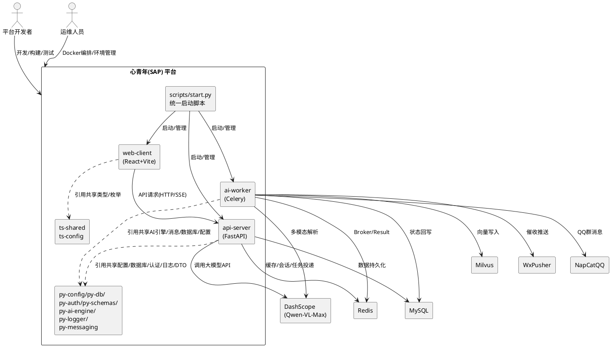
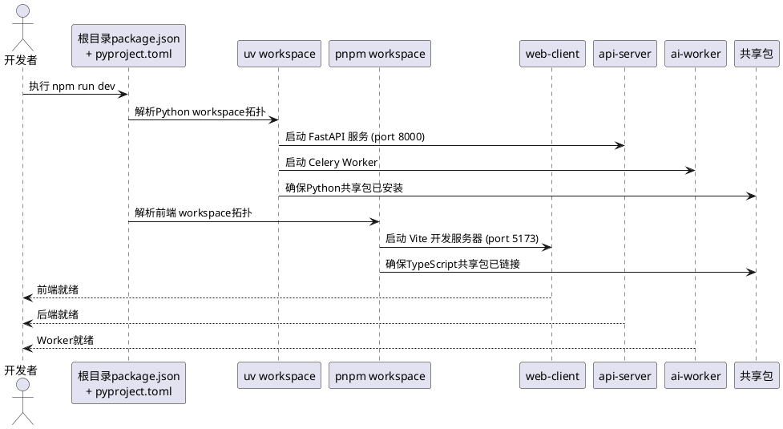
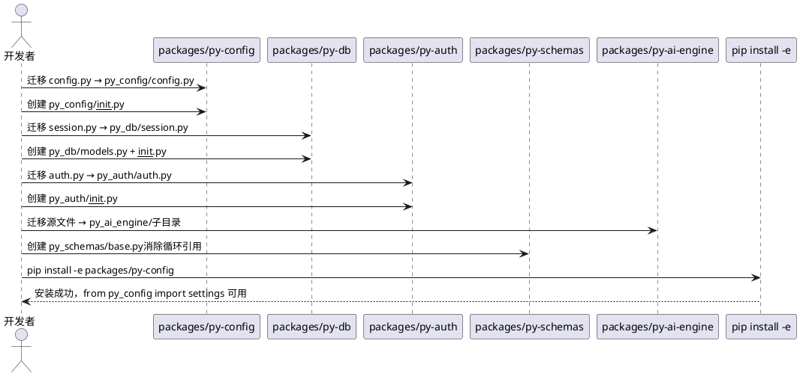
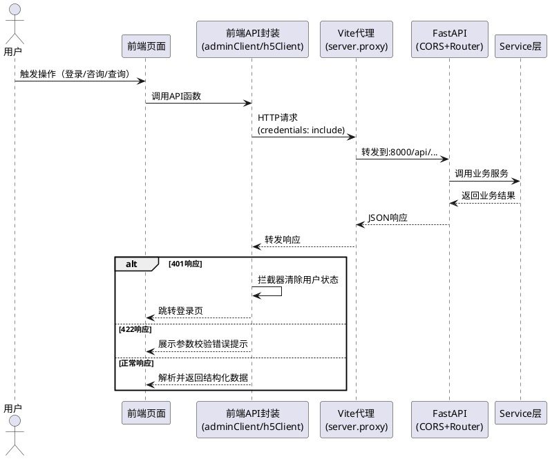
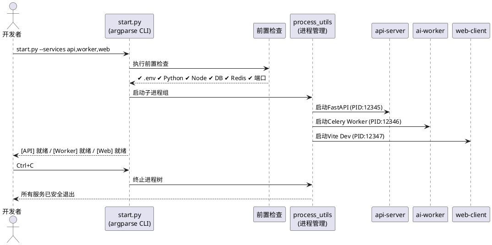
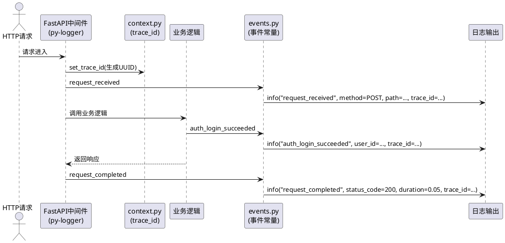
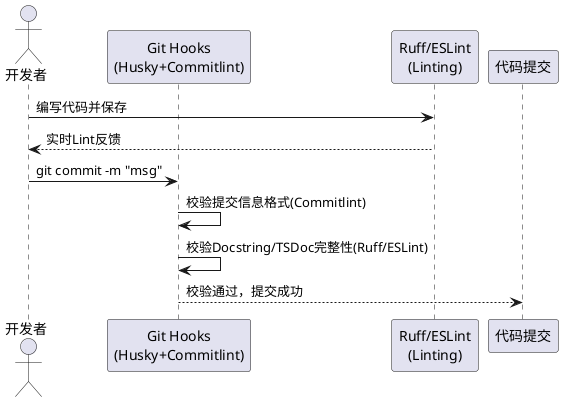
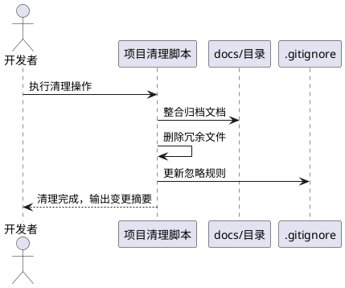
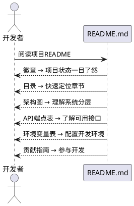

# **1. 组件定位**

## **1.1 核心职责**

本组件负责整合并优化心青年智能体平台的Monorepo工程体系，涵盖工作区配置、共享包结构修复、前后端API对接、启动脚本、日志增强、代码规范及项目清理，实现全栈开发环境的一体化治理。

## **1.2 核心输入**

1. **项目现有源码结构**：apps/（web-client、api-server）、packages/（待创建9个共享包）、scripts/（start.py等启动脚本）、规范/目录下的项目结构规范、启动脚本规范、日志规范、注释规范
2. **前后端API交互需求**：前端React+Vite应用对后端FastAPI的HTTP请求和SSE流式响应
3. **环境配置**：.env/.env.example环境变量模板、docker-compose.yml基础设施编排
4. **开发者操作指令**：工作区安装、构建、启动、测试等开发命令，含启动脚本的前置检查、进程管理、CLI参数等
5. **项目规范文档**：规范/目录下的项目结构规范、启动脚本规范、日志规范、注释规范四份规范文件

## **1.3 核心输出**

1. **规范化Monorepo双工作空间**：uv workspace（pyproject.toml声明2个apps+7个packages）+ pnpm workspace（pnpm-workspace.yaml声明apps/web-client与packages/ts-*）
2. **目录结构合规的Python共享包**：7个Python共享包源码均位于py_xxx/子目录中，匹配pyproject.toml的packages字段，消除循环引用
3. **前后端全链路API对接**：Vite代理、CORS配置、Cookie凭证传递、401/422拦截器、SSE流式响应处理
4. **统一启动脚本**：三阶段控制台布局、前置检查、跨平台进程管理、argparse CLI + 交互式菜单
5. **增强的py-logger**：events.py事件命名规范、context.py trace_id、FastAPI请求日志中间件
6. **代码规范工具链**：Ruff + Commitlint + Conventional Commits强制执行
7. **清理后的项目**：归档文档整合、冗余文件删除、.gitignore更新
8. **优化的README**：徽章 + 目录 + 架构图 + API端点表 + 环境变量表 + 贡献指南

## **1.4 职责边界**

1. **不负责**业务功能的新增开发（如新增咨询类型、新增知识分类等业务特性）
2. **不负责**UI/UX视觉设计的变更（如页面布局调整、组件样式重构）
3. **不负责**AI大模型算法的优化（如模型参数调优、RAG检索策略改进）
4. **不负责**生产环境部署流程的搭建（仅确保开发环境下的Docker编排可正常运行）
5. **不负责**数据库迁移和存量数据的清洗转换

# **2. 领域术语**

**Monorepo**
: 将多个相关项目（前端应用、后端应用、共享包）存储在同一个版本控制仓库中的代码组织方式，通过工作区工具统一管理依赖和构建流程。

**工作区（Workspace）**
: Monorepo中每个可独立构建的子项目称为一个工作区，工作区工具负责解析工作区间的依赖拓扑并执行统一操作。

**共享包（Shared Package）**
: 位于 packages/ 目录下的可复用软件包，被 apps/ 下的应用通过包名引用，避免代码重复和不一致。

**py_xxx子目录结构**
: Python共享包的标准源码目录结构，包名py-xxx的源码必须位于py_xxx/子目录中（如py-config → py_config/），匹配pyproject.toml的packages = [{include = "py_xxx"}]字段声明，确保pip install -e可正确发现和安装包。

**API对接（API Alignment）**
: 前端API封装层的请求路径、请求参数、响应结构与后端API路由的端点定义保持一一对应和数据格式匹配。

**SSE流式响应（Server-Sent Events）**
: 服务器向客户端单向推送数据的HTTP长连接机制，在AI对话场景中用于逐段推送模型生成内容。

**CORS（Cross-Origin Resource Sharing）**
: 跨域资源共享机制，允许浏览器向不同源的服务器发送请求并获得响应。

**Cookie凭证传递**
: 使用HTTP Cookie（credentials: 'include'）在前后端之间传递认证会话标识的方式。

**Vite代理（Vite Proxy）**
: 开发服务器将前端发出的API请求转发到后端服务器的机制，避免开发环境下的跨域问题。

**Feature-Based聚合**
: 前端代码按业务功能聚合于features/目录下，每个feature内部自治（api/hooks/components/store），降低模块耦合。

**三层架构**
: 后端采用Router→Service→Repository三层架构。Router负责参数校验与路由分发；Service负责核心业务逻辑；Repository负责数据访问层（ORM查询封装，租户过滤内置）。禁止跨层调用。

**EARS格式**
: Easy Approach to Requirements Syntax，一种简洁的需求语法模式，通过条件-主体-响应结构描述可验证的系统行为。

**Conventional Commits**
: Git提交信息规范格式，结构为"类型(作用域): 描述"，类型包括feat/fix/docs/style/refactor/perf/chore/test等。

**py-schemas循环引用**
: py-schemas包内models.py与__init__.py之间的相互导入问题，需通过base.py提取共享基础类消除循环。

**事件命名规范**
: 日志事件名统一使用小写下划线格式，前缀按模块（auth_*/user_*/student_*）+ 结果后缀（*_succeeded/*_failed），定义在py-logger/events.py中。

**trace_id（追踪标识）**
: 跨请求的分布式追踪标识，由py-logger/context.py生成并注入日志上下文，实现请求级日志关联。

# **3. 角色与边界**

## **3.1 核心角色**

- **平台开发者**：负责日常前后端代码开发、调试和构建，需要在统一的Monorepo环境下进行全栈开发
- **运维/部署人员**：负责Docker编排和环境配置，需要通过统一的脚本启动和管理服务

## **3.2 外部系统**

- **豆包AI大模型（DashScope/Qwen-VL-Max）**：下游依赖，后端通过API调用获取AI对话响应和嵌入向量
- **MySQL关系数据库**：下游依赖，存储业务数据，由py-db统一管理ORM模型与Alembic迁移
- **Redis缓存**：下游依赖，用于会话缓存、Celery Broker/Result Backend和任务队列
- **Milvus向量数据库**：下游依赖，存储和检索RAG知识向量
- **WxPusher消息推送**：下游依赖，通过py-messaging封装，实现催收推送
- **NapCatQQ消息推送**：下游依赖，通过py-messaging封装，实现QQ群消息分发
- **pnpm包管理器**：上游工具，管理前端和共享TypeScript包的依赖安装与pnpm workspace解析
- **uv包管理器**：上游工具，管理Python应用和共享Python包的依赖安装与uv workspace解析

## **3.3 交互上下文**

# **4. DFX约束**

## **4.1 性能**

1. When 开发者执行全栈启动命令（dev脚本），the Monorepo平台 shall 在30秒内完成前端和后端的同时启动并输出就绪信号
2. When 开发者执行全量安装命令（install:all脚本），the Monorepo平台 shall 在120秒内完成所有工作区的依赖安装（含前端pnpm和后端uv）
3. The 前端Vite开发服务器 shall 通过路由代理将API请求在50ms内转发到后端FastAPI服务
4. Where 常规查询接口执行，the api-server shall 保证P95响应时间小于300ms

## **4.2 可靠性**

1. While 前端Vite开发服务器运行中，When 后端FastAPI服务重启，the 前端开发服务器 shall 保持运行且在后端恢复后自动重新连接API
2. When SSE流式响应因网络中断而断开，the 前端 shall 在3秒内检测到断连并向用户展示断连提示，支持手动重连
3. The 前后端Cookie认证凭证 shall 在每次请求中可靠传递，不因代理配置或CORS策略导致凭证丢失
4. When 启动脚本收到中断信号（Ctrl+C），the 启动脚本 shall 安全终止所有子进程及孙进程，不留僵尸进程
5. Where 强依赖前置检查失败（如数据库/Redis不可连接），the 启动脚本 shall 立即中止启动流程并以非零状态码退出

## **4.3 安全性**

1. The 后端CORS配置 shall 仅允许已声明的前端源地址进行跨域请求，禁止使用通配符 `*` 作为 allow_origins
2. While 生产环境运行，the 前端VITE_API_BASE_URL shall 指向后端实际域名，不使用localhost或127.0.0.1
3. The .env文件中包含的敏感配置（SECRET_KEY、API_KEY等）shall 不被提交到版本控制系统
4. The 日志系统 shall 禁止记录密码、Token原文、密钥、完整身份证号等敏感信息
5. The repositories层 shall 默认注入tenant_id查询条件实现租户隔离

## **4.4 可维护性**

1. The Monorepo项目 shall 提供统一的根级npm脚本（dev、build、test、lint），可一键操作所有工作区
2. The 共享Python包 shall 各自包含独立的pyproject.toml，可通过 `pip install -e` 方式以可编辑模式安装到后端工作区
3. The 共享TypeScript包（ts-shared）shall 包含独立的package.json和TypeScript配置，可被web-client通过工作区引用使用
4. The 日志系统 shall 统一使用py-logger（get_logger），禁止裸print输出
5. The 日志输出 shall 采用结构化键值格式，不使用拼接字符串
6. The 异常处理 shall 使用精确异常类型，禁止 except Exception
7. The 日志事件命名 shall 使用小写下划线格式，前缀按模块 + 结果后缀（*_succeeded/*_failed）
8. The 后端代码 shall 遵循PEP8 + Google Style Docstring
9. The 前端代码 shall 遵循TSDoc/JSDoc标准，组件Props和自定义Hook必须注释
10. The Git提交信息 shall 遵循Conventional Commits格式
11. The 单文件行数 shall 控制在前端<=200行，Python函数50-80行内
12. The 前端代码 shall 禁止显式或隐式any类型，Python全面使用类型注解
13. The 关键动作（推送、权限拒绝、Agent Tool调用）shall 落审计日志

## **4.5 兼容性**

1. Where 现有根目录package.json中的脚本存在，the 优化后的工作区配置 shall 保留原有脚本行为的向后兼容
2. Where 后端当前通过sys.path.append临时引用共享包，the 优化后 shall 支持通过 `pip install -e` 的正式方式引用，同时保留sys.path.append作为降级兼容
3. The 前端API封装层的接口签名 shall 在对接优化过程中保持向后兼容，不改变已有的函数名和参数结构
4. The 启动脚本 shall 支持跨平台运行（Windows/Linux/macOS），平台差异封装至scripts/utils/process_utils.py
5. The 控制台颜色输出 shall 检测终端是否支持颜色（sys.stdout.isatty()），在不支持环境中自动降级为纯文本

# **5. 核心能力**

## **5.1 Monorepo工作区配置**

### **5.1.1 业务规则**

1. **uv workspace声明规则**：根目录pyproject.toml必须声明Python uv workspace，包含[tool.uv.workspace]段，members声明2个apps（api-server、ai-worker）和7个packages（py-config、py-db、py-schemas、py-ai-engine、py-logger、py-auth、py-messaging）的路径

   a. 验收条件：[执行uv sync --all-packages] → [所有Python应用和共享包被正确安装，无路径解析错误]

2. **pnpm workspace声明规则**：根目录pnpm-workspace.yaml必须声明Node.js pnpm workspace，packages声明apps/web-client与packages/ts-*的glob路径

   a. 验收条件：[执行pnpm install] → [web-client和ts-shared/ts-config被正确链接，workspace:协议解析成功]

3. **应用层完整清单规则**：apps/目录必须包含3个应用——web-client（React 18+Vite前端）、api-server（FastAPI网关）、ai-worker（Celery Worker异步任务处理器），不可遗漏

   a. 验收条件：[检查apps/目录] → [包含web-client/、api-server/、ai-worker/三个子目录]

4. **共享包完整清单规则**：packages/目录必须包含9个共享包——Python包：py-config、py-db、py-schemas、py-ai-engine、py-logger、py-auth、py-messaging；TypeScript包：ts-shared、ts-config

   a. 验收条件：[检查packages/目录] → [包含9个子目录，7个Python包+2个TypeScript包]

5. **根脚本统一规则**：根目录package.json必须提供统一的一键操作脚本，至少包含dev（全栈启动）、build（全量构建）、test（全量测试）、lint（全量检查）、install:all（全量安装）

   a. 验收条件：[在根目录执行npm run dev] → [同时启动前端Vite开发服务器、后端FastAPI服务和Celery Worker]

6. **目录分组规则**：项目顶层目录必须按职责明确分组——apps/存放可独立部署的应用，packages/存放可复用的共享包，infrastructure/存放部署配置，docs/存放文档，tests/存放测试，scripts/存放工具脚本，data/存放样例数据，logs/存放运行时日志，tmp/存放临时文件

   a. 验收条件：[检查根目录结构] → [仅包含apps/、packages/、docs/、tests/、scripts/、data/、logs/、tmp/及配置文件，无散落的项目文件]

7. **禁止项**：禁止在根目录散落应属于子项目的配置文件；禁止跨应用直接import，应用间共享能力必须通过packages/传递

   a. 验收条件：[检查根目录文件列表] → [不包含vite.config.js等应用专属文件]；[检查应用间import语句] → [无跨应用直接import]

### **5.1.2 交互流程**

### **5.1.3 异常场景**

1. **共享包安装失败**
   a. 触发条件：共享包的pyproject.toml或package.json配置有误
   b. 系统行为：跳过该共享包的安装，输出警告日志，继续安装其余工作区
   c. 用户感知：控制台输出"[WARNING] 共享包 {name} 安装失败，请检查其配置文件"

2. **工作区路径配置错误**
   a. 触发条件：pyproject.toml或pnpm-workspace.yaml中声明的路径不存在对应目录
   b. 系统行为：工作区管理器报告路径解析错误
   c. 用户感知：控制台输出"workspace: {path} does not exist"错误，命令执行失败

## **5.2 Python共享包目录结构修复**

### **5.2.1 业务规则**

1. **py_xxx子目录结构规则**：所有Python共享包必须将源码放在py_xxx/子目录中，匹配pyproject.toml的packages = [{include = "py_xxx"}]字段，确保pip install -e可正确发现和安装包

   a. 验收条件：[执行pip install -e packages/py-config] → [from py_config import settings 可正确导入，无ModuleNotFoundError]

2. **py-config结构修复规则**：py-config包源码必须从config.py迁移至py_config/config.py，并添加py_config/__init__.py导出核心对象

   a. 验收条件：[检查packages/py-config/目录] → [包含py_config/子目录，py_config/config.py存在，py_config/__init__.py存在]

3. **py-db结构修复规则**：py-db包源码必须从session.py迁移至py_db/session.py，并创建py_db/models.py和py_db/__init__.py

   a. 验收条件：[检查packages/py-db/目录] → [包含py_db/子目录，py_db/session.py、py_db/models.py、py_db/__init__.py均存在]

4. **py-auth结构修复规则**：py-auth包源码必须从auth.py迁移至py_auth/auth.py，并添加py_auth/__init__.py导出核心功能

   a. 验收条件：[检查packages/py-auth/目录] → [包含py_auth/子目录，py_auth/auth.py存在，py_auth/__init__.py存在]

5. **py-ai-engine结构修复规则**：py-ai-engine包所有源文件必须迁移至py_ai_engine/子目录中，并添加py_ai_engine/__init__.py

   a. 验收条件：[检查packages/py-ai-engine/目录] → [包含py_ai_engine/子目录，所有.py源文件位于py_ai_engine/内而非包根目录]

6. **py-schemas循环引用消除规则**：py-schemas包必须创建py_schemas/base.py存放共享基础类，models.py仅引用base.py而非__init__.py，消除models.py与__init__.py之间的循环导入

   a. 验收条件：[执行python -c "from py_schemas import models"] → [无循环导入错误（ImportError/CircularImport）]；[检查py_schemas/base.py] → [包含被models.py和__init__.py共同依赖的基础类定义]

7. **py-logger结构验证规则**：py-logger包已正确使用py_logger/子目录结构，需验证符合规范且pyproject.toml的packages字段正确声明

   a. 验收条件：[检查packages/py-logger/目录] → [包含py_logger/子目录，pyproject.toml中packages = [{include = "py_logger"}]]

8. **py-messaging结构验证规则**：py-messaging包已正确使用py_messaging/子目录结构，需验证符合规范且pyproject.toml的packages字段正确声明

   a. 验收条件：[检查packages/py-messaging/目录] → [包含py_messaging/子目录，pyproject.toml中packages = [{include = "py_messaging"}]]

9. **__init__.py导出规则**：每个Python共享包的py_xxx/__init__.py必须导出该包的核心公共API，使使用者可通过from py_xxx import CoreClass方式访问

   a. 验收条件：[执行from py_config import settings] → [成功获取settings对象]；[执行from py_auth import jwt_handler] → [成功获取jwt_handler模块]

10. **禁止项**：禁止在共享包根目录直接放置.py源码文件（除pyproject.toml、README.md、LICENSE等配置文件外）；禁止__init__.py中使用from . import *的模糊导出

    a. 验收条件：[检查packages/py-config/根目录] → [不包含config.py等源码文件，仅包含pyproject.toml和py_config/子目录]

### **5.2.2 交互流程**

### **5.2.3 异常场景**

1. **迁移后导入路径变更导致上层引用失败**
   a. 触发条件：api-server或ai-worker中仍使用旧导入路径（如from config import settings而非from py_config import settings）
   b. 系统行为：Python运行时抛出ModuleNotFoundError
   c. 用户感知：服务启动失败，控制台输出"ModuleNotFoundError: No module named 'config'"错误，需批量更新所有上层引用

2. **py-schemas循环引用未彻底消除**
   a. 触发条件：py_schemas/base.py仍间接引用models.py中的定义
   b. 系统行为：Python运行时检测到循环导入，抛出ImportError或返回部分初始化的模块
   c. 用户感知：服务启动时报"cannot import name 'XXX' from partially initialized module"错误

3. **__init__.py导出遗漏**
   a. 触发条件：py_xxx/__init__.py未导出上层应用需要使用的某个类或函数
   b. 系统行为：应用可通过from py_xxx.module import Class方式访问，但from py_xxx import Class失败
   c. 用户感知：开发者需要使用完整模块路径导入，不符合简化导入的预期

## **5.3 前后端API对接**

### **5.3.1 业务规则**

1. **Vite代理配置规则**：前端Vite开发服务器必须配置server.proxy，将 `/api` 路径的请求代理到后端FastAPI服务地址（默认http://localhost:8000），避免开发环境跨域问题

   a. 验收条件：[前端在开发模式请求/api/auth/me] → [Vite代理将请求转发至http://localhost:8000/api/auth/me]

2. **CORS动态配置规则**：后端CORSMiddleware的allow_origins必须从.env文件的CORS_ORIGINS变量动态读取，支持逗号分隔的多个源地址，默认包含localhost:5173

   a. 验收条件：[.env中CORS_ORIGINS=http://localhost:5173,http://10.15.9.148:5173] → [后端CORS配置包含两个源地址，来自该IP的跨域请求成功]

3. **Cookie凭证传递规则**：前端所有API请求必须携带 `credentials: 'include'`，后端必须配置 `allow_credentials=True`，adminClient和h5Client两个API客户端实例均需配置

   a. 验收条件：[前端发起任何API请求] → [请求HTTP头中包含Cookie字段，后端正确解析认证会话]

4. **401拦截器规则**：前端API拦截器必须捕获401 Unauthorized响应，清除本地用户状态，跳转至登录页，仅触发一次跳转（防止并发请求多次跳转）

   a. 验收条件：[后端返回401状态码] → [前端清除用户状态，跳转至登录页，展示"请重新登录"提示，不重复跳转]

5. **422拦截器规则**：前端API拦截器必须捕获422 Unprocessable Entity响应，将Pydantic校验错误详情映射为用户可读的提示消息

   a. 验收条件：[后端返回422及校验错误详情] → [前端展示"请求参数错误：{field} {reason}"的用户友好提示]

6. **SSE流式响应处理规则**：前端SSE解析器必须识别并处理所有SSE事件类型（message/topic/sources/error/done），实现流式渐进展示，支持AbortController用户主动中断

   a. 验收条件：[SSE流持续发送message事件] → [对话界面内容随事件到达实时增长]；[用户点击停止按钮] → [AbortController.abort()被调用，前端展示已接收的部分内容]

7. **API路径映射规则**：前端src/api/中每个模块的请求路径必须与后端app/api/v1/routes/中对应路由的prefix+path完全一致

   a. 验收条件：[前端auth模块请求路径为/api/auth/*] → [后端auth路由注册prefix为/api/auth，路径一一对应]

8. **环境变量统一管理规则**：前后端的环境配置必须通过.env文件统一管理，前端使用VITE_前缀，后端使用PYTHON环境变量，.env.example包含所有必需变量的示例

   a. 验收条件：[开发者复制.env.example为.env并填写实际值] → [前端VITE_API_BASE_URL和后端各配置项均可正确读取]

9. **禁止项**：禁止前端API封装层硬编码完整URL地址；禁止后端CORS配置中同时使用 `allow_origins=["*"]` 和 `allow_credentials=True`；禁止在生产环境使用Vite代理配置

   a. 验收条件：[检查src/api/所有文件] → [不包含硬编码URL]；[检查CORS配置] → [allow_origins为具体源地址列表]

### **5.3.2 交互流程**

### **5.3.3 异常场景**

1. **Vite代理未配置导致跨域失败**
   a. 触发条件：前端Vite开发服务器未配置server.proxy
   b. 系统行为：浏览器因CORS策略阻止请求
   c. 用户感知：API请求全部失败，控制台输出"Access-Control-Allow-Origin"错误

2. **CORS白名单未包含前端源地址**
   a. 触发条件：前端从局域网IP地址访问，但CORS_ORIGINS未包含该源
   b. 系统行为：后端拒绝该源的跨域请求
   c. 用户感知：局域网访问时API请求失败，需在.env的CORS_ORIGINS中添加对应源

3. **Cookie凭证丢失**
   a. 触发条件：前端请求未携带credentials: 'include'，或后端CORS未配置allow_credentials=True
   b. 系统行为：浏览器不发送Cookie，后端返回401 Unauthorized
   c. 用户感知：页面跳转至登录页，提示"登录已过期"

4. **SSE连接建立失败**
   a. 触发条件：后端/api/consult/chat端点不可用或返回非200状态码
   b. 系统行为：前端chatSSE函数抛出"SSE 连接失败"错误
   c. 用户感知：对话界面展示"连接失败，请重试"提示，提供重试按钮

5. **SSE流中途断开**
   a. 触发条件：网络波动或后端异常导致ReadableStream提前结束
   b. 系统行为：前端检测到流结束但completed标记为false
   c. 用户感知：对话界面展示已接收的部分内容，标记为"回答被中断"

6. **并发401响应重复跳转**
   a. 触发条件：多个并发请求同时收到401响应
   b. 系统行为：拦截器应仅触发一次登录跳转
   c. 用户感知：页面仅跳转一次登录页，不出现闪烁

## **5.4 统一启动脚本**

### **5.4.1 业务规则**

1. **三阶段控制台布局规则**：启动脚本控制台输出必须遵循三阶段布局——阶段一：前置检查（逐项实时打印检查结果）、阶段二：服务启动（逐个展示启动进度）、阶段三：运行中（持续展示服务日志）

   a. 验收条件：[执行start.py] → [控制台呈现三阶段分隔布局，前置检查项逐项实时打印，服务日志前缀对齐]

2. **前置检查规则**：启动脚本在拉起任何服务前必须执行五类前置检查——.env配置文件存在性、Python/Node关键依赖就绪性、目标端口占用检查、MySQL/Redis基础设施连通性Ping探测

   a. 验收条件：[.env文件不存在时执行启动脚本] → [提示"请从.env.example复制并配置"并中止启动]；[端口8000已被占用时] → [报错并终止api-server启动]

3. **跨平台进程管理规则**：启动脚本必须安全管理整个进程树——Linux/macOS使用os.setsid/os.killpg管理进程组，Windows使用taskkill /F /T /PID递归终止进程树；平台差异必须封装至scripts/utils/process_utils.py

   a. 验收条件：[收到Ctrl+C信号] → [所有子进程及孙进程被安全终止，无僵尸进程残留]

4. **argparse CLI规则**：启动脚本须支持argparse命令行参数——--services参数指定服务组合（如--services api,worker），--env-file参数指定环境文件路径

   a. 验收条件：[执行start.py --services api,worker] → [仅启动api-server和ai-worker，跳过web-client]

5. **交互式菜单规则**：无参数启动时提供交互式菜单供开发者手动选择服务组合

   a. 验收条件：[执行start.py无参数] → [展示交互式菜单，列出api/worker/web选项供选择]

6. **日志统一与隔离规则**：必须复用py-logger统一日志模块；控制台输出为不同服务添加带颜色的明确前缀（[API]/[Worker]/[Web]），固定宽度对齐；各子服务日志重定向到独立日志文件

   a. 验收条件：[多服务并发运行时] → [每行日志携带固定宽度服务名前缀，日志正文在同一列对齐]

7. **颜色语义绑定规则**：颜色与语义严格绑定——绿色=成功、黄色=警告、红色=错误、青色=信息；不支持颜色的环境自动降级为纯文本

   a. 验收条件：[CI管道中运行启动脚本] → [输出纯文本，无ANSI颜色码]

8. **禁止项**：禁止在业务脚本中直接硬编码ANSI转义码；禁止在不支持颜色的环境中输出颜色码；禁止在业务逻辑中硬编码平台判断

   a. 验收条件：[检查scripts/start*.py源码] → [不包含sys.platform硬编码判断，不包含硬编码ANSI转义码]

### **5.4.2 交互流程**

### **5.4.3 异常场景**

1. **前置检查失败中止启动**
   a. 触发条件：Redis连接失败或数据库不可达等强依赖检查未通过
   b. 系统行为：启动脚本立即中止，以非零状态码退出
   c. 用户感知：控制台红色输出"✘ Redis 连接失败 → 请确认 Redis 服务已启动"，启动流程中止

2. **子进程意外崩溃**
   a. 触发条件：api-server或ai-worker子进程因未捕获异常意外退出
   b. 系统行为：主脚本检测到子进程退出，输出警告日志
   c. 用户感知：控制台输出"[WARNING] API 服务 (PID: 12345) 意外退出，退出码: 1"

3. **进程终止超时**
   a. 触发条件：某子进程在收到终止信号后未在超时时间内退出
   b. 系统行为：主脚本对该进程执行强制终止
   c. 用户感知：控制台在该行末尾标注"强制终止"

## **5.5 py-logger增强**

### **5.5.1 业务规则**

1. **events.py事件命名规范规则**：py-logger必须提供events.py模块，预定义所有日志事件名常量，事件名统一使用小写下划线格式，前缀按模块（auth_*/user_*/student_*）+ 结果后缀（*_succeeded/*_failed）

   a. 验收条件：[检查py_logger/events.py] → [包含auth_login_succeeded、auth_login_failed等事件名常量，格式符合规范]

2. **context.py追踪标识规则**：py-logger必须提供context.py模块，生成并管理trace_id（分布式追踪标识），支持set_trace_id/get_trace_id操作，trace_id自动注入日志上下文

   a. 验收条件：[调用set_trace_id("abc-123")后输出日志] → [日志中包含trace_id=abc-123字段]

3. **FastAPI请求日志中间件规则**：py-logger必须提供FastAPI中间件，自动记录每个HTTP请求的入口和出口信息，包含method、path、status_code、duration、trace_id

   a. 验收条件：[API请求POST /api/auth/login] → [日志自动输出request_received和request_completed事件，包含method=POST、path=/api/auth/login、duration等字段]

4. **统一日志库规则**：后端统一使用py-logger（get_logger），禁止裸print；日志格式采用结构化键值，不使用拼接字符串

   a. 验收条件：[检查后端代码] → [所有日志输出通过get_logger获取的logger实例，无裸print调用]

5. **精确异常类型规则**：禁止except Exception，必须使用精确异常类型；在降级、拒绝、失败分支必须输出warning或error日志

   a. 验收条件：[检查except语句] → [无except Exception裸捕获，所有异常分支有对应日志输出]

6. **禁止项**：禁止裸print替代日志；禁止使用字符串拼接构造日志消息；禁止在日志中记录敏感信息原文

   a. 验收条件：[代码审查] → [无裸print、无字符串拼接日志、无敏感信息原文记录]

### **5.5.2 交互流程**

### **5.5.3 异常场景**

1. **trace_id上下文丢失**
   a. 触发条件：异步任务（Celery Worker）中未初始化trace_id上下文
   b. 系统行为：日志中trace_id字段为空或缺失
   c. 用户感知：无法跨进程关联请求日志，需在Worker任务入口显式调用set_trace_id

2. **事件名未预定义**
   a. 触发条件：开发者在新模块中直接使用未预定义的事件名输出日志
   b. 系统行为：日志可正常输出但事件名不规范
   c. 用户感知：代码审查发现事件名不在events.py已定义清单中

3. **中间件日志性能影响**
   a. 触发条件：高并发场景下请求日志中间件增加响应延迟
   b. 系统行为：每个请求增加约1ms的日志开销
   c. 用户感知：P95响应时间仍在300ms红线内，无需调整

## **5.6 注释与代码规范**

### **5.6.1 业务规则**

1. **Ruff配置规则**：后端代码必须配置Ruff作为Python linter/formatter，规则集至少包含：pydocstyle（强制Docstring）、isort（导入排序）、flake8-bugbear（常见Bug检测），配置文件为pyproject.toml的[tool.ruff]段

   a. 验收条件：[执行ruff check apps/api-server/] → [报告所有不符合规范的代码，包括缺失Docstring、导入顺序错误等]

2. **Commitlint配置规则**：前端必须配置Husky+Commitlint，拦截不符合Conventional Commits格式的提交信息；commitlint配置文件为.commitlintrc或package.json中的commitlint段

   a. 验收条件：[执行git commit -m "fix bug"] → [Commitlint拦截并提示"subject must match format: type(scope): description"错误]

3. **Conventional Commits格式规则**：提交信息必须符合"类型(作用域): 简短说明"格式，类型包括feat/fix/docs/style/refactor/perf/chore/test，作用域为可选的受影响模块名

   a. 验收条件：[检查git log] → [所有提交信息符合Conventional Commits格式]

4. **中英文结合规则**：代码命名（变量、函数、类）必须使用具有明确语义的英文；注释推荐使用中文，降低阅读理解成本

   a. 验收条件：[代码审查] → [所有命名使用英文，注释优先使用中文]

5. **后端Docstring规范**：后端代码严格遵守PEP8，Docstring采用Google Style格式；FastAPI路由的summary/description直接生成Swagger UI文档

   a. 验收条件：[访问Swagger UI] → [所有接口包含summary标题和description详细说明，无空白缺失]

6. **前端注释规范**：前端代码采用TSDoc/JSDoc标准；组件必须包含功能说明，Props接口每个属性必须有注释；自定义Hook必须说明入参和返回值

   a. 验收条件：[检查React组件文件] → [每个组件包含TSDoc功能说明，Props接口包含字段注释]

7. **禁止项**：禁止误导性注释；禁止注释与代码不同步；禁止提交不符合规范的代码（必须被Hook拦截）

   a. 验收条件：[提交缺少Docstring的代码] → [Git Hook拦截并提示修正]

### **5.6.2 交互流程**

### **5.6.3 异常场景**

1. **Lint检查失败阻止提交**
   a. 触发条件：开发者提交的代码缺少Docstring或TSDoc注释
   b. 系统行为：Ruff/ESLint检测到缺失注释，Git Hook拦截提交
   c. 用户感知：控制台输出"Missing docstring for public function"错误，提交被拒绝

2. **提交信息格式不合规**
   a. 触发条件：开发者使用非Conventional Commits格式的提交信息
   b. 系统行为：Commitlint拦截提交
   c. 用户感知：控制台输出"subject must match format: type(scope): description"错误

## **5.7 项目清理**

### **5.7.1 业务规则**

1. **文档整合规则**：项目根目录下归档的冗余文档（如各子项目docs/下的重复文档、.github/agents/下的agent配置等）必须整合至docs/统一目录，删除原始归档位置

   a. 验收条件：[检查项目根目录和子项目] → [无散落的重复文档，所有文档集中于docs/目录]

2. **冗余文件删除规则**：删除项目中不再使用的废弃文件——包括但不限于临时调试脚本、过时的配置文件备份、未引用的静态资源

   a. 验收条件：[执行清理操作后] → [项目中不存在标记为废弃或未引用的文件]

3. **.gitignore更新规则**：.gitignore必须覆盖所有生成的和运行时的文件——node_modules/、__pycache__/、*.pyc、.env、dist/、build/、logs/*.log、tmp/、.pytest_cache/、uv.lock等

   a. 验收条件：[检查.gitignore] → [包含上述所有忽略规则]；[执行git status] → [不显示应被忽略的文件]

4. **规范文档保留规则**：规范/目录下的项目结构规范、启动脚本规范、日志规范、注释规范四份文件必须保留，不纳入清理范围

   a. 验收条件：[检查规范/目录] → [包含项目结构规范、启动脚本规范、日志规范、注释规范四份文件]

5. **禁止项**：禁止删除业务功能源码文件；禁止删除.env.example模板文件；禁止删除生产配置文件

   a. 验收条件：[清理后检查] → [apps/下所有业务源码完好，.env.example存在，docker-compose.yml存在]

### **5.7.2 交互流程**

### **5.7.3 异常场景**

1. **误删业务文件**
   a. 触发条件：清理脚本错误匹配并删除了业务源码文件
   b. 系统行为：文件被删除，项目构建或运行失败
   c. 用户感知：需通过git恢复被误删文件，清理脚本需增加白名单保护机制

2. **.gitignore规则遗漏**
   a. 触发条件：.gitignore缺少某些运行时生成文件的忽略规则
   b. 系统行为：git status显示应被忽略的文件
   c. 用户感知：开发者可能意外提交生成文件，需补充忽略规则

## **5.8 README优化**

### **5.8.1 业务规则**

1. **徽章规则**：README.md顶部必须包含项目状态徽章——至少包含技术栈（Python/React）、许可证、构建状态等徽章

   a. 验收条件：[检查README.md顶部] → [包含shields.io格式的徽章，链接指向正确的项目地址]

2. **目录结构规则**：README.md必须包含可点击的目录（Table of Contents），覆盖所有二级标题

   a. 验收条件：[检查README.md] → [包含目录段，每个目录项为锚点链接，与实际二级标题一一对应]

3. **架构图规则**：README.md必须包含系统架构概览图（Mermaid或PlantUML格式），展示apps/packages/scripts的分层关系和数据流向

   a. 验收条件：[检查README.md] → [包含架构图，图中标注web-client、api-server、ai-worker和核心共享包]

4. **API端点表规则**：README.md必须包含API端点速查表，列出所有后端API路由的HTTP方法、路径、功能描述

   a. 验收条件：[检查README.md] → [包含API端点表，覆盖/api/auth、/api/consult、/api/knowledge等所有路由]

5. **环境变量表规则**：README.md必须包含环境变量配置表，列出所有必需环境变量的名称、类型、默认值、说明

   a. 验收条件：[检查README.md] → [包含环境变量表，覆盖VITE_API_BASE_URL、CORS_ORIGINS、SECRET_KEY等变量]

6. **贡献指南规则**：README.md必须包含贡献指南段，说明开发环境搭建步骤、代码规范要求、提交信息格式、PR流程

   a. 验收条件：[检查README.md] → [包含贡献指南段，覆盖安装步骤、Conventional Commits格式、Ruff/ESLint规范]

7. **禁止项**：禁止README.md包含过时或不准确的信息；禁止省略关键的环境变量说明

   a. 验收条件：[README中描述的启动步骤] → [实际执行可成功启动项目]

### **5.8.2 交互流程**

### **5.8.3 异常场景**

1. **README信息与实际不同步**
   a. 触发条件：新增了API端点或环境变量但未更新README
   b. 系统行为：README中缺少最新信息
   c. 用户感知：开发者按README操作失败，需手动排查差异

2. **架构图渲染失败**
   a. 触发条件：Mermaid/PlantUML语法错误导致GitHub无法渲染架构图
   b. 系统行为：README中架构图位置显示为原始代码块
   c. 用户感知：无法直观理解系统架构，需修复图表语法

# **6. 数据约束**

## **6.1 工作区配置对象**

1. **uv workspace members**：字符串数组类型，每个元素为apps/或packages/子目录的相对路径，pyproject.toml的[tool.uv.workspace].members字段声明
2. **pnpm workspace packages**：字符串数组类型，每个元素为glob模式（如"apps/*"、"packages/ts-*"），pnpm-workspace.yaml的packages字段声明
3. **共享包包名**：字符串类型，Python包使用py-前缀（如py-config），TypeScript包使用@young-hearts/作用域前缀

## **6.2 Python共享包结构对象**

1. **包名**：字符串类型，格式为py-xxx（连字符分隔的kebab-case），如py-config、py-db
2. **源码目录名**：字符串类型，格式为py_xxx（下划线分隔的snake_case），与包名对应，如py_config、py_db
3. **packages字段**：对象数组类型，pyproject.toml中packages = [{include = "py_xxx"}]，include值必须与源码目录名一致
4. **__init__.py导出列表**：字符串数组类型，列出该包对外暴露的核心公共API名称

## **6.3 API请求配置对象**

1. **API_BASE_URL**：字符串类型，必须为合法的HTTP/HTTPS URL，包含协议前缀、主机地址和可选端口，禁止包含尾部斜杠
2. **VITE_MODE**：枚举类型，取值为"development"或"production"，决定前端是否启用Mock数据
3. **credentials策略**：枚举类型，取值为"include"，所有API请求必须使用此值
4. **CORS_ORIGINS**：字符串类型，逗号分隔的合法URL列表，后端从.env动态读取

## **6.4 SSE事件对象**

1. **event类型**：枚举类型，取值为"message"、"topic"、"sources"、"source"、"error"、"done"之一
2. **data.content**：字符串类型，message事件的数据字段，AI生成的内容片段文本
3. **data.topic**：字符串类型，topic事件的数据字段，话题标记文本

## **6.5 启动脚本配置对象**

1. **--services参数**：字符串枚举类型，可选值"api"、"worker"、"web"的逗号分隔组合
2. **前置检查项**：对象数组类型，每项包含name（检查项名称）、type（强依赖/弱依赖）、check_fn（检查函数引用）
3. **服务日志前缀**：字符串类型，固定格式"[API   ]"/"[Worker]"/"[Web   ]"，右侧空格填充至固定宽度对齐
4. **颜色语义映射**：对象类型，键为颜色名，值为语义（成功/警告/错误/信息），与控制台输出严格绑定

## **6.6 日志事件对象**

1. **事件名**：字符串类型，格式为"{模块}_{动作}_{结果}"（如auth_login_succeeded），小写下划线
2. **reason**：字符串类型，失败原因的机器码枚举值（snake_case），禁止自然语言长句
3. **trace_id**：字符串类型，UUID格式的分布式追踪标识，由context.py生成
4. **通用上下文字段**：对象类型，可选包含user_id、tenant_id、username、role等字段，禁止包含敏感信息
5. **日志级别**：枚举类型，取值为"info"（成功事件）、"warning"（业务失败但系统可继续）、"error"（系统异常或关键流程失败）

## **6.7 README内容对象**

1. **徽章列表**：对象数组类型，每项包含label（标签文本）、url（链接地址）、color（徽章颜色）
2. **目录项**：对象数组类型，每项包含title（标题文本）、anchor（锚点ID）、level（标题层级）
3. **API端点条目**：对象数组类型，每项包含method（HTTP方法）、path（路由路径）、description（功能描述）
4. **环境变量条目**：对象数组类型，每项包含name（变量名）、type（类型）、default（默认值）、required（是否必填）、description（说明）
