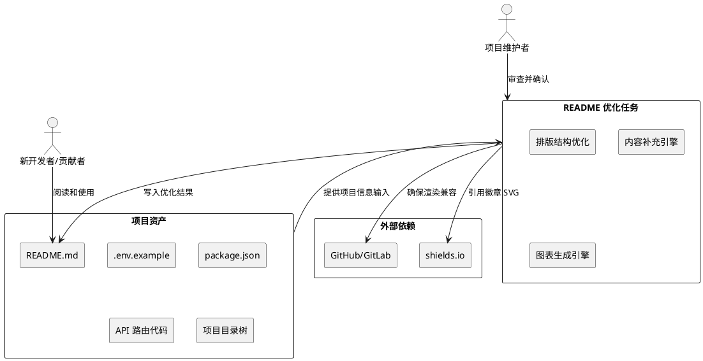

# **1. 实现模型**

## **1.1 上下文视图**

### 1.1.1 系统上下文图

README 优化作为项目文档层面的纯文本变更任务，不涉及运行时服务交互，其上下文关系如下：



### 1.1.2 架构决策记录（ADR）

| ADR 编号 | 决策标题 | 决策内容 | 理由 |
|----------|---------|---------|------|
| ADR-01 | Mermaid 架构图优先于 ASCII | 使用 Mermaid graph 语法绘制架构概览图，而非 ASCII 文本 | Mermaid 在 GitHub/GitLab 原生渲染，支持交互折叠，可维护性优于静态文本 |
| ADR-02 | shields.io flat 风格统一 | 全部徽章采用 `style=flat`，颜色使用技术栈标准色值 | 视觉一致性，flat 风格在小尺寸下可读性最佳 |
| ADR-03 | 表格化结构化信息 | 技术栈、前置条件、API 端点、环境变量均采用 Markdown 表格 | 表格提供列对齐和可扫描性，优于列表或纯文本段落 |
| ADR-04 | 章节内联而非拆分独立文件 | 贡献指南、FAQ 等内容直接内联于 README.md，不拆分 CONTRIBUTING.md | 降低新开发者跳转成本，README 作为唯一入口提供完整信息 |
| ADR-05 | Cookie 认证标注 | API 端点表格中 Auth 列使用 "Cookie" 而非 "JWT" | 与项目实际认证方式一致，Cookie 对前端不可见，降低误解风险 |

## **1.2 服务/组件总体架构**

### 1.2.1 README 优化组件架构

README 优化任务为一次性文本改写，不构成运行时服务。以下展示优化内容的逻辑模块划分：

```plantuml
@startuml
skinparam componentStyle rectangle

rectangle "README.md（优化后）" as readme {
    rectangle "头部区域" as header {
        rectangle "H1 标题" as h1
        rectangle "徽章行" as badges
        rectangle "目录（TOC）" as toc
    }
    rectangle "概览区域" as overview {
        rectangle "架构概览图\n（Mermaid）" as arch
        rectangle "技术栈表格" as techstack
        rectangle "目录结构" as dirstruct
    }
    rectangle "引导区域" as guide {
        rectangle "安装步骤\n（含前置条件表格）" as install
        rectangle "使用方法\n（含 CLI 参数）" as usage
    }
    rectangle "参考区域" as reference {
        rectangle "API 端点表格" as api
        rectangle "环境变量表格" as envvars
    }
    rectangle "协作区域" as collab {
        rectangle "开发指南" as devguide
        rectangle "贡献指南\n（含代码规范）" as contributing
        rectangle "许可证" as license
    }
}

h1 --> badges --> toc
toc --> overview
toc --> guide
toc --> reference
toc --> collab

@enduml
```

### 1.2.2 优化前后章节对照

| 区域 | 优化前章节 | 优化后章节 | 变更类型 |
|------|-----------|-----------|---------|
| 头部 | 无徽章、无目录 | 徽章行 + 目录（TOC） | 新增 |
| 概览 | 项目概述（纯文字） | 架构概览图 + 技术栈表格（含版本号） | 增强 |
| 引导 | 前置条件（列表） | 前置条件（表格 + 安装方式链接） | 增强 |
| 引导 | 使用方法（无 CLI 参数） | 使用方法（含 CLI 参数示例 + 访问地址） | 增强 |
| 参考 | 无 | API 端点表格（11 项） | 新增 |
| 参考 | 无 | 环境变量表格（13 变量/7 分组） | 新增 |
| 协作 | 无 | 贡献指南（含代码规范） | 新增 |
| 协作 | 许可证（单行） | 许可证（MIT 链接 + 说明） | 增强 |

## **1.3 实现设计文档**

### 1.3.1 已完成优化内容详细记录

#### 1.3.1.1 徽章添加

**实现位置**：README.md 第 5-12 行（H1 标题下方）

**已添加的 8 个徽章**：

| 序号 | 徽章 | URL 格式 | 颜色 | Logo |
|------|------|---------|------|------|
| 1 | Python 3.12+ | `shields.io/badge/Python-3.12+-3776AB` | 3776AB | python |
| 2 | Node.js 20+ | `shields.io/badge/Node.js-20+-339933` | 339933 | node.js |
| 3 | FastAPI 0.128+ | `shields.io/badge/FastAPI-0.128+-009688` | 009688 | fastapi |
| 4 | React 18 | `shields.io/badge/React-18-61DAFB` | 61DAFB | react |
| 5 | License MIT | `shields.io/badge/License-MIT-blue` | blue | - |
| 6 | Docker Compose | `shields.io/badge/Docker-Compose-2496ED` | 2496ED | docker |
| 7 | pnpm workspace | `shields.io/badge/pnpm-workspace-F69220` | F69220 | pnpm |
| 8 | uv workspace | `shields.io/badge/uv-workspace-4A90D9` | 4A90D9 | - |

**样式统一规则**：全部使用 `style=flat`，均引用 shields.io 域名。

#### 1.3.1.2 目录（TOC）生成

**实现位置**：README.md 第 16-28 行（徽章行之后、架构概览之前）

**已添加的 12 项目录链接**：

1. 架构概览 → `#架构概览`
2. 技术栈 → `#技术栈`
3. 目录结构 → `#目录结构`
4. 安装步骤 → `#安装步骤`
5. 使用方法 → `#使用方法`
6. API 端点 → `#api-端点`
7. 环境变量 → `#环境变量`
8. 开发指南 → `#开发指南`
9. 部署说明 → `#部署说明`
10. 贡献指南 → `#贡献指南`
11. 许可证 → `#许可证`

**格式**：`- [章节名](#锚点)` 列表形式，覆盖全部 H2 级别章节。

#### 1.3.1.3 架构概览图

**实现位置**：README.md 第 34-70 行（"架构概览" 章节内）

**Mermaid 图结构**：

```mermaid
graph TB
    subgraph 前端
        WC[web-client<br/>React 18 + Vite]
        TS[ts-shared<br/>共享类型/枚举]
    end
    subgraph 后端
        API[api-server<br/>FastAPI 网关]
        WRK[ai-worker<br/>Celery Worker]
    end
    subgraph 共享能力层
        CFG[py-config] → DB[py-db] → SCH[py-schemas] → AUTH[py-auth] → AI[py-ai-engine] → LOG[py-logger] → MSG[py-messaging]
    end
    subgraph 基础设施
        PG[(PostgreSQL)] → RD[(Redis)] → CH[(ChromaDB)]
    end
    WC -->|引用| TS
    WC -->|HTTP /api| API
    API --> AUTH & DB & SCH & LOG & CFG
    API -->|投递任务| RD
    WRK --> RD & AI & MSG & DB
    DB --> PG
    AI -->|HTTP| Doubao[豆包大模型]
    MSG -->|HTTP| WxPusher[WxPusher]
```

**五层架构**：前端 → 后端 → 共享能力层 → 基础设施 → 外部服务（豆包/WxPusher）。节点数 14，满足 ≤ 15 的 DFX 约束。

#### 1.3.1.4 技术栈表格增强

**变更内容**：原技术栈表格为两列（层级/技术选型），增加第三列"版本"。

| 层级 | 技术选型 | 版本（新增列） |
|------|----------|---------------|
| 前端 | React + Vite + TypeScript + antd-mobile | 18 / 7 / 5 / 5 |
| 后端 | FastAPI + SQLAlchemy + Pydantic + uv | 0.128 / 2.0 / 2.12 / latest |
| 异步任务 | Celery + Redis | 5.4 / 7 |
| AI 集成 | 豆包大模型 + LangChain + RAG + ChromaDB | - / - / - / 0.5 |
| 数据库 | PostgreSQL + SQLite (开发) | 16 / - |
| 部署 | Docker + Nginx | - / - |
| 工作区 | pnpm-workspace.yaml + pyproject.toml (uv) | 9 / - |

#### 1.3.1.5 前置条件表格化

**变更内容**：原前置条件为列表格式，改为三列表格（工具/最低版本/安装方式）。

| 工具 | 最低版本 | 安装方式 |
|------|----------|----------|
| Python | 3.12+ | [python.org](https://python.org) |
| Node.js | 20+ | [nodejs.org](https://nodejs.org) |
| pnpm | 9+ | `npm install -g pnpm` |
| uv | latest | [docs.astral.sh/uv](https://docs.astral.sh/uv/) |
| Docker | 24+ | [docker.com](https://docker.com) |

#### 1.3.1.6 API 端点表格

**实现位置**：README.md "API 端点" 章节内

**已添加的 11 个端点**：

| Method | Path | Description | Auth |
|--------|------|-------------|------|
| POST | `/api/auth/login` | 用户登录 | - |
| POST | `/api/auth/register` | 用户注册 | - |
| GET | `/api/auth/me` | 获取当前用户信息 | Cookie |
| POST | `/api/auth/logout` | 用户登出 | Cookie |
| POST | `/api/consult/chat` | AI 对话（SSE 流式响应） | Cookie |
| GET | `/api/consult/sessions` | 获取会话列表 | Cookie |
| GET | `/api/consult/sessions/{id}/messages` | 获取会话历史消息 | Cookie |
| POST | `/api/knowledge/upload` | 上传知识文档 | Cookie |
| GET | `/api/knowledge/list` | 获取知识库列表 | Cookie |
| POST | `/api/knowledge/retrieve` | RAG 知识检索 | Cookie |
| GET | `/health` | 健康检查 | - |

**补充说明**：章节末尾指向本地 Swagger 文档 `http://localhost:8000/docs`。

#### 1.3.1.7 环境变量表格

**实现位置**：README.md "环境变量" 章节内

**已添加的 13 个变量（7 个分组）**：

| 分组 | 变量 | 说明 | 默认值 |
|------|------|------|--------|
| 前端 | `VITE_MODE` | 运行模式 | `production` |
| 前端 | `VITE_API_BASE_URL` | API 基础路径 | `http://localhost:8000/api/v1` |
| 核心 | `SECRET_KEY` | JWT 签名密钥 | - |
| 核心 | `DEBUG` | 调试模式 | `true` |
| 数据库 | `DATABASE_URL` | 数据库连接串 | `postgresql://...` |
| Redis | `REDIS_URL` | Redis 连接串 | `redis://localhost:6379/0` |
| 大模型 | `DOUBAO_API_KEY` | 豆包 API 密钥 | - |
| 大模型 | `DOUBAO_MODEL` | 豆包模型名称 | `doubao-pro-32k` |
| 向量库 | `CHROMA_DB_PATH` | ChromaDB 存储路径 | `./data/chroma` |
| CORS | `CORS_ORIGINS` | 允许的跨域源 | `http://localhost:5173` |
| Celery | `CELERY_BROKER_URL` | 任务队列 Broker | `redis://localhost:6379/1` |
| 消息推送 | `WXPUSHER_TOKEN` | WxPusher 令牌 | - |

**安全合规**：所有敏感变量（SECRET_KEY、DOUBAO_API_KEY）未包含真实值，仅展示变量名和说明。

#### 1.3.1.8 启动说明增强

**变更内容**：

1. **统一启动控制台**：补充 CLI 参数示例
   - `python scripts/start.py`（交互式菜单）
   - `python scripts/start.py --services api,web,worker`（指定服务）
   - `python scripts/start.py --no-check`（跳过前置检查）

2. **启动后访问地址**：新增服务地址说明
   - 前端：`http://localhost:5173`
   - 后端 API 文档：`http://localhost:8000/docs`
   - 健康检查：`http://localhost:8000/health`

#### 1.3.1.9 贡献指南新增

**实现位置**：README.md "贡献指南" 章节内

**贡献流程**：
1. Fork 本仓库
2. 创建特性分支：`git checkout -b feat/your-feature`
3. 提交变更，遵循 Conventional Commits 规范
4. 推送分支：`git push origin feat/your-feature`
5. 创建 Pull Request，描述变更内容和关联 Issue

**代码规范**：

| 维度 | 规范 |
|------|------|
| 前端 | ESLint + TSDoc/JSDoc 注释 |
| 后端 | Ruff + Google Style Docstring |
| 注释语言 | 命名使用英文，注释推荐中文 |
| 行数控制 | 前端单文件 ≤ 200 行，Python 函数 50-80 行 |
| 零 Any 容忍 | 前端禁止 `any` 类型 |

#### 1.3.1.10 语言专业度提升

**已应用的优化规则**：

| 规则 | 示例 |
|------|------|
| 中英文混排空格 | "React 18 + Vite"（非 "React18+Vite"） |
| 术语一致性 | "Hybrid Monorepo" 全文统一，不混用 "混合仓库" |
| 主动语态 | "运行以下命令启动服务"（非 "服务可以通过运行以下命令来启动"） |
| 禁止口语化 | 不使用 "搞定"、"弄一下" 等表达 |
| 禁止不确定措辞 | 不使用 "大概"、"可能"、"应该" |

### 1.3.2 优化后 README.md 整体结构

```text
README.md
├── H1: 心青年智能体平台
├── 项目简介（blockquote）
├── 徽章行（8 个 shields.io flat 徽章）
├── 分隔线
├── H2: 目录（12 项锚点链接）
├── 分隔线
├── H2: 架构概览（Mermaid 五层图）
├── 分隔线
├── H2: 技术栈（三列表格：层级/技术选型/版本）
├── 分隔线
├── H2: 目录结构（bash 代码块 + 中文注释）
├── 分隔线
├── H2: 安装步骤
│   ├── H3: 前置条件（三列表格）
│   ├── H3: 1. 克隆仓库
│   ├── H3: 2. 安装依赖
│   ├── H3: 3. 配置环境变量
│   └── H3: 4. 启动基础设施
├── 分隔线
├── H2: 使用方法
│   ├── H3: 开发模式（含 CLI 参数示例）
│   ├── H3: 构建与测试
│   └── H3: 代码检查
├── 分隔线
├── H2: API 端点（四列表格：Method/Path/Description/Auth）
├── 分隔线
├── H2: 环境变量（四列表格：分组/变量/说明/默认值）
├── 分隔线
├── H2: 开发指南
│   ├── H3: 前端开发
│   ├── H3: 后端开发
│   ├── H3: 共享包开发
│   └── H3: 提交规范
├── 分隔线
├── H2: 部署说明
│   ├── H3: Docker Compose 部署
│   ├── H3: 生产构建
│   └── H3: Nginx 配置
├── 分隔线
├── H2: 贡献指南（含代码规范子表格）
├── 分隔线
└── H2: 许可证（MIT 链接 + 说明）
```

# **2. 接口设计**

## **2.1 总体设计**

本任务为纯文档变更，不涉及运行时接口。以下记录 README.md 对外暴露的信息接口（即读者可消费的结构化信息）。

## **2.2 接口清单**

| 接口类型 | 名称 | 消费方 | 说明 |
|----------|------|--------|------|
| 信息接口 | 徽章行 | GitHub/GitLab 渲染引擎 | 8 个 SVG 徽章 URL，指向 shields.io |
| 信息接口 | 目录锚点 | README 读者 | 12 个 Markdown 锚点链接，支持章节跳转 |
| 信息接口 | 架构概览图 | GitHub/GitLab Mermaid 渲染 | 1 个 Mermaid graph TB 代码块，14 个节点 |
| 信息接口 | 技术栈表格 | 新开发者 | 7 行 × 3 列表格，含版本号 |
| 信息接口 | 前置条件表格 | 新开发者 | 5 行 × 3 列表格，含安装方式链接 |
| 信息接口 | API 端点表格 | API 消费方/前端开发者 | 11 行 × 4 列表格 |
| 信息接口 | 环境变量表格 | 运维人员/开发者 | 13 行 × 4 列表格，7 个分组 |
| 信息接口 | 贡献指南 | 开源贡献者 | Conventional Commits 规范 + 代码规范表格 |
| 信息接口 | CLI 参数说明 | 开发者 | 3 个 start.py 调用示例 |
| 信息接口 | 访问地址说明 | 开发者 | 3 个 localhost URL |

# **4. 数据模型**

## **4.1 设计目标**

本任务不涉及持久化数据模型。以下记录 README.md 中结构化信息的数据形态，用于后续维护时确保信息一致性。

## **4.2 模型实现**

### 4.2.1 徽章数据模型

```typescript
interface Badge {
  label: string       // 徽章标签，如 "Python"
  message: string     // 徽章消息，如 "3.12+"
  color: string       // 标准色值，如 "3776AB"
  logo?: string       // 可选 Logo 标识，如 "python"
  style: 'flat'       // 固定为 flat
  targetUrl?: string  // 可选点击跳转 URL
}
```

### 4.2.2 API 端点数据模型

```typescript
interface ApiEndpoint {
  method: 'GET' | 'POST' | 'PUT' | 'DELETE' | 'PATCH'
  path: string          // 如 "/api/auth/login"
  description: string   // 不超过 30 个中文字符
  auth: '-' | 'Cookie' | 'Cookie + RBAC'
}
```

### 4.2.3 环境变量数据模型

```typescript
interface EnvVariable {
  group: string         // 分组名，如 "核心"、"数据库"
  name: string          // 变量名，如 "SECRET_KEY"
  description: string   // 变量说明
  defaultValue: string  // 默认值，无则标注 "-"
  required: boolean     // 是否必填
}
```

### 4.2.4 前置条件数据模型

```typescript
interface Prerequisite {
  tool: string          // 工具名，如 "Python"
  minVersion: string    // 最低版本，如 "3.12+"
  installMethod: string // 安装方式（URL 或命令）
}
```

### 4.2.5 技术栈数据模型

```typescript
interface TechStackEntry {
  layer: string         // 层级，如 "前端"、"后端"
  technologies: string  // 技术选型描述
  versions: string      // 版本号，如 "18 / 7 / 5 / 5"
}
```
