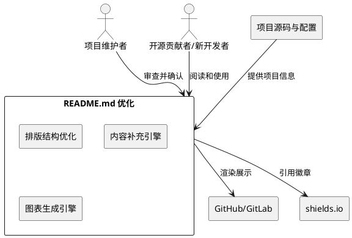
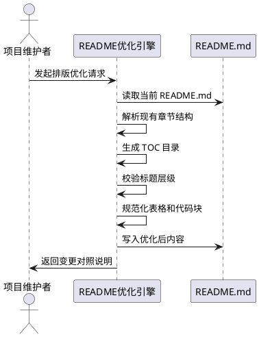
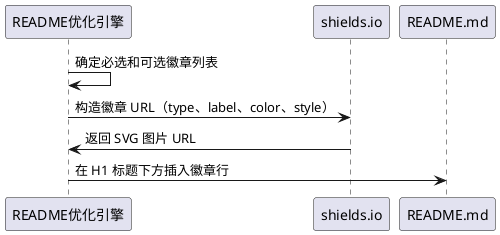
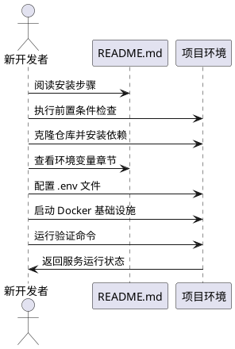
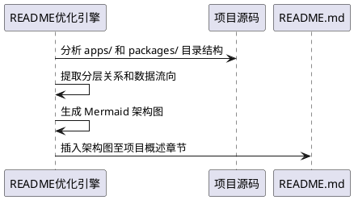
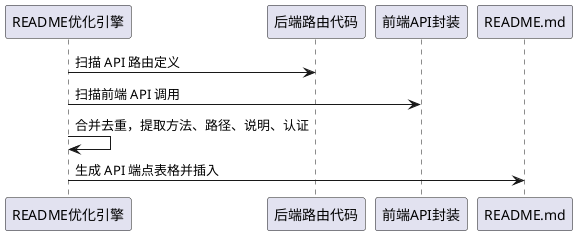
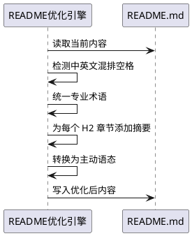
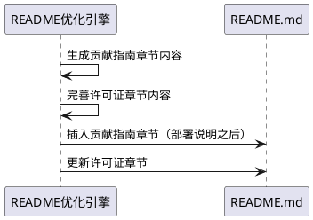
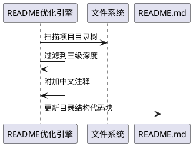

# **1. 组件定位**

## **1.1 核心职责**

本组件负责优化项目根目录 README.md 文件，通过改善排版结构、补充技术说明、增加徽章与架构图等手段，实现项目文档的专业度与可读性提升。

## **1.2 核心输入**

1. **当前 README.md**：项目根目录已有的 README.md 文件，包含7个章节（项目概述、技术栈、目录结构、安装步骤、使用方法、开发指南、部署说明）
2. **项目基本信息**：项目名称（心青年智能体平台）、核心功能描述、技术栈列表、工作区配置
3. **.env.example 环境变量模板**：包含全部环境变量定义及注释，用于生成环境变量说明章节
4. **package.json 脚本清单**：根级统一脚本定义（dev、build、test、lint、install 等），用于校验安装和使用说明的准确性
5. **docker-compose.yml 基础设施配置**：PostgreSQL 16、Redis 7、ChromaDB 服务定义，用于补充部署说明
6. **API 路由代码**：后端 API 路由定义及前端 API 封装层（auth.js、consult.js、knowledge.js），用于生成 API 端点说明
7. **项目目录树**：Monorepo 完整目录结构（apps/、packages/、infrastructure/、scripts/ 等），用于生成目录结构说明和架构图
8. **开发者反馈与优化目标**：7项具体优化目标（排版结构、安装说明、徽章、语言专业度、贡献指南、架构图、API端点）

## **1.3 核心输出**

1. **优化后的 README.md**：替换项目根目录的 README.md 文件，包含完整的目录（TOC）、徽章、架构概览图、环境变量说明、API 端点列表、贡献指南、常见问题等新增章节，以及优化后的原有章节
2. **README 变更对照说明**：列出新增章节、修改章节和删除章节的摘要，供开发者审查

## **1.4 职责边界**

1. **不负责**修改除 README.md 以外的任何项目文件
2. **不负责**修改 .env.example、package.json、docker-compose.yml 等配置文件的实际内容
3. **不负责**创建或修改 CONTRIBUTING.md、LICENSE 等独立文件（仅在 README.md 内提供相关说明段落）
4. **不负责**修改前端或后端的业务代码和 API 路由实现
5. **不负责**执行 git commit 或 git push 操作
6. **不负责**生成除 README.md 以外的任何新文档文件

# **2. 领域术语**

**README.md**
: 项目根目录的 Markdown 格式主文档，作为仓库的唯一说明入口，面向开发者和潜在贡献者提供项目全貌信息。

**徽章（Badge）**
: 在 README 顶部以 SVG 图片形式展示的项目元信息标签，如技术栈版本、许可证类型、构建状态等，通过 shields.io 等服务生成。

**目录（TOC，Table of Contents）**
: README.md 开头的章节导航目录，由 Markdown 锚点链接组成，支持快速跳转到任意章节。

**架构概览图**
: 使用 Mermaid 语法或 ASCII 文本绘制的项目分层架构示意图，展示前端、后端、Worker、共享包、基础设施之间的逻辑关系和数据流向。

**EARS格式**
: Easy Approach to Requirements Syntax，一种简洁的需求语法模式，通过条件-主体-响应结构描述可验证的系统行为。

**中英文混排规范**
: 中文文本中插入英文单词、缩写或代码片段时，在英文两侧各添加一个空格以提升可读性的排版规则。例外：英文与标点符号之间不加空格。

**Conventional Commits**
: 一种 Git 提交信息规范，格式为 `type(scope): description`，用于规范化提交历史和自动生成变更日志。

**API 端点（API Endpoint）**
: 后端暴露的 HTTP 接口路径，包含方法（GET/POST/PUT/DELETE）、路径（如 `/api/auth/login`）、简要功能说明和认证要求。

**环境变量说明**
: 对 .env.example 中定义的全部环境变量进行分组和解释，包括变量名、用途、是否必填、默认值等信息。

**Hybrid Monorepo**
: 混合型单体仓库，同时使用 pnpm-workspace.yaml（前端 Node.js 工作区）和 pyproject.toml uv workspace（后端 Python 工作区）管理多包和多应用的项目组织方式。

# **3. 角色与边界**

## **3.1 核心角色**

- **项目维护者**：负责审查优化后的 README.md 内容准确性，确认技术栈版本、API 端点、环境变量等信息的正确性
- **开源贡献者/新开发者**：README.md 的主要受众，需要通过 README 快速了解项目全貌、完成环境搭建、参与开发

## **3.2 外部系统**

- **GitHub/GitLab 平台**：README.md 的渲染平台，需确保 Markdown 语法和 Mermaid 图在该平台正确渲染
- **shields.io 徽章服务**：提供 SVG 格式的项目徽章图片，README 通过 URL 引用展示
- **pnpm 包管理器**：依赖方，README 中的安装命令需与 pnpm-workspace.yaml 配置一致
- **uv 包管理器**：依赖方，README 中的安装命令需与 pyproject.toml workspace 配置一致
- **Docker Compose**：依赖方，README 中的基础设施启动命令需与 docker-compose.yml 配置一致

## **3.3 交互上下文**

# **4. DFX约束**

## **4.1 性能**

1. README.md 文件大小不得超过 32KB，确保 GitHub 渲染不会截断
   - 验收条件：[优化后的 README.md 写入磁盘] → [文件大小 ≤ 32768 字节]
2. Mermaid 图的节点总数不超过 15 个，确保渲染速度和可读性
   - 验收条件：[架构概览图包含的节点数] → [节点数 ≤ 15]

## **4.2 可靠性**

1. README.md 中所有内部锚点链接必须可正确跳转至对应章节
   - 验收条件：[点击目录中任意章节链接] → [页面滚动到对应章节标题位置]
2. README.md 中所有外部 URL（徽章图片、参考链接）必须可正常访问
   - 验收条件：[访问 README 中任意外部 URL] → [返回 HTTP 200 状态码]
3. README.md 中所有代码块命令必须与 package.json 脚本或项目实际命令一致
   - 验收条件：[执行 README 中的任一安装/启动/构建命令] → [命令可被正确识别并执行]

## **4.3 安全性**

1. README.md 中禁止包含真实的 API 密钥、数据库密码或其他敏感凭证
   - 验收条件：[扫描优化后的 README.md] → [不包含 SECRET_KEY、DOUBAO_API_KEY 等敏感值的实际赋值]
2. 环境变量说明中必须使用占位符（如 `your_doubao_api_key`）替代真实值
   - 验收条件：[查看环境变量说明章节] → [所有敏感变量值均为占位符形式]

## **4.4 可维护性**

1. README.md 的章节结构必须与目录（TOC）保持同步
   - 验收条件：[新增或删除章节] → [目录（TOC）相应更新]
2. 技术栈版本信息应标注来源，便于后续版本升级时定位更新点
   - 验收条件：[查看技术栈徽章或表格] → [每个版本号可追溯至对应的配置文件]

## **4.5 兼容性**

1. README.md 必须在 GitHub 和 GitLab 的 Markdown 渲染引擎下均正确显示
   - 验收条件：[在 GitHub 和 GitLab 预览 README.md] → [排版、表格、代码块、Mermaid 图均正确渲染]
2. Mermaid 语法必须使用 v10+ 兼容版本
   - 验收条件：[架构概览图的 Mermaid 语法] → [在 Mermaid Live Editor 中正确渲染]

# **5. 核心能力**

## **5.1 排版结构优化**

### **5.1.1 业务规则**

1. **目录（TOC）生成规则**：README.md 必须在项目标题和徽章之后、正文内容之前包含完整的章节导航目录，目录由 Markdown 锚点链接组成，覆盖全部一级和二级标题
   - 验收条件：[阅读 README.md 前 30 行] → [包含覆盖全部章节的目录链接列表]

2. **标题层级规则**：README.md 必须严格遵循 Markdown 标题层级，项目名称为 H1，主要章节为 H2，子章节为 H3，禁止跳级使用标题
   - 验收条件：[扫描 README.md 标题结构] → [H1 → H2 → H3 层级递进，无跳级]

3. **表格排版规则**：技术栈表格、环境变量表格、API 端点表格必须包含表头行，列对齐一致，不允许出现跨行或跨列合并
   - 验收条件：[查看 README.md 中任一表格] → [表头完整、列对齐、无合并单元格]

4. **代码块标注规则**：所有代码块必须指定语言标识（bash、python、typescript、yaml、mermaid 等），禁止使用无语言标识的代码块
   - 验收条件：[扫描 README.md 所有代码块] → [每个代码块开头均包含语言标识]

5. **禁止项**：禁止使用 HTML 标签进行排版（除徽章图片 `` 外），禁止使用 `
` 折叠区块作为主要章节内容的组织方式
   - 验收条件：[扫描 README.md] → [不包含 `<table>`、`
`、`` 等 HTML 排版标签]

### **5.1.2 交互流程**

### **5.1.3 异常场景**

1. **章节标题含特殊字符**
   - 触发条件：[现有章节标题包含中文括号、冒号等 Markdown 锚点不兼容字符]
   - 系统行为：[自动将锚点链接中的特殊字符替换为 Markdown 兼容格式]
   - 用户感知：[目录链接可正确跳转到对应章节]

2. **代码块嵌套冲突**
   - 触发条件：[README 内需要在代码块中展示 Markdown 代码块示例]
   - 系统行为：[使用 4 个反引号包裹 3 个反引号的内部代码块]
   - 用户感知：[代码块嵌套正确渲染，无格式错乱]

## **5.2 徽章（Badges）添加**

### **5.2.1 业务规则**

1. **徽章位置规则**：所有徽章必须位于项目 H1 标题下方、项目简介段落上方，单行排列，徽章间以空格分隔
   - 验收条件：[查看 README.md 第 1-5 行] → [H1 标题下方紧接徽章行]

2. **必选徽章规则**：README.md 必须包含以下徽章：许可证（MIT）、Python 版本（3.12+）、Node.js 版本（20+）、FastAPI、React
   - 验收条件：[查看徽章行] → [包含 MIT、Python、Node.js、FastAPI、React 五个徽章]

3. **可选徽章规则**：README.md 应包含以下徽章：Docker、pnpm、uv、PostgreSQL、Redis
   - 验收条件：[查看徽章行] → [包含 Docker、pnpm、uv、PostgreSQL、Redis 徽章]

4. **徽章样式规则**：所有徽章必须使用 shields.io 的 flat 风格，颜色使用标准色值，禁止使用自定义 SVG
   - 验收条件：[查看任一徽章 URL] → [URL 以 shields.io 域名开头且包含 style=flat 参数]

5. **禁止项**：禁止添加构建状态徽章（因项目尚未配置 CI）和覆盖率徽章（因项目尚未配置覆盖率工具）
   - 验收条件：[查看徽章行] → [不包含 build-status 或 coverage 徽章]

### **5.2.2 交互流程**

### **5.2.3 异常场景**

1. **shields.io 服务不可用**
   - 触发条件：[构造徽章 URL 时 shields.io 域名无法访问]
   - 系统行为：[使用纯文本标签替代 SVG 徽章，如 `[MIT License]`]
   - 用户感知：[README 中仍可看到许可证等关键信息，但无彩色徽章样式]

## **5.3 安装与使用说明完善**

### **5.3.1 业务规则**

1. **前置条件完整性规则**：前置条件章节必须列出全部必需工具及其最低版本号，包括 Python ≥3.12、Node.js ≥20、pnpm ≥9、uv（最新版）、Docker & Docker Compose
   - 验收条件：[查看前置条件章节] → [包含上述 5 项工具及版本要求]

2. **安装步骤完整性规则**：安装步骤必须按顺序包含：前置条件检查 → 克隆仓库 → 安装依赖 → 配置环境变量 → 启动基础设施 → 验证安装结果，每个步骤必须包含可执行的命令
   - 验收条件：[按 README 安装步骤顺序执行] → [可成功完成项目环境搭建]

3. **环境变量说明规则**：必须新增独立的「环境变量」章节，按功能分组列出 .env.example 中的全部变量，每组包含：变量名、说明、是否必填、默认值
   - 验收条件：[查看环境变量章节] → [包含核心配置、数据库、Redis、大模型、向量数据库、CORS、Celery、邮件、消息推送共 9 个分组]

4. **常见问题规则**：必须新增「常见问题」章节（FAQ），至少包含以下条目：端口冲突处理、Docker 服务未启动、依赖安装失败、环境变量缺失
   - 验收条件：[查看 FAQ 章节] → [包含至少 4 个常见问题及解决方案]

5. **命令校验规则**：README 中出现的所有 npm run/pnpm/uv/python 命令必须与 package.json 的 scripts 字段或项目实际入口一致
   - 验收条件：[逐一比对 README 命令与 package.json scripts] → [全部命令可被正确执行]

6. **禁止项**：禁止在安装步骤中出现 `sudo` 命令，禁止出现硬编码的 IP 地址或端口号作为生产配置示例
   - 验收条件：[扫描安装章节] → [不包含 `sudo` 和硬编码 IP/端口]

### **5.3.2 交互流程**

### **5.3.3 异常场景**

1. **工具版本不满足**
   - 触发条件：[开发者本地 Python/Node.js 版本低于 README 要求的最低版本]
   - 系统行为：[FAQ 中提供版本升级指引链接]
   - 用户感知：[可通过 FAQ 找到版本升级方法]

2. **端口已被占用**
   - 触发条件：[8000/5173/5432/6379 等端口被其他服务占用]
   - 系统行为：[FAQ 中提供端口修改方法（修改 .env 或命令行参数）]
   - 用户感知：[可通过 FAQ 解决端口冲突问题]

3. **Docker 服务未安装**
   - 触发条件：[开发者未安装 Docker 但尝试执行 docker compose 命令]
   - 系统行为：[README 中标注 Docker 为可选依赖，并提供不使用 Docker 的替代方案（如 SQLite + 本地 Redis）]
   - 用户感知：[无 Docker 环境仍可进行基本开发]

## **5.4 架构概览图添加**

### **5.4.1 业务规则**

1. **架构图位置规则**：架构概览图必须位于「项目概述」章节内，在项目简介文字之后、目录结构之前
   - 验收条件：[查看项目概述章节] → [简介文字 → 架构图 → 目录结构，顺序正确]

2. **架构图内容规则**：架构图必须展示以下分层：前端应用层（web-client）、后端应用层（api-server）、异步任务层（ai-worker）、共享包层（packages）、基础设施层（PostgreSQL、Redis、ChromaDB），以及层间的数据流向
   - 验收条件：[查看架构图] → [包含上述 5 个分层及层间箭头]

3. **架构图语法规则**：必须使用 Mermaid flowchart 或 graph 语法绘制，禁止使用外部图片引用
   - 验收条件：[查看架构图代码块] → [语言标识为 mermaid，语法为 flowchart/graph]

4. **架构图简洁性规则**：架构图中每个分层最多展示 3 个代表性组件，避免过度细节
   - 验收条件：[统计架构图中节点数] → [节点数 ≤ 15]

### **5.4.2 交互流程**

### **5.4.3 异常场景**

1. **Mermaid 渲染失败**
   - 触发条件：[生成的 Mermaid 语法在 GitHub 渲染时报错]
   - 系统行为：[回退为 ASCII 文本架构图]
   - 用户感知：[架构图以文本形式正确展示]

## **5.5 API 端点说明补充**

### **5.5.1 业务规则**

1. **API 端点章节规则**：必须新增「API 端点」章节，位于开发指南章节之后、部署说明章节之前
   - 验收条件：[查看 README 章节顺序] → [开发指南 → API 端点 → 部署说明]

2. **API 端点表格规则**：API 端点必须以表格形式呈现，表格列包含：方法、路径、说明、认证要求
   - 验收条件：[查看 API 端点章节] → [表格包含 Method、Path、Description、Auth 四列]

3. **必列端点规则**：API 端点表格必须包含以下端点：
   - `GET /health` — 健康检查 — 无
   - `POST /api/auth/login` — 用户登录 — 无
   - `POST /api/auth/logout` — 用户登出 — Cookie
   - `POST /api/auth/register` — 用户注册 — 无
   - `GET /api/auth/me` — 获取当前用户 — Cookie
   - `PUT /api/auth/me` — 更新当前用户 — Cookie
   - `DELETE /api/auth/me` — 注销当前用户 — Cookie
   - `GET /api/knowledge/items` — 获取知识列表 — Cookie
   - `GET /api/knowledge/items/:id` — 获取知识详情 — Cookie
   - `POST /api/knowledge/upload` — 上传知识文件 — Cookie
   - `GET /api/consult/sessions` — 获取会话列表 — Cookie
   - `POST /api/consult/sessions` — 创建新会话 — Cookie
   - `GET /api/consult/sessions/:id` — 获取会话消息 — Cookie
   - `DELETE /api/consult/sessions/:id` — 删除会话 — Cookie
   - `POST /api/consult/chat` — SSE 流式对话 — Cookie
   - 验收条件：[查看 API 端点表格] → [包含上述 15 个端点]

4. **API 文档链接规则**：API 端点章节末尾必须包含指向本地 Swagger 文档的链接（`http://localhost:8000/docs`）
   - 验收条件：[查看 API 端点章节末尾] → [包含指向 `/docs` 的链接]

5. **禁止项**：禁止在 API 端点表格中包含请求体和响应体的完整 JSON Schema，仅提供简要说明
   - 验收条件：[查看 API 端点表格] → [Description 列为简要文字，无 JSON Schema]

### **5.5.2 交互流程**

### **5.5.3 异常场景**

1. **API 路由信息不完整**
   - 触发条件：[部分路由缺少 docstring 或功能说明]
   - 系统行为：[根据路由路径和方法名推断功能说明，并标注"需确认"]
   - 用户感知：[API 端点表格中该条目说明后附有"需确认"标记]

## **5.6 语言专业度与可读性提升**

### **5.6.1 业务规则**

1. **中英文混排规则**：中文文本中的英文单词、缩写、数字、代码片段两侧必须添加空格，但英文与标点符号之间不加空格
   - 验收条件：[扫描 README.md 中英文混排段落] → [英文/数字与中文之间有空格，与标点之间无空格]

2. **专业术语一致性规则**：同一概念在 README 全文中必须使用统一的术语表达，如 "Hybrid Monorepo" 不混用 "混合仓库" 和 "单体仓库"，"SSE" 不混用 "Server-Sent Events" 和 "服务端推送"
   - 验收条件：[扫描 README.md 全文] → [同一概念使用统一术语]

3. **章节摘要规则**：每个主要章节（H2）的开头必须有一句概括性说明（不超过 80 字），再展开详细内容
   - 验收条件：[查看每个 H2 章节的前两行] → [首行为概括性说明文字]

4. **主动语态规则**：说明性文字应使用主动语态和祈使句式，如 "运行以下命令启动服务" 而非 "服务可以通过运行以下命令来启动"
   - 验收条件：[扫描说明性段落] → [使用主动语态和祈使句式]

5. **禁止项**：禁止使用口语化表达（如"搞定"、"弄一下"），禁止使用不确定措辞（如"大概"、"可能"、"应该"）
   - 验收条件：[扫描 README.md] → [不包含口语化表达和不确定措辞]

### **5.6.2 交互流程**

### **5.6.3 异常场景**

1. **术语存在行业多种表达**
   - 触发条件：[某概念在行业内存在多种中文译法，如 "Monorepo" 可译为 "单体仓库" 或 "单仓多包"]
   - 系统行为：[在术语首次出现时标注英文原文，后续统一使用首次出现的表达]
   - 用户感知：[全文术语一致，首次出现可看到英文对照]

## **5.7 贡献指南与许可证说明**

### **5.7.1 业务规则**

1. **贡献指南章节规则**：必须新增「贡献指南」章节，位于部署说明之后、许可证之前，内容包含：开发流程、提交规范、代码风格、PR 流程
   - 验收条件：[查看 README 章节顺序] → [部署说明 → 贡献指南 → 许可证]

2. **提交规范说明规则**：贡献指南中必须包含 Conventional Commits 规范说明，列出 type（feat/fix/docs/refactor/test/chore）和 scope 示例
   - 验收条件：[查看贡献指南章节] → [包含 Conventional Commits 规范及 type/scope 示例]

3. **代码风格说明规则**：贡献指南中必须说明前端使用 ESLint + Prettier、后端使用 Ruff 进行代码风格检查，并提供 lint 命令
   - 验收条件：[查看贡献指南章节] → [包含 ESLint、Prettier、Ruff 说明及 lint 命令]

4. **PR 流程规则**：贡献指南中必须说明 PR 提交流程：Fork → Branch → Commit → Push → PR，并标注目标分支为 main
   - 验收条件：[查看贡献指南章节] → [包含 Fork → Branch → Commit → Push → PR 流程]

5. **许可证说明规则**：许可证章节必须包含：许可证类型（MIT）、许可证范围说明、版权归属
   - 验收条件：[查看许可证章节] → [包含 MIT 类型、范围说明、版权归属]

### **5.7.2 交互流程**

### **5.7.3 异常场景**

1. **项目尚无 CONTRIBUTING.md 文件**
   - 触发条件：[项目根目录不存在 CONTRIBUTING.md 独立文件]
   - 系统行为：[在 README.md 贡献指南章节中直接提供完整说明，不引用外部文件]
   - 用户感知：[README 内可直接阅读全部贡献指南，无需跳转]

## **5.8 目录结构优化**

### **5.8.1 业务规则**

1. **目录结构代码块规则**：目录树必须使用 bash 代码块包裹，缩进使用 Unicode 绘图字符（├── └──），每个目录和文件必须附带单行中文注释
   - 验收条件：[查看目录结构代码块] → [语言标识为 bash，每行含中文注释]

2. **目录结构精简规则**：目录树最多展开到三级深度，超过三级的子目录用 `...` 省略标记，重点展示 apps/、packages/、infrastructure/、scripts/ 四个顶层目录
   - 验收条件：[查看目录树] → [最大深度为三级，超过部分有 `...` 省略]

3. **目录结构更新规则**：目录树内容必须与项目实际目录结构一致，不得出现过时或不存在的目录/文件
   - 验收条件：[比对 README 目录树与实际目录结构] → [全部条目对应实际存在的目录/文件]

### **5.8.2 交互流程**

### **5.8.3 异常场景**

1. **目录结构发生变化**
   - 触发条件：[项目新增或删除了顶层目录/文件]
   - 系统行为：[根据当前文件系统重新生成目录树]
   - 用户感知：[目录树与实际项目结构一致]

# **6. 数据约束**

## **6.1 README 章节**

1. **章节名称**：必须使用中文命名，技术专有名词可保留英文（如 API、SSE、RAG、Docker）
2. **章节顺序**：项目概述 → 技术栈 → 目录结构 → 安装步骤 → 使用方法 → 开发指南 → API 端点 → 部署说明 → 贡献指南 → 常见问题 → 许可证
3. **章节数量**：不少于 10 个 H2 级别章节
4. **每个章节**：必须包含至少一段说明文字或一个结构化元素（表格/代码块/列表），禁止出现空章节

## **6.2 徽章**

1. **徽章 URL 格式**：`https://img.shields.io/badge/{label}-{message}-{color}?style=flat`
2. **label 字段**：不超过 15 个字符
3. **message 字段**：不超过 20 个字符
4. **color 字段**：仅允许使用标准颜色名（blue、green、orange、red、brightgreen、yellow、lightgrey）

## **6.3 环境变量条目**

1. **变量名**：必须与 .env.example 中完全一致，包含大写字母、下划线和数字
2. **分组**：按功能分为核心配置、数据库、Redis、大模型、向量数据库、CORS、Celery、邮件、消息推送
3. **必填标记**：SECRET_KEY、DATABASE_URL、DOUBAO_API_KEY 必须标记为"必填"，其余标记为"可选"
4. **默认值**：若 .env.example 中提供了默认值则列出，否则标注"无"

## **6.4 API 端点条目**

1. **HTTP 方法**：仅允许 GET、POST、PUT、DELETE、PATCH
2. **路径格式**：以 `/` 开头，路径参数使用 `:param` 格式（如 `:id`）
3. **认证要求**：仅允许"无"、"Cookie"、"Cookie + RBAC"三种取值
4. **说明长度**：不超过 30 个中文字符
