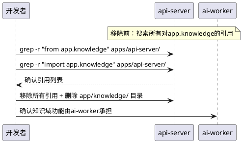

# **1. 实现模型**

## **1.1 上下文视图**

本实现方案将项目现有代码与四份规范（项目结构、启动脚本、日志、注释）对齐，消除7大差异域的合规缺陷。改造范围覆盖三个应用（api-server、web-client、ai-worker）、基础设施目录（infrastructure）、启动脚本（scripts/）和共享包（packages/）。

```plantuml
@startuml
skinparam componentStyle rectangle

rectangle "规范合规优化实现" as impl {
    rectangle "D1: api-server\n三层架构重组" as d1
    rectangle "D2: web-client\nFeature-Based聚合" as d2
    rectangle "D3: ai-worker\n目录补齐" as d3
    rectangle "D4: infrastructure\n目录补齐" as d4
    rectangle "D5: 启动脚本\n规范对齐" as d5
    rectangle "D6: 日志规范\n对齐" as d6
    rectangle "D7: 注释规范\n对齐" as d7
}

rectangle "项目代码基线\n(commit ea15700)" as baseline {
    rectangle "apps/api-server" as api
    rectangle "apps/web-client" as web
    rectangle "apps/ai-worker" as worker
    rectangle "scripts/" as scripts
    rectangle "packages/" as pkgs
}

rectangle "四份规范" as specs [
    项目结构规范
    启动脚本规范
    日志规范
    注释规范
]

d1 --> api : 重组目录+外迁models/schemas/config
d2 --> web : pages→app/ + features补齐 + store合并
d3 --> worker : 创建clients/ + pipelines/
d4 --> baseline : 创建infrastructure/预留目录
d5 --> scripts : Banner/日志对齐/退出阶段/py-logger复用
d6 --> api : py-logger接入 + 消除except Exception
d6 --> worker : py-logger接入
d7 --> api : Google Style Docstring + summary/description
d7 --> web : TSDoc + Props注释

impl --> specs : 遵循规范要求
@enduml
```

### **依赖关系与执行顺序**

7大差异域的改造存在依赖关系，必须按拓扑排序执行：

| 执行阶段 | 差异域 | 优先级 | 依赖 | 破坏性 | 说明 |
|---------|--------|--------|------|--------|------|
| **Phase 0** | D4: infrastructure目录补齐 | P2 | 无 | 🟢无 | 纯新增目录，零风险 |
| **Phase 1** | D3: ai-worker目录补齐 | P1 | 无 | 🟢无 | 纯新增空壳目录 |
| **Phase 2** | D6: 日志规范对齐 | P0 | D1(部分) | 🟡低 | 替换logging/print，需在新service层就绪后统一替换 |
| **Phase 3** | D1: api-server三层架构重组 | P0 | 无 | 🔴高 | 最大变更，需渐进迁移 |
| **Phase 4** | D2: web-client Feature-Based聚合 | P0 | 无 | 🔴高 | pages→app迁移+store合并，路由配置需同步更新 |
| **Phase 5** | D5: 启动脚本规范对齐 | P1 | D6 | 🟡低 | Banner/退出阶段增强，py-logger复用依赖D6 |
| **Phase 6** | D7: 注释规范对齐 | P1 | D1,D2 | 🟢无 | 纯注释补充，不改变逻辑 |

**关键约束**：D1（api-server三层架构重组）和D2（web-client Feature-Based聚合）可并行执行，但D6（日志规范）需在D1的service/repository层创建完成后才能统一替换日志调用。D5依赖D6完成py-logger复用。D7依赖D1和D2的目录结构稳定后补齐注释。

## **1.2 服务/组件总体架构**

### **api-server 三层架构目标结构**

```text
api-server/
├─ app/
│  ├─ api/
│  │  └─ v1/
│  │     ├─ routes/                    # Router层：仅路由定义+参数校验
│  │     │  ├─ __init__.py
│  │     │  ├─ auth.py                 # 认证路由（summary/description/Docstring）
│  │     │  ├─ notices.py              # 通知路由（P1预留）
│  │     │  ├─ health.py               # 健康检查路由
│  │     │  ├─ activities.py           # P1预留
│  │     │  ├─ knowledge.py            # P1预留
│  │     │  └─ agent.py                # P2预留
│  │     └─ __init__.py
│  ├─ services/                        # Service层：核心业务逻辑
│  │  ├─ __init__.py
│  │  ├─ auth_service.py               # 认证业务逻辑
│  │  ├─ user_service.py               # 用户业务逻辑
│  │  ├─ notice_service.py             # 通知业务逻辑（预留）
│  │  └─ tenant_service.py             # 租户业务逻辑（预留）
│  ├─ repositories/                    # Repository层：数据访问
│  │  ├─ __init__.py
│  │  ├─ user_repository.py            # 用户数据访问
│  │  ├─ session_repository.py         # 会话数据访问
│  │  └─ notice_repository.py          # 通知数据访问（预留）
│  ├─ dependencies/                    # FastAPI依赖注入项
│  │  ├─ __init__.py
│  │  └─ deps.py                       # get_db/get_current_user/get_current_tenant
│  ├─ middleware/                       # 中间件
│  │  └─ __init__.py
│  ├─ models/                          # 重导出层（从py-db引用）
│  │  └─ __init__.py
│  ├─ schemas/                         # 重导出层（从py-schemas引用）
│  │  └─ __init__.py
│  ├─ core/                            # 配置重导出（从py-config引用）
│  │  └─ __init__.py
│  └─ main.py                          # FastAPI应用入口
├─ tests/
└─ pyproject.toml
```

### **web-client Feature-Based 目标结构**

```text
web-client/src/
├─ app/                                # 页面级入口组件（原pages/迁移）
│  ├─ auth/                            # 认证页面
│  ├─ admin/                           # B端管理后台页面（预留）
│  ├─ h5/                              # C端H5页面（预留）
│  ├─ headless/                        # 无头逻辑页面（预留）
│  └─ landing/                         # 落地页（预留）
├─ features/                           # 按业务功能聚合
│  ├─ auth/                            # 认证
│  ├─ notice/                          # 通知引擎
│  ├─ member/                          # 成员管理（预留）
│  ├─ student/                         # 学生端（预留）
│  ├─ tenant/                          # 租户管理（预留）
│  ├─ knowledge/                       # 知识库（P1预留）
│  ├─ activity/                        # 活动大厅（P1预留）
│  └─ agent/                           # Agent助理（P2预留）
├─ shared/                             # 跨功能复用基础设施
│  ├─ api/                             # API客户端封装（原src/api/迁移）
│  └─ store/                           # Zustand全局状态（原src/store/合并）
├─ test/                               # Vitest测试目录
│  ├─ admin/
│  ├─ auth/
│  ├─ components/
│  ├─ features/
│  └─ store/
├─ components/                         # 全局通用UI组件
├─ hooks/                              # 全局通用Hooks
├─ layouts/                            # 页面布局壳
├─ styles/
├─ assets/
└─ types/
```

## **1.3 实现设计文档**

### **D1: api-server 三层架构重组**（🔴高风险，渐进迁移）

#### 1.3.1 兼容策略

三层架构重组是最大的变更，必须采用**渐进迁移**策略，确保现有接口行为不变：

**迁移原则**：
1. **URL路径不变**：所有路由的prefix保持 `/api/auth/*`，不改变外部契约
2. **先建后迁**：先创建新层（repositories/、dependencies/），再逐步将逻辑从旧位置抽取到新层
3. **重导出兼容**：models/schemas/config外迁至共享包后，api-server内保留`__init__.py`重导出，现有import路径不立即断裂
4. **逐模块迁移**：按auth→user→notice的顺序逐个模块迁移，每迁移一个模块即运行测试验证

**迁移步骤**（以auth模块为例）：

```
Step 1: 创建 repositories/ + dependencies/ 目录和基础文件
Step 2: 从 user_service.py 抽取 db.query 调用至 user_repository.py / session_repository.py
Step 3: 创建 dependencies/deps.py，将 get_db / get_current_user 迁入
Step 4: auth.py 路由文件：替换直接 db 操作为 service 调用，移除 db: Session 依赖
Step 5: auth_service.py：替换直接 db.query 为 repository 调用
Step 6: 运行测试验证 /api/auth/* 全部接口行为不变
Step 7: 重复 Step 2-6 迁移下一个模块
```

#### 1.3.2 文件变更清单

| 操作 | 文件路径 | 变更内容 | 风险 |
|------|---------|---------|------|
| **新建** | `app/repositories/__init__.py` | 空模块初始化 | 🟢 |
| **新建** | `app/repositories/user_repository.py` | 从user_service.py抽取：get_user_by_username、get_user_by_id、create_user | 🟡需确保db.session传递正确 |
| **新建** | `app/repositories/session_repository.py` | 从auth.py抽取：create_session、delete_session、get_session_by_id、validate_session | 🟡会话逻辑迁移 |
| **新建** | `app/repositories/notice_repository.py` | 预留空壳，含CRUD方法签名 | 🟢 |
| **新建** | `app/dependencies/__init__.py` | 空模块初始化 | 🟢 |
| **新建** | `app/dependencies/deps.py` | 集中依赖注入：get_db、get_current_user、get_current_tenant、require_roles | 🟡权限装饰器迁移 |
| **新建** | `app/services/notice_service.py` | 预留空壳 | 🟢 |
| **新建** | `app/services/tenant_service.py` | 预留空壳 | 🟢 |
| **重构** | `app/api/v1/routes/auth.py` | 移除db直接操作，调用service层，移除`next(get_db())`模式 | 🔴核心变更 |
| **重构** | `app/services/auth.py` | 移除db.query，改为调用repository层 | 🔴核心变更 |
| **重构** | `app/services/user_service.py` | 移除db.query/db.add/db.commit，改为调用repository层 | 🔴核心变更 |
| **重构** | `app/main.py` | 路由注册路径从`api.v1.routes.auth`改为`api.v1.routes.auth`（不变），增加py-logger初始化 | 🟡 |
| **重写** | `app/models/__init__.py` | 改为从py-db重导出：`from py_db.models import *` | 🟡需验证导入链 |
| **重写** | `app/models/user.py` | 改为从py-db重导出：`from py_db.models.user import User, VolunteerProfile, ExpertProfile, Session` | 🟡需验证所有引用 |
| **重写** | `app/schemas/__init__.py` | 改为从py-schemas重导出 | 🟡 |
| **重写** | `app/schemas/user.py` | 改为从py-schemas重导出：`from py_schemas.user import *` | 🟡需验证Pydantic模型兼容 |
| **重写** | `app/core/config.py` | 改为从py-config重导出：`from py_config.settings import settings` | 🟡需验证Settings字段完整 |
| **删除** | `app/knowledge/` | 整个目录移除（ingest.py、rag_pipeline.py、retriever.py、vectorstore/） | 🔴需先移除所有引用 |
| **删除** | `app/db/session.py` | 数据库引擎迁至py-db，此文件改为从py-db重导出 | 🟡 |

#### 1.3.3 knowledge域移除策略



移除前必须：
1. 全局搜索 `from app.knowledge` 和 `import app.knowledge`，逐一移除
2. 检查路由注册中是否有knowledge相关路由，如有则移除
3. 确认ai-worker已具备知识域相关任务（或记录为P1待实现）

#### 1.3.4 风险点与回退策略

| 风险 | 影响 | 缓解措施 | 回退策略 |
|------|------|---------|---------|
| 路由层移除db操作后接口行为改变 | 🔴高 | 逐模块迁移+每步运行pytest | `git revert`回退到迁移前commit |
| models/schemas外迁后循环引用 | 🟡中 | 使用`__init__.py`纯重导出，不引入新反向依赖 | 保留原文件，仅添加重导出 |
| knowledge移除后引用断裂 | 🟡中 | 移除前全局搜索+移除所有引用 | 恢复knowledge目录 |
| `next(get_db())`模式替换 | 🟡中 | 改为`Depends(get_db)`注入，需验证异步兼容性 | 保留旧模式在过渡期 |
| config外迁后Settings字段缺失 | 🟡中 | py-config的settings.py必须包含api-server所需全部字段 | api-server保留本地config补充缺失字段 |

---

### **D2: web-client Feature-Based聚合**（🔴高风险，渐进迁移）

#### 1.3.5 兼容策略

前端目录重组同样采用渐进迁移：

1. **pages/ → app/ 迁移**：先创建app/目录，`git mv`移动pages/内容，同步更新路由配置import路径
2. **store/ → shared/store/ 合并**：将src/store/下文件移动至src/shared/store/，全局替换import路径
3. **api/ → shared/api/ 迁移**：将src/api/下文件移动至src/shared/api/，全局替换import路径
4. **features/补齐**：创建auth/notice/member/student/tenant等预留目录，每个含`__init__.js`

#### 1.3.6 文件变更清单

| 操作 | 文件路径 | 变更内容 | 风险 |
|------|---------|---------|------|
| **新建** | `src/app/auth/` | 从`src/pages/auth/`迁移login.jsx、register.jsx、login.css、register.css | 🟡需更新路由import |
| **新建** | `src/app/admin/` | 预留空壳（B端管理后台页面） | 🟢 |
| **新建** | `src/app/h5/` | 预留空壳（C端H5页面） | 🟢 |
| **新建** | `src/app/headless/` | 预留空壳 | 🟢 |
| **新建** | `src/app/landing/` | 预留空壳 | 🟢 |
| **新建** | `src/features/auth/` | 认证业务逻辑目录 | 🟢 |
| **新建** | `src/features/notice/` | 通知业务逻辑目录 | 🟢 |
| **新建** | `src/features/member/` | 成员管理预留 | 🟢 |
| **新建** | `src/features/student/` | 学生端预留 | 🟢 |
| **新建** | `src/features/tenant/` | 租户管理预留 | 🟢 |
| **新建** | `src/features/activity/` | P1预留 | 🟢 |
| **新建** | `src/features/agent/` | P2预留 | 🟢 |
| **迁移** | `src/api/` → `src/shared/api/` | API客户端迁移（auth.js、consult.js、knowledge.js） | 🟡需全局替换import |
| **迁移** | `src/store/` → `src/shared/store/` | 状态管理合并（consultSession.jsx、roleUtils.js、UserContext.jsx、useUser.js） | 🟡需全局替换import |
| **新建** | `src/test/` | 测试目录创建，按业务域镜像子目录 | 🟢 |
| **删除** | `src/pages/` | 迁移完成后删除原目录 | 🔴需确认所有引用已更新 |
| **删除** | `src/store/` | 迁移完成后删除原目录 | 🔴需确认所有引用已更新 |
| **删除** | `src/api/` | 迁移完成后删除原目录 | 🔴需确认所有引用已更新 |
| **修改** | `src/App.jsx` | 路由import路径更新（pages/→app/） | 🔴路由断裂风险 |

#### 1.3.7 风险点与回退策略

| 风险 | 影响 | 缓解措施 | 回退策略 |
|------|------|---------|---------|
| pages→app后路由白屏 | 🔴高 | 同步更新App.jsx和路由配置中所有import路径 | `git revert`恢复pages/ |
| store合并后状态丢失 | 🟡中 | 全局搜索替换import路径，逐个验证 | 恢复src/store/目录 |
| api迁移后请求失败 | 🟡中 | 全局搜索替换import路径 | 恢复src/api/目录 |

---

### **D3: ai-worker目录补齐**（🟢无风险）

#### 1.3.8 文件变更清单

| 操作 | 文件路径 | 变更内容 |
|------|---------|---------|
| **新建** | `src/ai_worker/clients/__init__.py` | 空模块初始化 |
| **新建** | `src/ai_worker/clients/dashscope_client.py` | DashScope API客户端封装（从py-ai-engine调用） |
| **新建** | `src/ai_worker/clients/wxpusher_client.py` | WxPusher客户端封装（从py-messaging调用） |
| **新建** | `src/ai_worker/clients/napcat_client.py` | NapCatQQ客户端封装（从py-messaging调用） |
| **新建** | `src/ai_worker/pipelines/__init__.py` | 预留空模块 |
| **修改** | `src/ai_worker/celery_app.py` | 补齐beat_schedule配置（当前扫描周期60秒） |

#### 1.3.9 客户端封装设计

```python
# dashscope_client.py 设计签名
class DashScopeClient:
    """DashScope大模型API客户端封装。

    封装HTTP调用逻辑，提供重试、超时、错误处理等横切关注点，
    业务层（tasks/）仅需调用高层接口。

    Args:
        api_key: DashScope API密钥，默认从py-config读取
        base_url: API基础URL
        timeout: 请求超时秒数
    """

    async def chat_completion(self, messages: list, **kwargs) -> dict: ...
    async def embed_texts(self, texts: list) -> list: ...
```

---

### **D4: infrastructure目录补齐**（🟢无风险）

#### 1.3.10 文件变更清单

| 操作 | 文件路径 | 变更内容 |
|------|---------|---------|
| **新建** | `infrastructure/__init__.py` | 空标记 |
| **新建** | `infrastructure/docker/README.md` | 说明当前为空预留，未来用于存放各应用Dockerfile与compose片段 |
| **新建** | `infrastructure/nginx/README.md` | 说明当前为空预留，未来用于存放反向代理与静态资源网关配置 |
| **新建** | `infrastructure/observability/README.md` | 说明当前为空预留，未来用于存放Sentry/Prometheus/Grafana配置模板 |

---

### **D5: 启动脚本规范对齐**（🟡低风险）

#### 1.3.11 文件变更清单

| 操作 | 文件路径 | 变更内容 | 风险 |
|------|---------|---------|------|
| **修改** | `scripts/utils/log_utils.py` | 基于py-logger封装，替换裸print；日志前缀固定宽度对齐 | 🟡需验证py-logger在scripts环境可用 |
| **修改** | `scripts/utils/check_utils.py` | 前置检查输出格式对齐（名称右对齐+状态左对齐） | 🟢 |
| **修改** | `scripts/utils/process_utils.py` | 确认无硬编码平台判断泄露 | 🟢 |
| **修改** | `scripts/start.py` | Banner方框输出（╔═══╗格式）；退出阶段逐服务进度展示 | 🟡 |
| **修改** | `scripts/start_api.py` | stdout/stderr重定向至logs/api.log | 🟡需确认logs/目录存在 |
| **修改** | `scripts/start_worker.py` | stdout/stderr重定向至logs/worker.log | 🟡 |
| **修改** | `scripts/start_web.py` | stdout/stderr重定向至logs/web.log | 🟡 |

#### 1.3.12 Banner输出实现设计

```python
def print_banner(project_name: str) -> None:
    """输出项目启动Banner（方框格式）。

    Args:
        project_name: 项目名称，用于Banner居中显示
    """
    width = 70
    inner = width - 2  # 去除两侧║
    text = f"[{project_name}] 服务启动控制台"
    padded = text.center(inner)
    print(_color(f"╔{'═' * inner}╗", "bold"))
    print(_color(f"║{padded}║", "bold"))
    print(_color(f"╚{'═' * inner}╝", "bold"))
```

#### 1.3.13 日志前缀固定宽度对齐设计

```python
# 按最长服务名填充空格，确保日志正文对齐
_MAX_SERVICE_WIDTH = max(len(name) for name in SERVICE_NAMES)  # e.g. "Worker" = 6

def print_service_log(service_name: str, message: str) -> None:
    padded_name = service_name.ljust(_MAX_SERVICE_WIDTH)
    prefix = _color(f"[{padded_name}]", "cyan")
    line = message.rstrip()
    if line:
        print(f"{prefix} {line}")
```

#### 1.3.14 退出阶段进度展示设计

```python
async def graceful_terminate_with_progress(services: dict) -> None:
    """逐服务展示关闭进度，超时标注强制终止。

    Args:
        services: 服务名→进程对象的映射
    """
    print_stage_header("退出信号")
    print("接收到退出信号，正在安全关闭所有服务...\n")
    for name, proc in services.items():
        print(f"  → 正在终止 {name} 服务 (PID: {proc.pid}) ... ", end="", flush=True)
        try:
            await graceful_terminate(proc, timeout=10)
            print(_color("✔ 已关闭", "green"))
        except TimeoutError:
            force_terminate(proc)
            print(_color("⚠ 强制终止", "yellow"))
    print("\n所有服务已安全退出。")
```

---

### **D6: 日志规范对齐**（🟡低风险）

#### 1.3.15 文件变更清单

| 操作 | 文件路径 | 变更内容 | 风险 |
|------|---------|---------|------|
| **修改** | `app/main.py` | lifespan中增加`configure_logging()`初始化py-logger | 🟡 |
| **修改** | `app/services/auth.py` | 替换裸print/标准logging为py-logger；补齐结构化事件日志 | 🟡需确保事件名已定义 |
| **修改** | `app/services/user_service.py` | 替换为py-logger | 🟡 |
| **修改** | `app/api/v1/routes/auth.py` | 异常分支补齐logger.warning/error（raise前输出日志） | 🟡 |
| **修改** | `app/db/session.py` | `except Exception`替换为精确异常类型；init_db补齐py-logger | 🔴需确认init_db可能的异常类型 |
| **修改** | `py-logger/py_logger/events.py` | 补齐缺失的事件常量（user_update_*、user_delete_*、session_*） | 🟢 |
| **修改** | ai-worker所有Python文件 | 替换裸print/标准logging为py-logger | 🟡 |

#### 1.3.16 except Exception精确替换清单

| 文件 | 行号 | 当前代码 | 替换为 | 依据 |
|------|------|---------|--------|------|
| `routes/auth.py` | 132 | `except Exception as e` | `except (IntegrityError, ValueError) as e` | 注册失败只可能由唯一约束违反或数据校验错误导致 |
| `routes/auth.py` | 146 | `except Exception` | `except json.JSONDecodeError` | json.loads失败仅抛JSONDecodeError |
| `routes/auth.py` | 155 | `except Exception` | `except json.JSONDecodeError` | 同上 |
| `routes/auth.py` | 165 | `except Exception` | `except json.JSONDecodeError` | 同上 |
| `db/session.py` | 23 | `except Exception` | `except (ImportError, AttributeError)` | init_db中仅import models可能失败 |

#### 1.3.17 结构化事件日志补齐示例

```python
# auth_service.py 登录成功
logger.info(
    events.AUTH_LOGIN_SUCCEEDED,
    user_id=user.id,
    username=user.username,
    roles=user.roles,
)

# auth_service.py 登录失败
logger.warning(
    events.AUTH_LOGIN_FAILED,
    username=user_in.username,
    reason="invalid_credentials",
)

# user_service.py 用户创建成功
logger.info(
    events.USER_CREATE_SUCCEEDED,
    user_id=user.id,
    username=user.username,
)
```

#### 1.3.18 py-logger降级策略

```python
# main.py lifespan中初始化
try:
    from py_logger import configure_logging
    configure_logging()
except ImportError:
    import logging
    logging.basicConfig(level=logging.INFO)
    logging.getLogger(__name__).warning("py-logger初始化失败，降级为标准logging")
```

---

### **D7: 注释规范对齐**（🟢无风险）

#### 1.3.19 文件变更清单

| 操作 | 文件路径 | 变更内容 | 风险 |
|------|---------|---------|------|
| **修改** | `app/api/v1/routes/auth.py` | 每个路由补齐summary/description参数；函数补齐Google Style Docstring | 🟢 |
| **修改** | `app/services/auth.py` | 每个函数补齐Google Style Docstring（Args/Returns/Raises） | 🟢 |
| **修改** | `app/services/user_service.py` | 同上 | 🟢 |
| **修改** | `app/repositories/*.py` | 新建文件即含Google Style Docstring | 🟢 |
| **修改** | `app/dependencies/deps.py` | 新建文件即含Google Style Docstring | 🟢 |
| **修改** | `app/schemas/user.py` | 每个Pydantic模型补齐类Docstring；Field补齐title/description | 🟢 |
| **修改** | `app/models/user.py` | 每个ORM模型补齐类Docstring | 🟢 |
| **修改** | web-client所有`.jsx/.tsx`文件 | 补齐TSDoc功能说明和Props注释 | 🟢 |
| **修改** | web-client `src/hooks/` | 自定义Hook补齐@param/@returns注释 | 🟢 |

#### 1.3.20 后端注释补齐示例

```python
@router.post(
    "/login",
    summary="用户登录",
    description="验证用户名和密码，创建会话记录，Web端设置Cookie，App端返回session_id。",
    tags=["auth"],
)
async def login(user_in: UserLogin, response: Response, request: Request):
    """执行用户登录的核心逻辑。

    Args:
        user_in (UserLogin): 包含用户名和密码的登录请求模型
        response (Response): FastAPI响应对象，用于设置Cookie
        request (Request): FastAPI请求对象，用于提取User-Agent和IP

    Returns:
        UserOut: 登录成功的用户信息（Web端）
        dict: 包含user和session_id的字典（App端）

    Raises:
        HTTPException(401): 用户名或密码错误
    """
```

#### 1.3.21 前端注释补齐示例

```tsx
/**
 * 用户登录页面
 *
 * 提供用户名/密码表单，登录成功后根据角色跳转到对应首页。
 * 支持记住用户名功能和登录错误提示。
 */
const Login = () => {
  // ...
}

interface LoginProps {
  /** 登录成功后的重定向路径，默认为 '/' */
  redirectAfterLogin?: string;
  /** 是否显示注册链接 @default true */
  showRegisterLink?: boolean;
}
```

#### 1.3.22 Ruff D规则渐进收紧策略

由于现有代码大量缺少Docstring，一次性开启D规则会导致CI崩溃，采用渐进策略：

| 阶段 | Ruff配置 | 说明 |
|------|---------|------|
| Phase 1 | `ignore = ["D100", "D101", "D102", "D103", "D104"]` | 忽略所有D规则，先补齐注释 |
| Phase 2 | `ignore = ["D102", "D103"]` | 仅要求模块(D100)/包(D101)/类(D104)有Docstring |
| Phase 3 | `ignore = []` | 全量开启，要求所有公开函数有Docstring |

---

# **2. 接口设计**

## **2.1 总体设计**

本方案不新增对外API接口，仅重组内部调用链路。接口变更仅限于内部模块间调用关系：

- **Router → Service**：路由层不再直接操作数据库，必须委托Service层
- **Service → Repository**：Service层不再直接调用`db.query/db.add/db.commit`，必须委托Repository层
- **Dependencies注入**：`get_db`、`get_current_user`、`require_roles`统一由`dependencies/deps.py`提供

## **2.2 接口清单**

### **Repository层接口**

#### `user_repository.py`

```python
def get_by_username(db: Session, username: str) -> User | None:
    """按用户名查询用户。

    Args:
        db: 数据库会话
        username: 用户名

    Returns:
        User | None: 用户对象或None
    """

def get_by_id(db: Session, user_id: int) -> User | None:
    """按ID查询用户。"""

def create(db: Session, user_in: UserRegisterRequest) -> User:
    """创建用户（不含commit，由Service层控制事务）。"""

def update(db: Session, user: User, data: dict) -> User:
    """更新用户字段。"""

def delete(db: Session, user: User) -> None:
    """删除用户。"""
```

#### `session_repository.py`

```python
def create_session(db: Session, session_id: str, user_id: int, ...) -> SessionModel:
    """创建会话记录。"""

def delete_by_session_id(db: Session, session_id: str) -> None:
    """按session_id删除会话。"""

def get_by_session_id(db: Session, session_id: str) -> SessionModel | None:
    """按session_id查询会话。"""

def get_user_by_session(db: Session, session_id: str) -> User | None:
    """通过session_id获取关联用户。"""
```

### **Dependencies层接口**

#### `deps.py`

```python
def get_db() -> Generator[Session, None, None]:
    """获取数据库会话（FastAPI依赖注入项）。"""

def get_current_user(request: Request, db: Session = Depends(get_db)) -> User:
    """从Cookie/Header提取session_id，验证会话，返回当前用户。

    Raises:
        HTTPException(401): 未提供session_id或会话失效/过期
        HTTPException(403): 用户已被禁用
    """

def get_current_tenant(request: Request, user: User = Depends(get_current_user)) -> Tenant:
    """获取当前用户的租户上下文（预留）。"""

def require_roles(roles: list[str]) -> Callable:
    """角色权限校验装饰器工厂。

    Args:
        roles: 允许访问的角色列表

    Returns:
        装饰器函数，校验current_user.roles与所需角色的交集
    """
```

### **启动脚本接口变更**

#### `log_utils.py`（基于py-logger重构）

```python
def get_script_logger(name: str) -> Logger:
    """获取基于py-logger的脚本日志器。

    Args:
        name: 日志器名称（通常为__name__）

    Returns:
        Logger: py-logger实例，降级时返回标准logging.Logger
    """

def print_service_log(service_name: str, message: str) -> None:
    """输出服务日志行（固定宽度前缀对齐）。"""

def print_banner(project_name: str) -> None:
    """输出项目启动Banner（方框格式）。"""

def print_shutdown_progress(name: str, pid: int, status: str) -> None:
    """输出服务关闭进度行。"""
```

---

# **4. 数据模型**

## **4.1 设计目标**

本方案不新增数据库表或修改表结构。数据模型变更仅涉及：

1. **ORM模型外迁**：`app/models/user.py`中的User/VolunteerProfile/ExpertProfile/Session迁移至`packages/py-db/py_db/models/`（py-db已存在models/目录，可能已包含这些模型）
2. **DTO外迁**：`app/schemas/user.py`中的Pydantic模型迁移至`packages/py-schemas/py_schemas/`
3. **配置外迁**：`app/core/config.py`中的Settings类迁移至`packages/py-config/py_config/settings.py`

## **4.2 模型实现**

### **外迁兼容策略**

外迁后api-server内保留重导出文件，确保现有import路径在过渡期内不断裂：

```python
# app/models/user.py（重导出模式）
"""用户ORM模型 - 从py-db共享包重导出。

本文件仅做重导出兼容，ORM模型定义已迁移至packages/py-db。
新代码应直接从py_db.models.user导入。
"""
from py_db.models.user import User, VolunteerProfile, ExpertProfile, Session

__all__ = ["User", "VolunteerProfile", "ExpertProfile", "Session"]
```

```python
# app/schemas/user.py（重导出模式）
"""用户DTO模型 - 从py-schemas共享包重导出。

本文件仅做重导出兼容，DTO定义已迁移至packages/py-schemas。
新代码应直接从py_schemas.user导入。
"""
from py_schemas.user import *

# 显式重导出常用类型，便于IDE自动补全
from py_schemas.user import (
    UserLogin, UserOut, UserUpdate, UserRegisterRequest,
    VolunteerProfileCreate, VolunteerProfileOut,
    ExpertProfileCreate, ExpertProfileOut,
    SessionBase, SessionCreate, SessionOut,
    Token, TokenData, UserRole,
)
```

```python
# app/core/config.py（重导出模式）
"""应用配置 - 从py-config共享包重导出。

本文件仅做重导出兼容，Settings定义已迁移至packages/py-config。
新代码应直接从py_config.settings导入。
"""
from py_config.settings import Settings, settings

__all__ = ["Settings", "settings"]
```

### **py-config Settings字段完整性约束**

迁移Settings类至py-config时，必须确保api-server所需的所有字段均存在于py-config的settings.py中。对照当前config.py，必需字段清单：

| 字段名 | 类型 | 默认值 | 使用方 |
|--------|------|--------|--------|
| APP_NAME | str | "心青年智能体平台 - Backend" | main.py |
| DB_URL | str | "sqlite:///./dev.db" | db/session.py |
| VECTOR_STORE | str | "chroma" | knowledge/ (待移除) |
| SECRET_KEY | str | "dev-secret-change-me" | auth |
| ALGORITHM | str | "HS256" | auth |
| ACCESS_TOKEN_EXPIRE_MINUTES | int | 30 | auth |
| SESSION_COOKIE_NAME | str | "session_id" | auth |
| SESSION_COOKIE_HTTPONLY | bool | True | auth |
| SESSION_COOKIE_SECURE | bool | False | auth |
| SESSION_EXPIRE_MINUTES | int | 10080 | auth |
| CORS_ORIGINS | str | "http://localhost:5173,..." | main.py |
| REDIS_URL | str | "redis://localhost:6379/0" | celery |
| DOUBAO_API_KEY | str | "" | ai-engine |
| DOUBAO_BASE_URL | str | "" | ai-engine |
| CELERY_BROKER_URL | str | "redis://localhost:6379/1" | celery |
| CELERY_RESULT_BACKEND | str | "redis://localhost:6379/2" | celery |

---

# **附录A：完整执行计划**

```text
Phase 0: infrastructure目录补齐 (D4)        ─── 约0.5小时
  ├─ 创建infrastructure/{docker,nginx,observability}/ + README.md

Phase 1: ai-worker目录补齐 (D3)              ─── 约1小时
  ├─ 创建clients/{dashscope,wxpusher,napcat}_client.py
  ├─ 创建pipelines/__init__.py
  └─ celery_app.py补齐beat_schedule

Phase 2: api-server三层架构重组 (D1)          ─── 约4-6小时（最大变更）
  ├─ Step 2.1: 创建repositories/ + dependencies/目录
  ├─ Step 2.2: 从user_service.py抽取user_repository.py
  ├─ Step 2.3: 从auth.py抽取session_repository.py
  ├─ Step 2.4: 创建dependencies/deps.py（迁移get_db/get_current_user/require_roles）
  ├─ Step 2.5: 重构auth.py路由（移除db操作，调用service）
  ├─ Step 2.6: 重构auth_service.py（移除db.query，调用repository）
  ├─ Step 2.7: 重构user_service.py（移除db操作，调用repository）
  ├─ Step 2.8: models/schemas/config外迁至共享包 + 重导出兼容
  ├─ Step 2.9: 移除knowledge/目录
  └─ Step 2.10: 运行测试验证

Phase 3: web-client Feature-Based聚合 (D2)   ─── 约3-4小时
  ├─ Step 3.1: git mv pages/ → app/
  ├─ Step 3.2: git mv api/ → shared/api/
  ├─ Step 3.3: git mv store/ → shared/store/
  ├─ Step 3.4: 全局替换import路径
  ├─ Step 3.5: 创建features/预留目录
  ├─ Step 3.6: 创建test/镜像目录
  └─ Step 3.7: 验证页面正常加载

Phase 4: 日志规范对齐 (D6)                    ─── 约2-3小时
  ├─ Step 4.1: main.py增加configure_logging()
  ├─ Step 4.2: 替换except Exception为精确异常
  ├─ Step 4.3: 补齐结构化事件日志
  ├─ Step 4.4: ai-worker全量接入py-logger
  └─ Step 4.5: 补齐events.py缺失事件常量

Phase 5: 启动脚本规范对齐 (D5)                ─── 约2小时
  ├─ Step 5.1: log_utils.py基于py-logger重构
  ├─ Step 5.2: start.py增加Banner输出
  ├─ Step 5.3: 日志前缀固定宽度对齐
  ├─ Step 5.4: 退出阶段进度展示
  └─ Step 5.5: 日志重定向至logs/目录

Phase 6: 注释规范对齐 (D7)                    ─── 约3-4小时
  ├─ Step 6.1: 路由补齐summary/description/Docstring
  ├─ Step 6.2: Service/Repository补齐Docstring
  ├─ Step 6.3: Pydantic模型补齐Docstring+Field描述
  ├─ Step 6.4: 前端组件补齐TSDoc
  ├─ Step 6.5: 前端Hook补齐@param/@returns
  └─ Step 6.6: Ruff D规则渐进收紧

总计预估: 约15-20小时
```

# **附录B：验证检查清单**

```text
□ api-server三层架构验证
  □ routes/中无直接db.query/db.add/db.commit调用
  □ services/中无直接db.query调用（通过repository）
  □ repositories/目录包含user_repository.py、session_repository.py
  □ dependencies/deps.py包含get_db、get_current_user、require_roles
  □ app/knowledge/目录不存在
  □ app/models/__init__.py从py-db重导出
  □ app/schemas/__init__.py从py-schemas重导出
  □ 所有/api/auth/*接口行为不变（pytest通过）

□ web-client Feature-Based验证
  □ src/app/目录存在，含auth/子目录
  □ src/pages/目录不存在
  □ src/shared/api/目录包含adminClient.ts/h5Client.ts
  □ src/shared/store/目录包含全局状态
  □ src/store/目录不存在
  □ src/test/目录存在
  □ 页面正常加载，无白屏

□ ai-worker目录补齐验证
  □ clients/目录包含dashscope_client.py、wxpusher_client.py、napcat_client.py
  □ pipelines/目录存在且含__init__.py
  □ celery_app.py包含beat_schedule配置

□ infrastructure目录验证
  □ infrastructure/{docker,nginx,observability}/均存在
  □ 每个子目录包含README.md

□ 启动脚本验证
  □ start.py启动输出方框Banner
  □ 前置检查项逐项输出且格式对齐
  □ 日志前缀固定宽度对齐
  □ Ctrl+C退出时逐服务展示关闭进度
  □ logs/目录下生成api.log/worker.log/web.log

□ 日志规范验证
  □ apps/下无import logging
  □ apps/下无except Exception
  □ 所有raise HTTPException前有logger.warning/error
  □ main.py lifespan包含configure_logging()

□ 注释规范验证
  □ 所有@router装饰器含summary和description
  □ 所有路由函数含Google Style Docstring
  □ 所有Pydantic模型含类Docstring
  □ 前端组件含TSDoc功能说明
  □ 前端Hook含@param/@returns
```
