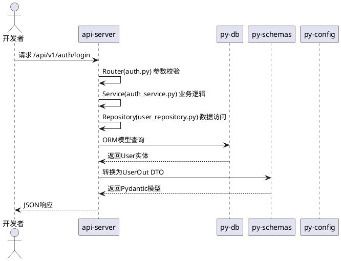
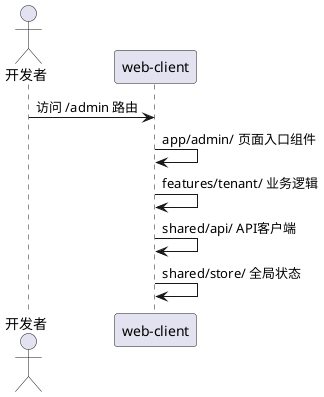
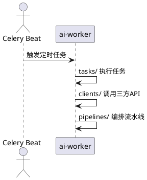
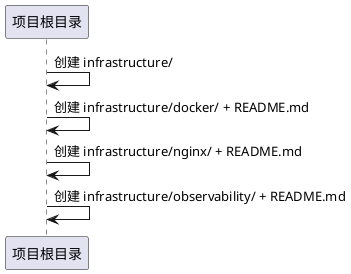
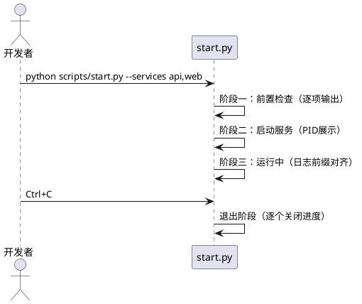
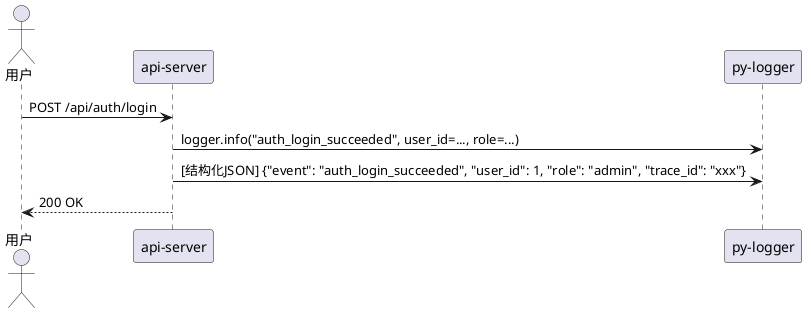
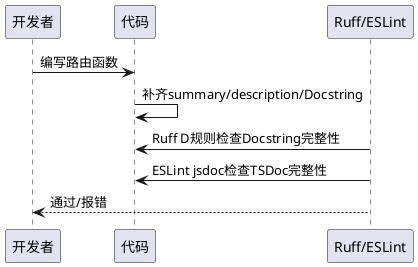

# **1. 组件定位**

## **1.1 核心职责**

本组件负责将项目现有代码与四份规范（项目结构、启动脚本、日志、注释）对齐，消除结构偏差、日志裸用、注释缺失等合规缺陷，实现全栈代码的规范一致性。

## **1.2 核心输入**

1. **四份规范文档**：项目结构规范（智院灵枢(SAP)-项目结构.md）、启动脚本规范、日志规范、注释规范
2. **项目现有源码**：apps/（web-client、api-server、ai-worker）、packages/（7个Python共享包+2个TS包）、scripts/（启动脚本+utils）
3. **差异分析结果**：项目当前结构与规范之间的偏差清单
4. **已完成工作基线**：commit ea15700 中已落地的Hybrid Monorepo、共享包、启动脚本、py-logger增强等

## **1.3 核心输出**

1. **目录结构合规的api-server**：app/下按api/v1/→services/→repositories/三层架构重组，移除知识域内嵌代码
2. **目录结构合规的web-client**：src/下按app/→features/→shared/→layouts/ Feature-Based聚合重组，pages/内容迁移至app/
3. **目录结构合规的ai-worker**：src/ai_worker/下补齐clients/和pipelines/目录
4. **补齐的infrastructure/目录**：创建docker/、nginx/、observability/三个空预留子目录
5. **规范对齐的启动脚本**：消除process_utils.py中的硬编码平台判断，实现日志重定向与持久化，补齐Banner/退出阶段输出
6. **规范对齐的日志使用**：api-server/ai-worker全量接入py-logger，消除except Exception，补齐结构化事件日志
7. **规范对齐的代码注释**：后端补齐Google Style Docstring，前端补齐TSDoc注释，路由补齐summary/description

## **1.4 职责边界**

1. **不负责**业务功能的新增或修改（如新增接口、修改用户注册逻辑）
2. **不负责**AI大模型算法或RAG检索策略的优化
3. **不负责**生产环境部署流程的搭建
4. **不负责**数据库迁移和存量数据的清洗转换
5. **不负责**前端UI/UX视觉设计的变更

# **2. 领域术语**

**规范合规（Spec Compliance）**
: 项目代码在目录结构、日志使用、注释风格、启动脚本行为等方面与规范文档要求的一致程度，差异项为零即为完全合规。

**Feature-Based聚合**
: 前端代码按业务功能聚合于features/目录下，每个feature内部自治（api/hooks/components/store），降低模块耦合。规范要求页面入口组件置于app/目录，业务逻辑下沉至features/。

**三层架构**
: 后端采用Router→Service→Repository三层架构。Router负责参数校验与路由分发；Service负责核心业务逻辑；Repository负责数据访问层（ORM查询封装，租户过滤内置）。禁止跨层调用。

**结构化日志（Structured Logging）**
: 日志输出采用键值对格式（非拼接字符串），事件名使用小写下划线格式，前缀按模块+结果后缀（*_succeeded/*_failed），通过py-logger的get_logger统一产出。

**Google Style Docstring**
: Python函数/类的Docstring采用Google Style格式，包含Args、Returns、Raises等标准段落，FastAPI路由需同时填写summary和description装饰器参数。

**TSDoc/JSDoc**
: TypeScript/React代码使用TSDoc标准注释，组件必须包含功能说明，Props接口的每个非显而易见属性必须有注释，自定义Hook必须说明入参和返回值。

**EARS格式**
: Easy Approach to Requirements Syntax，一种简洁的需求语法模式，通过条件-主体-响应结构描述可验证的系统行为。

**防御性编程（Defensive Programming）**
: 启动脚本在拉起服务前必须进行充分的前置检查（配置文件、依赖、端口、连通性），强依赖检查失败立即中止并以非零状态码退出。

**跨平台封装**
: 平台差异（信号处理、进程树清理、路径拼接）必须抽象封装至scripts/utils/process_utils.py，严禁业务逻辑中硬编码平台判断语句。

# **3. 角色与边界**

## **3.1 核心角色**

- **平台开发者**：负责执行规范对齐改造，修改目录结构、补充日志和注释，确保代码通过规范检查
- **代码审查者**：负责验证改造后的代码是否符合四份规范的所有要求

## **3.2 外部系统**

- **Ruff Linter**：代码检查工具，扩展D/ANN规则后将对Docstring和类型注解缺失报错
- **py-logger**：结构化日志库，提供get_logger、events、context、middleware能力
- **ESLint + Commitlint**：前端代码检查和Git提交规范强制执行工具

## **3.3 交互上下文**

```plantuml
@startuml
skinparam componentStyle rectangle

rectangle "规范合规优化" as optimizer {
    [目录结构重组] as dir
    [日志合规替换] as log
    [注释补齐] as doc
    [启动脚本对齐] as script
}

rectangle "规范文档" as specs [
    项目结构规范
    启动脚本规范
    日志规范
    注释规范
]

rectangle "项目代码" as code [
    apps/api-server
    apps/web-client
    apps/ai-worker
    scripts/
]

rectangle "检查工具" as tools [
    Ruff (D/ANN)
    ESLint
    Commitlint
]

optimizer --> specs : 读取规范要求
optimizer --> code : 修改/重组
tools --> code : 验证合规性

@enduml
```

# **4. DFX约束**

## **4.1 性能**

1. The 规范对齐改造 shall 不引入任何运行时性能退化（重组仅涉及文件移动和注释补充，不改变业务逻辑）
2. Where 日志替换为py-logger，the 结构化日志输出 shall 在JSON格式下单条日志序列化耗时不超过0.5ms

## **4.2 可靠性**

1. When 目录结构重组过程中，the git历史 shall 保持可追溯（使用git mv保留文件历史）
2. The 重组后的api-server三层架构 shall 保持所有现有接口的行为不变，不破坏现有测试

## **4.3 安全性**

1. The 日志替换 shall 禁止记录密码、Token原文、密钥、完整身份证号等敏感信息
2. The 注释补齐 shall 不在Docstring或TSDoc中暴露SECRET_KEY等敏感配置值

## **4.4 可维护性**

1. The 重组后的目录结构 shall 与"智院灵枢(SAP)-项目结构.md"完全一致
2. The 启动脚本 shall 完全符合"单体仓库全栈项目启动脚本规范"的所有细则
3. The 日志使用 shall 完全符合"智院灵枢(SAP)-日志规范"的基础约束和级别约定
4. The 代码注释 shall 完全符合"注释规范"的后端和前端章节
5. The 重组后代码 shall 通过Ruff（含D/ANN规则）和ESLint的全量检查

## **4.5 兼容性**

1. Where 现有接口路由路径存在，the 重组后 shall 保持URL路径不变（如/api/auth/login不改变）
2. The py-logger替换logging/print shall 保持日志信息的语义等价，不丢失关键上下文
3. The 启动脚本改造 shall 保持--services和--env-file CLI参数的向后兼容

# **5. 核心能力**

## **5.1 api-server目录结构重组**

### **5.1.1 业务规则**

1. **Router层隔离**：api-server/app/api/v1/routes/必须仅包含路由定义和参数校验逻辑，业务逻辑必须委托至services/层

   a. 验收条件：[检查auth.py路由文件] → [不含直接数据库操作（db.add/db.commit/db.query），仅包含路由装饰器、参数解析和service调用]

2. **Service层补齐**：当前services/仅有auth.py和user_service.py，必须按业务域补齐notice_service.py、tenant_service.py等

   a. 验收条件：[检查services/目录] → [每个api/v1/routes/下的路由模块都有对应的services/模块]

3. **Repository层创建**：必须创建repositories/目录，将ORM查询从services/中抽取，默认注入tenant_id过滤条件

   a. 验收条件：[检查repositories/目录] → [包含user_repository.py、notice_repository.py等，services/不直接调用db.query]

4. **Dependencies层创建**：必须创建dependencies/deps.py，集中提供get_db_session、get_current_user、get_current_tenant等FastAPI依赖注入项

   a. 验收条件：[检查dependencies/deps.py] → [包含可注入的DB Session、当前用户、租户上下文依赖]

5. **Knowledge域外迁**：app/knowledge/目录下的ingest.py、rag_pipeline.py、retriever.py、vectorstore/属于ai-worker职责，必须从api-server中移除

   a. 验收条件：[检查api-server/app/目录] → [不存在knowledge/子目录]

6. **Models外迁至py-db**：app/models/user.py中的ORM模型必须迁移至packages/py-db/py_db/models/，api-server通过py-db引用

   a. 验收条件：[检查api-server/app/models/] → [仅剩__init__.py从py-db重导出，不再定义ORM模型]

7. **Schemas外迁至py-schemas**：app/schemas/user.py中的DTO必须迁移至packages/py-schemas/py_schemas/，api-server通过py-schemas引用

   a. 验收条件：[检查api-server/app/schemas/] → [仅剩__init__.py从py-schemas重导出，不再定义DTO]

8. **Config外迁至py-config**：app/core/config.py中的Settings类必须迁移至packages/py-config/py_config/settings.py，api-server通过py-config引用

   a. 验收条件：[检查api-server/app/core/config.py] → [仅从py-config重导出settings]

9. **禁止项**：禁止Router直接调用Repository，禁止Service直接操作数据库（db.add/db.commit），禁止跨层调用

   a. 验收条件：[Ruff自定义规则或代码审查] → [无跨层调用]

### **5.1.2 交互流程**



### **5.1.3 异常场景**

1. **模型外迁循环引用**

   a. 触发条件：api-server的app/models/__init__.py同时从py-db导入又反向引用
   b. 系统行为：使用__init__.py做纯重导出（from py_db.models.user import User），不引入新依赖
   c. 用户感知：无影响，导入路径不变

2. **知识域代码移除后引用断裂**

   a. 触发条件：其他模块import了app.knowledge
   b. 系统行为：全局搜索并移除所有对app.knowledge的引用，知识域功能由ai-worker承担
   c. 用户感知：知识域相关接口返回404，需通过ai-worker重新暴露

## **5.2 web-client目录结构重组**

### **5.2.1 业务规则**

1. **pages/迁移至app/**：规范要求页面级入口组件存放于app/目录，当前pages/必须按B端/C端/认证分域迁移

   a. 验收条件：[检查src/app/目录] → [包含admin/、h5/、auth/、headless/、landing/子目录，内容来自原pages/]

2. **Feature目录补齐**：当前features/仅有knowledge/，必须补齐auth/、notice/、member/、student/、tenant/、activity/、agent/等业务域目录

   a. 验收条件：[检查src/features/目录] → [包含auth/、notice/、member/、student/、tenant/及P1/P2预留目录]

3. **shared/store统一**：当前存在src/store/和src/shared/store/两个状态目录，必须合并至shared/store/，仅存放跨页面共享状态

   a. 验收条件：[检查src/目录] → [不存在src/store/目录，所有全局状态在src/shared/store/中]

4. **测试目录创建**：必须创建src/test/目录，按业务域镜像源码结构（admin/、auth/、features/、components/等）

   a. 验收条件：[检查src/test/目录] → [包含按业务域镜像的子目录结构]

5. **API客户端归位**：src/api/目录下的客户端封装必须迁移至src/shared/api/，保持adminClient.ts和h5Client.ts命名

   a. 验收条件：[检查src/shared/api/] → [包含adminClient.ts、h5Client.ts、consultSSE.ts]

6. **禁止项**：禁止app/目录包含业务逻辑，业务逻辑必须下沉至features/；禁止feature间直接引用，必须通过shared/传递

   a. 验收条件：[代码审查] → [app/仅含页面入口组件，features/间无直接import]

### **5.2.2 交互流程**



### **5.2.3 异常场景**

1. **页面迁移后路由失效**

   a. 触发条件：pages/迁移至app/后路由配置仍引用旧路径
   b. 系统行为：同步更新路由配置文件中的所有import路径
   c. 用户感知：页面正常加载，无白屏

2. **store合并后状态丢失**

   a. 触发条件：src/store/迁移至shared/store/后组件引用路径断裂
   b. 系统行为：全局搜索替换所有import路径
   c. 用户感知：状态管理正常工作

## **5.3 ai-worker目录结构补齐**

### **5.3.1 业务规则**

1. **clients/目录创建**：必须在ai_worker/下创建clients/目录，封装三方API客户端（dashscope_client.py、wxpusher_client.py、napcat_client.py）

   a. 验收条件：[检查ai_worker/clients/] → [包含dashscope_client.py、wxpusher_client.py、napcat_client.py]

2. **pipelines/目录创建**：必须创建pipelines/目录（预留复杂任务编排链路），含__init__.py

   a. 验收条件：[检查ai_worker/pipelines/] → [目录存在且含__init__.py]

3. **Celery Beat定时任务注册**：celery_app.py必须包含Beat定时任务注册配置（当前扫描周期60秒）

   a. 验收条件：[检查celery_app.py] → [包含beat_schedule配置]

### **5.3.2 交互流程**



### **5.3.3 异常场景**

1. **客户端封装遗漏**

   a. 触发条件：新增推送渠道但clients/中无对应适配器
   b. 系统行为：py-messaging提供统一接口，clients/仅做HTTP调用封装
   c. 用户感知：新增渠道需同时实现messaging适配器和client封装

## **5.4 infrastructure目录补齐**

### **5.4.1 业务规则**

1. **infrastructure/目录创建**：必须在项目根目录创建infrastructure/，包含docker/、nginx/、observability/三个空预留子目录

   a. 验收条件：[检查项目根目录] → [infrastructure/docker/、infrastructure/nginx/、infrastructure/observability/均存在]

2. **各子目录含README**：每个预留子目录必须包含README.md说明当前为空预留及未来用途

   a. 验收条件：[检查各子目录] → [均包含README.md说明文件]

### **5.4.2 交互流程**



### **5.4.3 异常场景**

无特殊异常场景。

## **5.5 启动脚本规范对齐**

### **5.5.1 业务规则**

1. **消除硬编码平台判断**：process_utils.py中`if sys.platform == 'win32'`的判断虽已封装在utils内，但start.py中直接import process_utils的launch_process/graceful_terminate已满足跨平台封装要求。需确认start_api.py/start_web.py/start_worker.py如有独立逻辑也通过utils调用

   a. 验收条件：[检查start_api.py/start_web.py/start_worker.py] → [不包含sys.platform硬编码判断]

2. **Banner输出规范**：启动时必须输出项目名称的方框Banner（╔═══╗格式），当前仅有文本标题

   a. 验收条件：[启动start.py] → [控制台首行输出方框Banner，包含项目名称]

3. **前置检查逐项实时输出**：当前check_utils.py已逐项打印，但需确保检查项名称和结果对齐规范布局（名称右对齐+状态左对齐）

   a. 验收条件：[启动start.py阶段一] → [检查项输出格式为"  ✔  检查项名称        已就绪"，对齐排列]

4. **服务运行阶段日志前缀固定宽度**：当前log_utils.py的print_service_log仅用`[name]`前缀，需按最长服务名右侧空格填充对齐

   a. 验收条件：[多服务并发运行时] → [日志前缀宽度一致，如`[API   ]`、`[Worker]`、`[Web   ]`]

5. **退出阶段输出规范**：当前signal_handler输出较简略，需展示每个服务的关闭进度（→ 正在终止... ✔ 已关闭），超时标注"强制终止"

   a. 验收条件：[Ctrl+C退出时] → [逐个展示"→ 正在终止 API 服务 (PID: 12345) ... ✔ 已关闭"]

6. **日志重定向与持久化**：各子服务的stdout/stderr必须重定向至logs/目录下的独立日志文件（logs/api.log、logs/worker.log、logs/web.log）

   a. 验收条件：[服务运行时] → [logs/目录下生成对应日志文件，实时写入]

7. **统一日志模块复用**：启动脚本的日志输出（log_utils.py）应基于项目统一日志模块（py-logger），避免重复造轮子

   a. 验收条件：[检查log_utils.py] → [使用py-logger的get_logger或其封装，非裸print]

8. **禁止项**：严禁在业务启动逻辑中硬编码平台判断；严禁在业务脚本中直接硬编码ANSI转义码；严禁在不支持颜色的环境中输出ANSI码

   a. 验收条件：[代码审查+CI检查] → [无硬编码平台判断、无硬编码ANSI码、isatty()检测生效]

### **5.5.2 交互流程**



### **5.5.3 异常场景**

1. **前置检查强依赖失败**

   a. 触发条件：Redis或数据库不可连接
   b. 系统行为：立即中止启动流程，输出失败原因和修复建议，以非零状态码退出
   c. 用户感知：控制台显示"✘ Redis 连接 连接失败 → 请确认 Redis 服务已启动"并退出

2. **日志文件写入权限不足**

   a. 触发条件：logs/目录无写入权限
   b. 系统行为：降级为仅控制台输出，在启动时警告日志持久化不可用
   c. 用户感知：服务正常启动，控制台显示警告

3. **服务退出超时**

   a. 触发条件：某服务在10秒内未响应SIGTERM
   b. 系统行为：强制终止（taskkill /F /T 或 kill -9），标注"强制终止"并以警告色输出
   c. 用户感知：控制台显示"→ 正在终止 API 服务 ... ⚠ 强制终止"

## **5.6 日志使用规范对齐**

### **5.6.1 业务规则**

1. **全量接入py-logger**：api-server和ai-worker中所有Python代码必须使用`from py_logger import get_logger`，禁止裸print和标准logging

   a. 验收条件：[全局搜索apps/下Python文件] → [无`import logging`、无裸print（除启动脚本外）、均通过get_logger产出日志]

2. **消除except Exception**：当前auth.py中存在`except Exception as e`（行132、146、155、165）和session.py中`except Exception`（行23），必须替换为精确异常类型

   a. 验收条件：[全局搜索apps/下Python文件] → [无`except Exception`模式，全部使用精确异常类型如IntegrityError、ValueError等]

3. **结构化事件日志**：所有关键业务动作（登录成功/失败、用户创建、权限校验失败等）必须使用events.py中定义的事件名，以结构化键值格式输出

   a. 验收条件：[检查auth_service.py] → [登录成功输出logger.info(events.AUTH_LOGIN_SUCCEEDED, user_id=..., role=...)，登录失败输出logger.warning(events.AUTH_LOGIN_FAILED, username=..., reason=...)]

4. **降级/拒绝/失败分支必须输出日志**：所有异常分支（HTTPException、业务校验失败）必须在raise前输出warning或error日志

   a. 验收条件：[检查所有raise HTTPException处] → [raise前有对应的logger.warning或logger.error调用]

5. **敏感信息禁止记录**：日志中禁止记录密码原文、Token原文、密钥、完整身份证号

   a. 验收条件：[审查所有logger调用] → [无password、token原文、secret_key等敏感字段值记录]

6. **配置py-logger初始化**：api-server的main.py lifespan中必须调用configure_logging()初始化py-logger

   a. 验收条件：[检查main.py] → [lifespan内包含configure_logging()调用]

### **5.6.2 交互流程**



### **5.6.3 异常场景**

1. **py-logger不可导入**

   a. 触发条件：py-logger包未安装或路径错误
   b. 系统行为：启动时configure_logging()失败，降级为标准logging并输出警告
   c. 用户感知：服务可启动，控制台显示"py-logger初始化失败，降级为标准logging"

2. **事件名未定义**

   a. 触发条件：业务代码使用events.py中未定义的事件名
   b. 系统行为：Ruff或pre-commit hook检查events.py常量引用完整性
   c. 用户感知：CI构建失败，提示未定义的事件名

## **5.7 代码注释规范对齐**

### **5.7.1 业务规则**

1. **后端路由注释**：所有FastAPI路由装饰器必须填写summary和description参数，函数Docstring采用Google Style格式（含Args、Returns、Raises）

   a. 验收条件：[检查所有@router装饰器] → [均含summary和description；函数Docstring含Args/Returns/Raises段落]

2. **后端数据模型注释**：Pydantic模型必须包含类Docstring，每个Field必须填写title和description参数

   a. 验收条件：[检查所有Pydantic模型] → [类有Docstring，字段有Field(title=..., description=...)]

3. **后端服务/仓库层注释**：所有Service和Repository函数必须有Google Style Docstring，解释业务逻辑的"为什么"

   a. 验收条件：[检查services/和repositories/下所有函数] → [均含Docstring，说明业务逻辑原因]

4. **前端组件注释**：React组件必须包含TSDoc功能说明，Props接口每个非显而易见属性必须有注释

   a. 验收条件：[检查所有.tsx组件] → [文件顶部有TSDoc功能说明，Props接口有属性注释]

5. **前端Hook注释**：自定义Hook必须说明入参、返回值和用途

   a. 验收条件：[检查src/hooks/下所有Hook] → [均含TSDoc@param和@returns注释]

6. **全局特殊标记**：TODO/FIXME/HACK/NOTE标记必须遵循格式`关键字(责任人): 说明 [关联Issue/日期]`

   a. 验收条件：[全局搜索TODO/FIXME/HACK/NOTE] → [格式合规，含责任人标识]

7. **禁止项**：禁止误导性注释（与代码行为不一致）；禁止纯装饰性注释（仅重复代码本身）；禁止无Docstring的公开函数

   a. 验收条件：[Ruff D规则检查] → [无D100/D102/D103违规]

### **5.7.2 交互流程**



### **5.7.3 异常场景**

1. **Ruff D规则大量报错**

   a. 触发条件：开启D规则后现有代码大量缺少Docstring
   b. 系统行为：按模块分批补齐，先补路由和公开函数，再补内部函数；暂可通过ignore列表过渡
   c. 用户感知：CI逐步收紧D规则覆盖范围

2. **历史注释与规范冲突**

   a. 触发条件：现有注释格式不符合Google Style
   b. 系统行为：统一替换为Google Style，保留语义信息
   c. 用户感知：Swagger文档质量提升

# **6. 数据约束**

## **6.1 规范差异项**

1. **差异编号**：唯一标识，格式为DIFF-NNN（如DIFF-001）
2. **规范来源**：四份规范之一（项目结构/启动脚本/日志/注释）
3. **差异描述**：当前代码与规范要求的具体偏差
4. **合规要求**：规范原文中的具体条款引用
5. **优先级**：P0（必须修复）/P1（应该修复）/P2（建议修复）
6. **修复状态**：待修复/修复中/已修复

## **6.2 日志事件扩展项**

1. **事件名**：小写下划线格式，前缀按模块+结果后缀
2. **所属模块**：auth/user/student/notice/tenant/task/ai/message
3. **日志级别**：info/warning/error
4. **必需字段**：reason（失败原因机器码）、user_id/tenant_id（若可获取）

## **6.3 注释覆盖目标**

1. **后端路由**：100%覆盖summary+description+Docstring
2. **后端Pydantic模型**：100%覆盖类Docstring+Field描述
3. **后端Service/Repository**：100%覆盖函数Docstring
4. **前端组件**：100%覆盖TSDoc功能说明+Props注释
5. **前端Hook**：100%覆盖TSDoc@param+@returns
