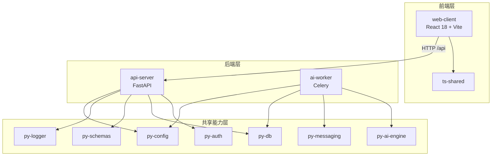

# 心青年智能体平台 (Young Hearts Agent Platform)

[](https://python.org)
[](https://react.dev)
[](https://fastapi.tiangolo.com)
[](LICENSE)

基于 FastAPI + React 的全栈智能体平台，支持多租户权限、RAG 知识库检索与豆包大模型对接。

## 目录

- [架构概览](#架构概览)
- [快速启动](#快速启动)
- [项目结构](#项目结构)
- [API 端点速查](#api-端点速查)
- [环境变量配置](#环境变量配置)
- [开发指南](#开发指南)
- [贡献指南](#贡献指南)

## 架构概览



## 快速启动

```bash
# 1. 安装所有依赖
npm run install:all

# 2. 复制配置模板并填写相关密钥
cp .env.example .env

# 3. 启动全部服务（API + Web）
npm run dev

# 4. 或启动全部含 Worker
npm run dev:all
```

| 服务 | 地址 | 说明 |
|------|------|------|
| 前端 | http://localhost:5173 | React + Vite 开发服务器 |
| 后端 | http://localhost:8000 | FastAPI 网关 |
| API 文档 | http://localhost:8000/docs | Swagger UI |

## 项目结构

```
Young-Hearts-Agent-Platform/
├─ apps/
│  ├─ web-client/          # React 18 + Vite 前端
│  ├─ api-server/          # FastAPI 网关
│  └─ ai-worker/           # Celery Worker
├─ packages/
│  ├─ py-config/           # Pydantic-settings 全局配置
│  ├─ py-db/               # SQLAlchemy ORM + 会话管理
│  ├─ py-schemas/          # Pydantic DTO 契约
│  ├─ py-auth/             # JWT + RBAC + 租户隔离
│  ├─ py-ai-engine/        # LLM HTTPX 客户端
│  ├─ py-logger/           # structlog 结构化日志
│  ├─ py-messaging/        # WxPusher + NapCatQQ 消息
│  ├─ ts-shared/           # TypeScript 共享枚举和类型
│  └─ ts-config/           # TS/ESLint/Vite 共享配置（占位）
├─ scripts/                # 统一启动脚本
├─ tests/                  # 根级集成测试
├─ docs/                   # 文档
└─ 规范/                   # 项目规范文件
```

## API 端点速查

| 方法 | 路径 | 描述 |
|------|------|------|
| POST | `/api/auth/login` | 用户登录 |
| POST | `/api/auth/register` | 用户注册 |
| POST | `/api/auth/logout` | 用户登出 |
| GET | `/api/auth/me` | 获取当前用户信息 |
| GET | `/health` | 健康检查 |

## 环境变量配置

| 变量名 | 类型 | 默认值 | 必填 | 说明 |
|--------|------|--------|------|------|
| `SECRET_KEY` | str | `dev-secret-change-me` | 生产必填 | JWT 签名密钥 |
| `DB_URL` | str | `sqlite:///./dev.db` | 否 | 数据库连接 URL |
| `CORS_ORIGINS` | str | `http://localhost:5173` | 否 | 逗号分隔的允许源 |
| `REDIS_URL` | str | `redis://localhost:6379/0` | 否 | Redis 连接 URL |
| `DOUBAO_API_KEY` | str | 空 | AI 功能必填 | 豆包大模型 API Key |
| `DOUBAO_BASE_URL` | str | DashScope 默认 | 否 | 豆包 API Base URL |
| `CELERY_BROKER_URL` | str | `redis://localhost:6379/1` | 否 | Celery Broker URL |
| `SESSION_EXPIRE_MINUTES` | int | `1440` | 否 | Session 过期时间（分钟） |

## 开发指南

```bash
# 单独启动服务
npm run dev:api          # 仅 API Server
npm run dev:web          # 仅 Web Client
npm run dev:worker       # 仅 AI Worker

# 测试
npm run test             # 全量测试
npm run test:api         # 后端测试
npm run test:web         # 前端测试

# 代码检查
npm run lint             # Ruff + ESLint
npm run lint:fix         # 自动修复

# Python 共享包安装
pip install -e packages/py-config
pip install -e packages/py-db
# ... 或使用 uv
uv sync --all-packages
```

## 贡献指南

1. Fork 仓库并创建功能分支：`git checkout -b feat/your-feature`
2. 遵循 [Conventional Commits](https://www.conventionalcommits.org/) 格式提交
3. 确保代码检查通过：`npm run lint`
4. 确保测试通过：`npm run test`
5. 提交 Pull Request 并填写变更说明
