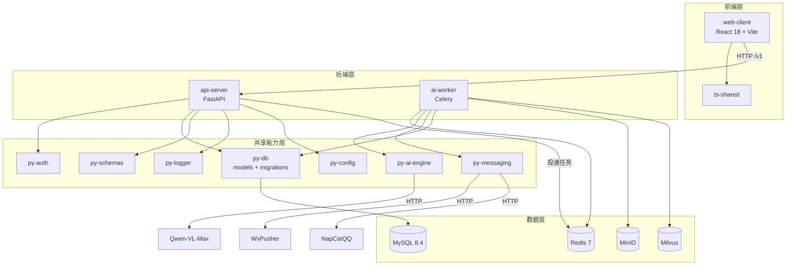

# 智院灵枢 (SAP) 项目结构设计

## 版本记录

| 日期 | 版本 | 变更内容 | 关联技术栈 |
|------|------|----------|-----------|
| 2026-04-12 | v1.0 | 初始创建：基于 SAP 功能文档与技术栈文档完成全栈 Monorepo 项目结构设计 | React 18, FastAPI, MySQL, Milvus, Redis, Celery |
| 2026-04-25 | v1.1 | 增量更新：精确化实际代码结构（补充已落地但未记录的目录：app/auth, app/headless, app/landing, features/member, features/student, features/tenant, shared/api, shared/store, py-db/migrations, py-db/models, py-logger/middlewares, ts-shared/src/enums, ts-shared/src/types, scripts/utils）；为 P1/P2 功能（活动大厅、RAG 问答、Agent 助理）标注预留目录 | React 18.3.1, FastAPI >=0.116.0, MySQL 8.4, Milvus v2.4.9, Redis 7, Celery >=5.4.0 |

---

## 1. 项目基本信息

- **项目名称**：智院灵枢 | Smart-Academy Pivot (SAP)
- **项目类型**：全栈 Hybrid Monorepo（前后端分离，uv + pnpm 双工作空间）
- **核心功能**：
  - P0（已落地）：多租户权限底座、AI 智能通知引擎、WxPusher 催收闭环
  - P1（预留）：模板化活动大厅、专域 RAG 问答中枢与知识库
  - P2（预留）：全局 AI Agent 助理
- **目标平台**：
  - B 端：管理后台（PC 优先，React 18 Web 应用）
  - C 端：轻量 H5 页面（低门槛免登录触达与身份确认）
- **预期规模**：中大型（多应用 + 多共享包 + 异步任务 + AI 工程链路）
- **团队规模（建议）**：前端 1-2 人、后端 1-2 人、AI/算法 1 人（兼职），无专职运维
- **代码组织风格**：**混合式**——顶层按应用边界分层（apps/packages/infrastructure），应用内前端按 **Feature-Based** 聚合，后端按 **三层架构**（Router → Service → Repository）分层

---

## 2. 设计原则

1. **应用与共享包解耦**：`apps/` 承载可独立构建运行的服务，`packages/` 承载跨应用复用能力；禁止应用间直接引用，必须通过 packages 共享。
2. **前端 Feature-Based 聚合**：按业务功能（auth/notice/activity 等）聚合组件、Hooks、API 与状态，降低模块耦合，便于功能级增删。
3. **后端三层架构**：Router（参数校验/路由）→ Service（业务逻辑）→ Repository（数据访问），禁止跨层调用。
4. **测试就近 + 镜像**：后端单元/集成测试就近放置于 `tests/` 或同目录；前端测试集中于 `src/test/` 并按业务域镜像源码结构。
5. **预留扩展边界**：P1/P2 功能目录已预留（activity/knowledge/agent），新增功能时优先在预留目录内扩展，避免结构重构。
6. **配置外置**：所有密钥、第三方地址、环境开关通过 `.env` 注入，禁止硬编码至源码。

---

## 3. 整体结构概览

```text
Smart-Academy-Pivot/
├─ apps/                                   # 可执行应用层
│  ├─ web-client/                          # React 18 + Vite 前端（B端后台 + C端H5）
│  ├─ api-server/                          # FastAPI 网关（认证、业务 API、任务调度）
│  └─ ai-worker/                           # Celery Worker（解析、推送、向量化、导出）
├─ packages/                               # 可复用能力层
│  ├─ py-config/                           # Pydantic-settings 全局配置读取
│  ├─ py-db/                               # SQLAlchemy ORM、Alembic 迁移、模型定义
│  ├─ py-schemas/                          # Pydantic DTO 与跨服务契约
│  ├─ py-ai-engine/                        # AI 引擎抽象层（HTTPX 客户端、预留 LangChain 接入）
│  ├─ py-logger/                           # structlog 结构化日志、审计、trace_id
│  ├─ py-auth/                             # JWT、RBAC、租户隔离中间件
│  ├─ py-messaging/                        # 消息推送适配器（WxPusher、NapCatQQ）
│  ├─ ts-config/                           # 前端 TS / ESLint / Vite 共享配置（当前占位）
│  └─ ts-shared/                           # 前端共享类型、枚举、常量
├─ infrastructure/                         # 基础设施与部署资产（当前为空目录，预留）
│  ├─ docker/                              # 各应用 Dockerfile 与 compose 片段
│  ├─ nginx/                               # 反向代理与静态资源网关配置
│  └─ observability/                       # Sentry / Prometheus / Grafana 配置模板
├─ scripts/                                # 启动、迁移、导入、运维脚本
│  └─ utils/                               # 脚本内部工具模块（前置检查、日志输出、进程管理）
├─ tests/                                  # 根级集成与 E2E 测试
├─ docs/                                   # 架构、接口、部署与需求文档
├─ data/                                   # 样例数据、导入模板、测试资源
├─ logs/                                   # 运行时日志（api.log / web.log / worker.log）
├─ tmp/                                    # 临时文件目录
├─ .env.example                            # 环境变量模板
├─ docker-compose.yml                      # 本地开发基础设施编排
├─ pyproject.toml                          # Python uv workspace 配置
├─ pnpm-workspace.yaml                     # Node.js pnpm workspace 配置
├─ main.py                                 # 项目根级入口（预留或快捷启动）
└─ README.md
```

---

## 4. 详细目录说明

### 4.1 应用层（apps）

#### apps/web-client（前端）

```text
web-client/
├─ src/
│  ├─ app/                                 # 页面级入口组件
│  │  ├─ admin/                            # B 端管理后台页面（租户管理、成员管理）
│  │  ├─ auth/                             # 认证相关页面（登录、租户选择）
│  │  ├─ h5/                               # C 端 H5 页面（免登录确认、打卡）
│  │  ├─ headless/                         # 无头逻辑页面（通知编辑、逻辑处理页）
│  │  │  └─ components/                    # headless 页面专用组件
│  │  └─ landing/                          # 落地页与引导页
│  │     └─ components/                    # 落地页专用组件
│  ├─ components/                          # 全局通用 UI 组件
│  │  ├─ ConfirmModal.tsx                  # 确认弹窗
│  │  └─ PromptModal.tsx                   # 分步输入弹窗
│  ├─ features/                            # 按业务功能聚合（Feature-Based）
│  │  ├─ auth/                             # 认证：登录、会话、租户上下文
│  │  ├─ notice/                           # 通知引擎：解析、发布、催收
│  │  │  └─ utils/                         # 通知相关工具函数（formatNoticeText 等）
│  │  ├─ member/                           # 成员管理：B 端账号创建、角色分配
│  │  ├─ student/                          # 学生端：验证、WxPusher 绑定
│  │  ├─ tenant/                           # 租户管理：租户 CRUD、状态切换
│  │  ├─ activity/                         # 活动大厅（P1 预留）
│  │  ├─ knowledge/                        # 知识库与 RAG（P1 预留）
│  │  └─ agent/                            # Agent 助理（P2 预留）
│  ├─ hooks/                               # 全局通用 Hooks
│  │  ├─ useDateFormat.ts
│  │  └─ useInView.ts
│  ├─ layouts/                             # 页面布局壳
│  │  ├─ AdminLayout.tsx                   # B 端后台布局（侧边栏 + 内容区）
│  │  └─ H5Layout.tsx                      # C 端 H5 布局
│  ├─ shared/                              # 跨功能复用基础设施
│  │  ├─ api/                              # API 客户端封装
│  │  │  ├─ adminClient.ts                 # B 端 Axios 实例（JWT 注入、401 刷新）
│  │  │  └─ h5Client.ts                    # C 端 Axios 实例（学生凭证注入）
│  │  └─ store/                            # Zustand 全局状态
│  │     ├─ studentStore.ts                # 学生认证状态
│  │     └─ tenantStore.ts                 # 租户上下文状态
│  ├─ styles/                              # 全局样式与 CSS 变量
│  │  └─ global.css
│  ├─ assets/                              # 图片、图标、字体
│  └─ test/                                # Vitest 测试（按业务域镜像源码结构）
│     ├─ admin/
│     ├─ api/                              # API 客户端测试
│     ├─ auth/                             # 认证相关测试
│     ├─ components/                       # 通用组件测试
│     ├─ features/                         # Features API 测试
│     ├─ hooks/                            # Hooks 测试
│     ├─ layouts/                          # 布局测试
│     ├─ notice/                           # 通知模块测试
│     ├─ store/                            # Store 测试
│     └─ student/                          # 学生端测试
├─ public/                                 # 静态公共资源
├─ package.json
├─ vite.config.ts                          # Vite 配置（含代理 /v1 → API Server）
├─ tsconfig.json
└─ tsconfig.tsbuildinfo
```

**设计重点**：
- 采用 **Feature-Based** 聚合，每个 feature 内部自治（api / hooks / components / store）。
- `app/` 目录仅存放页面级入口组件，业务逻辑下沉至 `features/`。
- `shared/api/` 统一封装 Axios 实例，处理 JWT 注入、401 静默刷新、租户头注入。
- `shared/store/` 仅存放跨页面共享状态（学生身份、租户上下文），页面级状态保留在 feature 内部。
- 测试采用**独立目录 + 业务域镜像**策略：`test/` 集中管理，子目录结构与 `src/` 对应，便于批量运行与覆盖率统计。
- P1/P2 预留目录（activity/knowledge/agent）已创建空壳，后续功能直接在内部分子目录扩展。

---

#### apps/api-server（后端网关）

```text
api-server/
├─ app/
│  ├─ api/
│  │  └─ v1/                               # API 版本化（v1 起步，预留 v2 空间）
│  │     ├─ auth.py                        # 认证与会话（登录、刷新、租户上下文）
│  │     ├─ notices.py                     # 通知解析/发布/确认/催收
│  │     ├─ activities.py                  # 活动与报名（P1 预留接口）
│  │     ├─ knowledge.py                   # 文档上传与 RAG 问答（P1 预留接口）
│  │     ├─ agent.py                       # Agent 任务入口（P2 预留接口）
│  │     └─ health.py                      # 健康检查
│  ├─ services/                            # 业务服务层（核心逻辑）
│  │  ├─ auth_service.py
│  │  ├─ notice_service.py
│  │  └─ tenant_service.py
│  ├─ repositories/                        # 数据访问层（ORM 查询封装，租户过滤内置）
│  │  ├─ user_repository.py
│  │  └─ notice_repository.py
│  ├─ dependencies/                        # FastAPI 依赖注入项
│  │  └─ deps.py                           # DB Session、当前用户、租户上下文
│  ├─ middleware/                          # 中间件（CORS、审计、异常处理）
│  ├─ tasks/                               # Celery 任务调度封装（投递异步任务）
│  └─ main.py                              # FastAPI 应用入口与生命周期管理
├─ tests/                                  # pytest 接口与集成测试
│  ├─ test_auth_feature.py
│  ├─ test_notice_feature.py
│  └─ test_tenant_management_feature.py
└─ pyproject.toml
```

**设计重点**：
- 严格遵循 **Controller(Router) → Service → Repository** 三层架构，禁止跨层调用。
- API 版本化从 `/api/v1/` 起步，为后续演进保留空间。
- `dependencies/deps.py` 统一提供 `get_db_session`、`get_current_user`、`get_current_tenant` 等可注入依赖。
- `services/` 禁止直接操作数据库，必须通过 `repositories/` 层；`repositories/` 层默认注入 `tenant_id` 过滤条件。
- P1/P2 预留 Router（activities/knowledge/agent）已创建空壳，避免后续大规模重构路由注册。

---

#### apps/ai-worker（异步任务 Worker）

```text
ai-worker/
├─ src/
│  └─ ai_worker/
│     ├─ tasks/                            # 具体异步任务实现
│     │  ├─ parse_notice.py                # 多模态通知解析（调用 Qwen-VL-Max）
│     │  ├─ send_wxpusher.py               # WxPusher 催收推送
│     │  ├─ send_napcatqq.py               # QQ 群消息分发
│     │  ├─ process_knowledge.py           # 文档切片与向量化（P1 预留）
│     │  └─ export_activity_excel.py       # 报名数据 Excel 导出（P1 预留）
│     ├─ pipelines/                        # 任务编排流水线（预留复杂链路）
│     ├─ clients/                          # 三方 API 客户端封装
│     │  ├─ dashscope_client.py            # DashScope（Qwen-VL-Max）
│     │  ├─ wxpusher_client.py             # WxPusher
│     │  └─ napcat_client.py               # NapCatQQ
│     └─ celery_app.py                     # Celery 应用入口与 Beat 定时任务注册
├─ tests/                                  # Worker 任务单元测试
└─ pyproject.toml
```

**设计重点**：
- 高耗时任务（AI 解析、推送、导出）从 API 进程剥离，保证在线接口响应稳定。
- 每个任务具备幂等键、重试策略（3 次 + 指数退避）与失败日志记录。
- `clients/` 封装三方 API 调用，便于切换渠道或适配新平台（预留企业微信/飞书）。
- Celery Beat 定时任务注册于 `celery_app.py`，当前扫描周期为 60 秒。

---

### 4.2 能力层（packages）

#### packages/py-db

```text
py-db/
├─ py_db/
│  ├─ __init__.py
│  ├─ database.py                          # 数据库引擎与 Session 工厂
│  ├─ models/                              # SQLAlchemy ORM 模型定义
│  │  ├─ __init__.py
│  │  ├─ user.py
│  │  ├─ tenant.py
│  │  ├─ notice.py
│  │  └─ student.py
│  ├─ migrations/                          # Alembic 迁移脚本
│  │  ├─ versions/                         # 自动生成的迁移版本
│  │  └─ env.py
│  └─ alembic.ini                          # Alembic 配置
├─ tests/
└─ pyproject.toml
```

**职责**：ORM 模型、数据库引擎、会话管理、Alembic 迁移。  
**关键约束**：所有核心业务表统一包含 `tenant_id`，并建立复合索引；模型禁止直接作为 API 响应返回。

---

#### packages/py-schemas

```text
py-schemas/
├─ py_schemas/
│  ├─ __init__.py
│  ├─ auth.py                              # 认证相关 DTO
│  ├─ notice.py                            # 通知相关 DTO
│  └─ tenant.py                            # 租户相关 DTO
├─ tests/
└─ pyproject.toml
```

**职责**：统一请求/响应 DTO，隔离数据库实体与 API 输出。  
**价值**：避免跨服务 DTO 漂移与敏感字段泄漏；前后端可共享字段命名约定。

---

#### packages/py-auth

```text
py-auth/
├─ py_auth/
│  ├─ __init__.py
│  ├─ jwt_handler.py                       # JWT 生成/解析/校验
│  ├─ password.py                          # bcrypt 密码哈希
│  ├─ rbac.py                              # 角色权限辅助函数
│  └─ middleware.py                        # 租户隔离与鉴权中间件（预留）
├─ tests/
└─ pyproject.toml
```

**职责**：JWT 颁发/校验、RBAC、租户上下文提取、权限守卫。  
**价值**：将认证鉴权与业务服务解耦，支持 API 与 Agent 复用。

---

#### packages/py-ai-engine

```text
py-ai-engine/
├─ py_ai_engine/
│  ├─ __init__.py
│  ├─ llm_client.py                        # LLM HTTPX 客户端（当前直接调用 DashScope）
│  └─ parsers.py                           # 响应解析与格式化工具
├─ tests/
└─ pyproject.toml
```

**职责**：AI 引擎抽象层（文档解析、视觉理解、预留 LangChain 接入）。  
**价值**：P0 阶段直接 HTTPX 调用；P1/P2 可平滑迁移至 LangChain 统一接口，无需改动业务层。

---

#### packages/py-logger

```text
py-logger/
├─ py_logger/
│  ├─ __init__.py
│  ├─ core.py                              # structlog 配置与日志工厂
│  ├─ context.py                           # trace_id 与上下文变量注入
│  ├─ events.py                            # 标准事件命名规范
│  └─ middlewares/
│     └─ fastapi_middleware.py             # FastAPI 请求日志中间件
├─ tests/
└─ pyproject.toml
```

**职责**：结构化日志、审计日志、trace_id 全链路贯通。

---

#### packages/py-messaging

```text
py-messaging/
├─ py_messaging/
│  ├─ __init__.py
│  ├─ wxpusher.py                          # WxPusher SDK 封装
│  └─ napcat.py                            # NapCatQQ HTTP API 封装
├─ tests/
└─ pyproject.toml
```

**职责**：消息推送渠道适配器，统一对外接口，便于新增渠道。

---

#### packages/py-config

```text
py-config/
├─ py_config/
│  ├─ __init__.py
│  └─ settings.py                          # Pydantic BaseSettings 全局配置
├─ tests/
└─ pyproject.toml
```

**职责**：统一 `.env` 读取与环境变量校验，所有 Python 包共享同一配置实例。

---

#### packages/ts-shared

```text
ts-shared/
├─ src/
│  ├─ enums/                               # 共享枚举（USER_ROLE, USER_STATUS, BIND_STATUS 等）
│  └─ types/                               # 共享 TypeScript 类型定义
├─ package.json
└─ tsconfig.json
```

**职责**：前端共享类型、枚举、常量；通过 `workspace:*` 被 `web-client` 引用。

---

#### packages/ts-config

```text
ts-config/
└─ (当前为空占位)
```

**职责**：预留前端共享 TS / ESLint / Vite 配置。当前各应用独立维护配置，后续提取公共配置至此包。

---

### 4.3 基础设施与工程支撑

#### infrastructure/

```text
infrastructure/
├─ docker/                                 # Dockerfile 与 compose 片段（当前为空，预留）
├─ nginx/                                  # 反向代理与静态资源缓存配置（当前为空，预留）
└─ observability/                          # 可观测性配置模板（当前为空，预留）
│     ├─ sentry.conf.py                    # Sentry 集成配置（规划中）
│     └─ prometheus/                       # Prometheus + Grafana 配置（后续评估）
```

> **注意**：当前应用层未容器化，`docker/` 仅预留。生产部署需补充各应用 Dockerfile 与编排配置。

#### scripts/

```text
scripts/
├─ start.py                                # 统一编排启动入口（前置检查、多进程管理、优雅关闭）
├─ start_api.py                            # 单独启动 API Server
├─ start_web.py                            # 单独启动 Web Client
├─ start_worker.py                         # 单独启动 AI Worker
├─ create_tenant_space.py                  # 交互式创建租户工作空间
├─ assign_user_tenants.py                  # 为 B 端用户分配/替换租户绑定
├─ init_superadmin_password.py             # 安全重置超级管理员密码
├─ __init__.py
└─ utils/                                  # 脚本内部共享工具模块
   ├─ check_utils.py                       # 前置检查（端口、依赖、基础设施连通性）
   ├─ log_utils.py                         # 带颜色前缀的多进程日志输出与文件写入
   └─ process_utils.py                     # 子进程生命周期管理（启动、信号、强制终止）
```

#### tests/（根级）

```text
tests/
├─ conftest.py                             # pytest 共享 fixtures
├─ test_startup_cli.py                     # 启动 CLI 参数解析测试
└─ test_startup_check_utils.py             # 前置检查工具测试
```

**职责**：根级 `tests/` 负责跨应用联调与全链路回归测试（如通知发布→确认→催收闭环）。各应用的单元/局部集成测试就近放置于 `apps/*/tests` 或 `apps/web-client/src/test/`。

---

## 5. 特殊文件说明

| 文件名 | 作用 | 注意事项 |
|---|---|---|
| `.env.example` | 统一环境变量模板 | 不保存真实密钥；字段必须与代码读取保持一致；更新时需同步修改 |
| `docker-compose.yml` | 本地开发基础设施编排 | 包含 MySQL 8.4 / Redis 7 / etcd / MinIO / Milvus v2.4.9；端口配置需与 `.env` 同步 |
| `pnpm-workspace.yaml` | 前端工作区与共享包编排 | 包含 `apps/web-client` 与 `packages/ts-*`；保证 workspace 依赖链清晰 |
| `pyproject.toml` | Python uv workspace 配置 | 定义 2 个 apps + 7 个 packages 为 workspace 成员；`[tool.coverage.report] fail_under = 70` |
| `apps/api-server/app/main.py` | FastAPI 应用入口与生命周期 | 中间件注册顺序影响鉴权与审计效果；lifespan 内自动建表并引导创建超级管理员 |
| `apps/ai-worker/src/ai_worker/celery_app.py` | Celery 应用与 Beat 定时任务注册 | 配置队列并发、结果后端、Beat 扫描周期（当前 60 秒）；避免任务堆积 |
| `apps/web-client/vite.config.ts` | Vite 开发与构建配置 | 含 `/v1` 代理至 API Server；Vitest 配置（jsdom、覆盖率阈值 70%） |
| `packages/py-db/alembic.ini` | Alembic 数据库迁移配置 | 迁移脚本存放于 `py_db/migrations/versions/`；开发环境 FastAPI lifespan 自动建表，不自动执行迁移 |
| `.github/workflows/ci.yml` | GitHub Actions CI 流水线 | 后端 `uv sync --all-packages` + `pytest --cov`；前端 `pnpm install` + `vitest --coverage` |

---

## 6. 模块间依赖关系



**依赖规则**：
1. `web-client` 通过统一 API SDK 调用 `api-server`，前端不直接连接数据库或向量库。
2. `api-server` 依赖 `py-auth`、`py-db`、`py-schemas`、`py-logger`、`py-config` 承担在线编排与鉴权。
3. `ai-worker` 复用 `py-ai-engine`、`py-messaging`、`py-db`、`py-config` 执行离线任务，并回写业务状态。
4. Redis 同时服务于缓存、会话短状态与 Celery Broker/Result Backend。
5. Milvus 与 MySQL 分别存储向量索引与结构化元数据，RAG 查询时组合使用。
6. **禁止跨应用直接 import**；应用间共享能力必须通过 `packages/` 传递。

---

## 7. 扩展性考虑

- **功能扩展**：新增业务域时优先在 `apps/web-client/src/features/` 与 `apps/api-server/app/api/v1/` 追加模块，避免横向污染已有 feature。
- **服务拆分**：当某能力流量上升，可将 `agent` 或 `knowledge` 独立为新 app，继续复用 `packages/`。
- **模型切换**：在 `py-ai-engine` 增加适配器即可切换 Qwen/Kimi/智谱，不影响业务层调用。
- **通知多通道**：在 `py-messaging` 或 `ai-worker/clients/` 新增企业微信/飞书适配，不影响现有业务层调用。
- **前端 UI 库引入**：P1 阶段引入 Ant Design 时，建议在 `shared/components/` 内封装业务组件，避免与现有原生组件冲突。
- **ts-config 激活**：当多个前端应用需要共享 TS/ESLint 配置时，将公共配置提取至 `packages/ts-config/`。

---

## 8. 测试与文档规划

### 8.1 单元测试

| 层级 | 工具 | 放置位置 | 状态 |
|------|------|----------|------|
| 前端组件/逻辑 | Vitest + jsdom + @testing-library/react | `apps/web-client/src/test/`（按业务域镜像） | 已落地（34 个测试文件） |
| Python 包单元测试 | pytest + pytest-asyncio | `packages/*/tests/` | 已落地 |
| API 接口测试 | pytest + TestClient | `apps/api-server/tests/` | 已落地 |
| Worker 任务测试 | pytest | `apps/ai-worker/tests/` | 已落地 |

### 8.2 集成与 E2E 测试

- **根级 `tests/`**：跨服务场景（通知发布到确认、催收闭环、RAG 引用准确性、Agent 多工具链路）。
- **启动脚本测试**：`tests/test_startup_cli.py`、`tests/test_startup_check_utils.py`。

### 8.3 文档体系

| 目录 | 用途 | 状态 |
|------|------|------|
| `docs/智院灵枢(SAP)-功能文档.md` | 功能需求与验收标准 | 已落地（v1.1） |
| `docs/智院灵枢(SAP)-技术栈设计.md` | 技术选型与架构决策 | 已落地（v1.1） |
| `docs/智院灵枢(SAP)-项目结构.md` | 本文件：目录结构与模块边界 | 已落地（v1.1） |
| `docs/智院灵枢(SAP)-前端逻辑架构蓝图.md` | 前端状态流与组件关系 | 已落地 |
| `docs/智院灵枢(SAP)-初始化配置方案.md` | 环境配置与启动指南 | 已落地 |
| `docs/智院灵枢(SAP)-日志规范.md` | 日志事件命名与级别约定 | 已落地 |
| `docs/智院灵枢(SAP)-注释规范.md` | 代码注释与文档规范 | 已落地 |
| `docs/AI对话记录/` | 技术决策与方案讨论记录 | 已落地 |
| `docs/前端开发/` | 前端专项技术文档 | 已落地 |
| `docs/参考文档/` | 第三方技术参考 | 已落地 |

---

## 9. 最佳实践说明

1. **严格执行租户隔离**：`repositories/` 层默认注入 `tenant_id` 查询条件；安全测试中加入越权回归测试集（403 验证）。
2. **线上耗时任务异步化**：通知解析、导出、向量化统一走 Worker，API 仅负责调度与查询状态；常规查询接口 P95 < 300ms。
3. **契约先行**：前后端共享 DTO（`py-schemas`）与错误码约定（`ts-shared`），减少联调期歧义。
4. **配置外置**：所有密钥、第三方地址、功能开关都通过 `.env` 注入，`pydantic-settings` 统一校验；禁止硬编码。
5. **可观测与审计**：关键动作（推送、权限拒绝、Agent Tool 调用）必须落审计日志（`py-logger` + `events.py`），满足追踪与复盘。
6. **单文件行数控制**：前端单文件 <= 200 行，超出必须拆分；Python 函数建议 50-80 行内，超出必须拆分。
7. **零 Any 容忍**：前端禁止显式或隐式 `any`；Python 全面使用 3.12+ 类型注解（`str \| None`、`list[int]`）。

---

## 10. 自检结果

- [x] 已区分新建设计与增量更新场景（本次为增量更新 v1.1）。
- [x] 增量更新时保留了原文档中仍有效的结构决策。
- [x] 目录树已精确反映实际代码结构（通过 `Get-ChildItem` 逐层核对）。
- [x] 已补充实际已落地但原文档遗漏的目录（app/auth, app/headless, app/landing, features/member, features/student, features/tenant, shared/api, shared/store, scripts/utils, py-db/migrations, py-db/models, py-logger/middlewares, ts-shared/src/enums, ts-shared/src/types）。
- [x] 已标注 P1/P2 预留目录（activity/knowledge/agent）及对应的预留文件。
- [x] 已标注「当前为空，预留」的目录（infrastructure/docker, nginx, observability, ts-config）。
- [x] 已包含测试文件放置策略（前端独立 test/ 镜像结构，后端就近 tests/）。
- [x] 已包含扩展性说明与未来迁移路径。
- [x] 输出路径正确：`docs/智院灵枢(SAP)-项目结构.md`（覆盖原文件）。

---

*本文档由 AI 辅助生成，建议经技术负责人评审后生效。*
